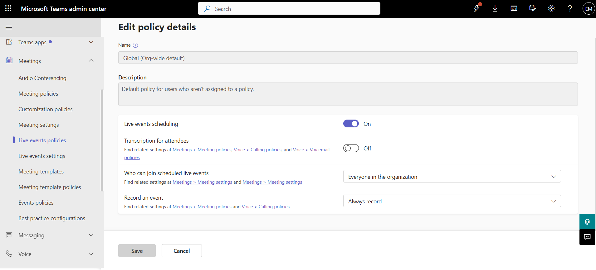
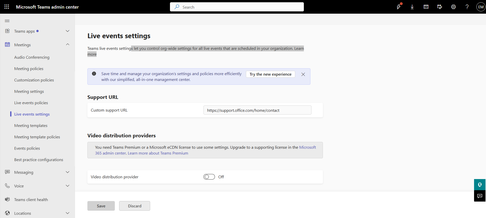

# Configure Live Events and Webinars

## Overview

Live Events and Webinars enable organizations to deliver large-scale online presentations, training sessions, company announcements, and public events using Microsoft Teams.

## Location

**Microsoft Teams admin center → Meetings → Live events policies**

**Microsoft Teams admin center → Meetings → Live events settings**

## Steps

1. Opened the **Microsoft Teams admin center**.
2. Navigated to **Meetings → Live events policies**.
3. Reviewed the available live event policies.
4. Opened the **Global (Org-wide default)** policy.
5. Reviewed scheduling permissions.
6. Reviewed recording settings.
7. Reviewed attendee transcription settings.
8. Reviewed external attendee permissions.
9. Saved the configuration where required.
10. Navigated to **Meetings → Live events settings**.
11. Reviewed organization-wide live event settings.
12. Reviewed external event access settings.
13. Reviewed event support and provider options.
14. Confirmed that Live Events functionality was available in the tenant.

## Result

Live Events settings were successfully reviewed and validated. The tenant's live event configuration was confirmed through the Microsoft Teams admin center.

### Live Events Policy Configuration

### Live Events Settings

## Administrative Notes

Live Events are designed for large-scale broadcasts and organization-wide communications.

Live event availability depends on licensing, policy configuration, and organizational settings.

Live event permissions and external attendee settings should be reviewed periodically to ensure they align with organizational requirements.