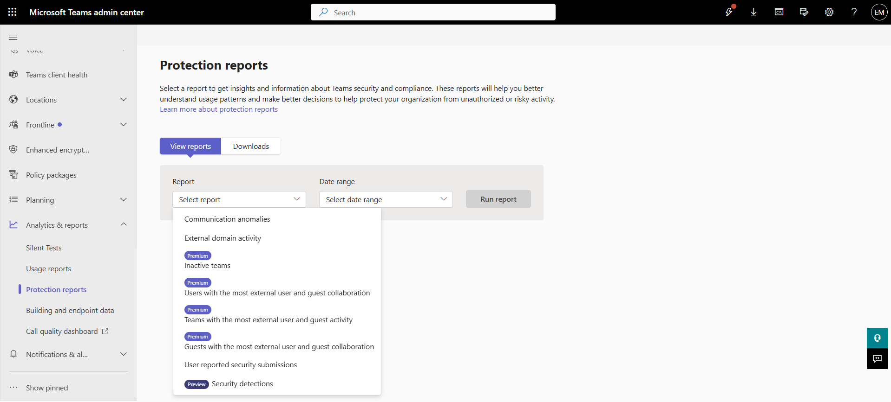
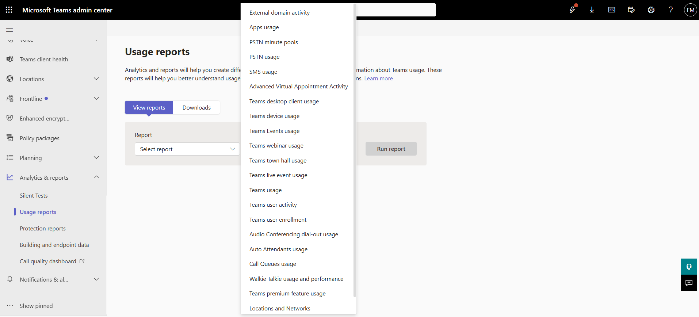

# Teams Admin Reports

## Overview

Teams Admin Reports provide insights into Microsoft Teams usage, user activity, device usage, application adoption, and service performance. These reports help administrators monitor usage trends and support operational decision-making.

## Location

**Microsoft Teams admin center → Analytics & reports**

## Steps

1. Opened the **Microsoft Teams admin center**.
2. Navigated to **Analytics & reports**.
3. Reviewed the available Teams reports.
4. Opened a Teams usage report.
5. Reviewed user activity information.
6. Reviewed meeting and collaboration metrics.
7. Reviewed device and client usage statistics.
8. Applied filters where required.
9. Reviewed the report data and trends.
10. Exported the report where applicable.
11. Confirmed that report information was available for analysis and monitoring.

## Result

Teams reporting data was successfully reviewed. Administrative reports provided visibility into Teams usage, collaboration activity, and adoption metrics across the organization.

### Teams Protectio Reports 

### Teams Usage Report

## Administrative Notes

Teams reports help administrators monitor adoption, user activity, collaboration trends, and service usage.

Reports should be reviewed regularly to identify usage patterns and support operational planning.

Exported reports can be used for auditing, trend analysis, and management reporting.