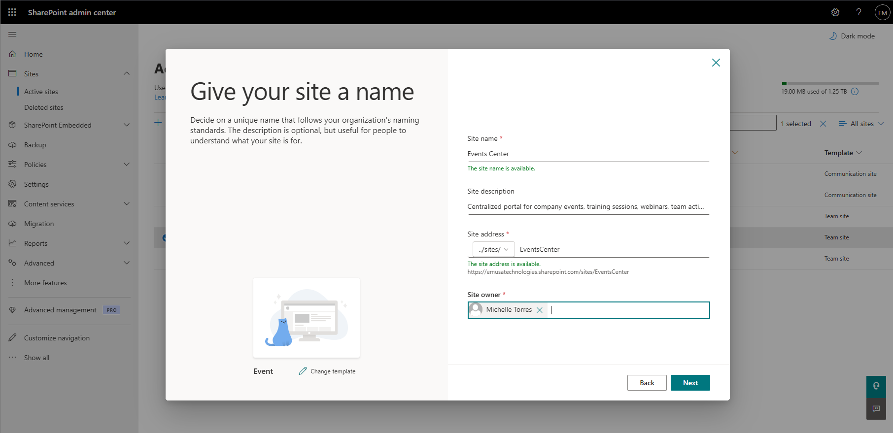
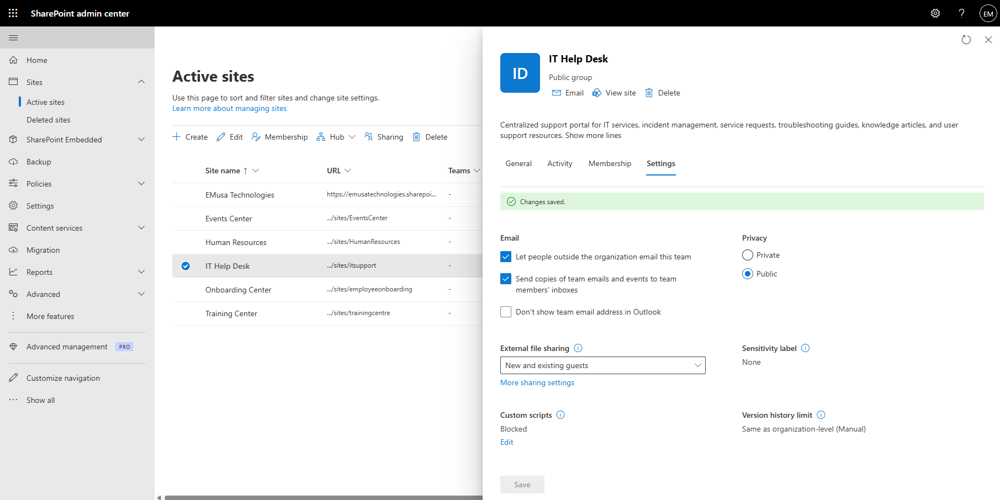
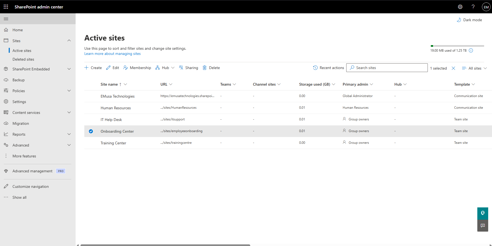

# Create SharePoint Site

## Overview

A SharePoint site provides a centralized location for collaboration, document management, information sharing, and team productivity within Microsoft 365.

## Location

**SharePoint admin center → Sites → Active sites**

## Steps

1. Opened the **SharePoint admin center**.
2. Navigated to **Sites → Active sites**.
3. Selected **Create**.
4. Chose either a **Team site** or **Communication site**.
5. Entered the site name and description.
6. Confirmed the site URL.
7. Selected the site owner.
8. Configured the site privacy settings.
9. Added site members where applicable.
10. Selected **Finish** to create the site.
11. Waited for SharePoint Online to provision the site.
12. Opened the newly created site.
13. Verified that the site homepage loaded successfully.
14. Confirmed that users could access the site according to the configured permissions.

## Result

The SharePoint site was successfully created and is available for collaboration, document management, and information sharing.

### SharePoint Site Configuration

### SharePoint Site Created

## Administrative Notes

Team sites are designed for collaboration and are connected to Microsoft 365 Groups.

Communication sites are intended for publishing information to a broader audience.

Site ownership and permissions should be reviewed after creation to ensure proper governance and security.