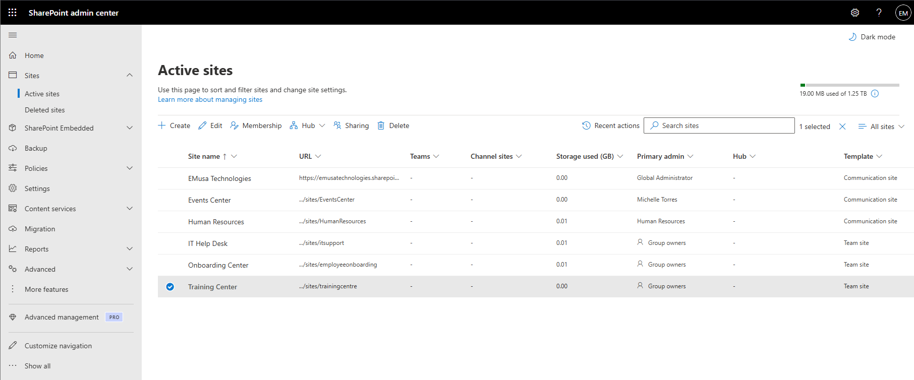
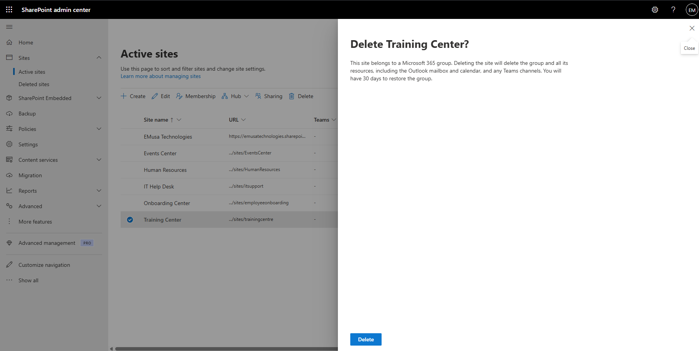
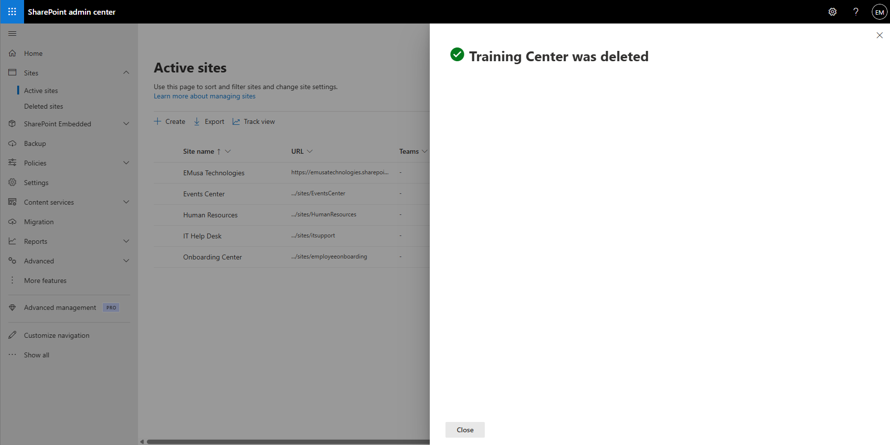
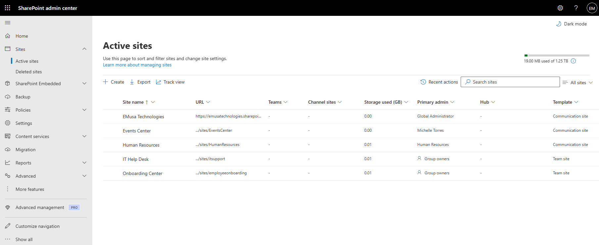

# Delete SharePoint Site

## Overview

Deleting a SharePoint site removes the site and its associated content from active use. Deleted sites are retained for a period and can be restored if necessary.

## Location

**SharePoint admin center → Sites → Active sites**

## Steps

1. Opened the **SharePoint admin center**.
2. Navigated to **Sites → Active sites**.
3. Located the SharePoint site to be deleted.
4. Selected the target site.
5. Reviewed the site details and ownership information.
6. Selected **Delete**.
7. Reviewed the deletion warning message.
8. Confirmed the site deletion.
9. Waited for SharePoint Online to process the request.
10. Verified that the site no longer appeared in the active sites list.
11. Opened the **Deleted sites** section.
12. Confirmed that the deleted site was available for recovery.

## Result

The SharePoint site was successfully deleted and moved to the Deleted Sites area where it can be restored during the retention period.

### SharePoint Site Selected for Deletion

### Deleted Site

## Administrative Notes

Deleted SharePoint sites are retained for a limited period before permanent removal.

Site owners and stakeholders should be notified before deleting production sites.

Administrators can restore deleted sites from the **Deleted sites** section during the retention period.