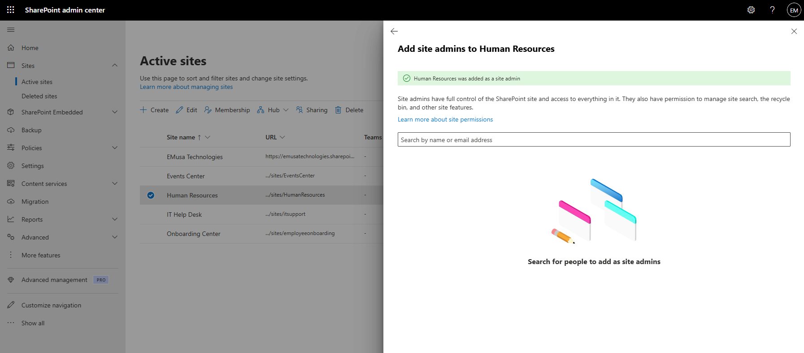

# Manage Site Permissions

## Overview

Site permissions determine who can access and manage a SharePoint site. Administrators can assign site admins, owners, members, and visitors to control access and collaboration.

## Location

**SharePoint admin center → Sites → Active sites → Membership**

## Steps

1. Opened the **SharePoint admin center**.
2. Navigated to **Sites → Active sites**.
3. Selected the target SharePoint site.
4. Opened the **Membership** tab.
5. Reviewed the existing site admins.
6. Reviewed the site owners, members, and visitors.
7. Selected **Add site admins**.
8. Added the required user account.
9. Saved the permission changes.
10. Verified that the user appeared in the appropriate membership group.
11. Reviewed the updated site membership configuration.

## Result

Site permissions were successfully reviewed and updated. The appropriate users were assigned access to the SharePoint site according to their responsibilities.

### Site Membership Configuration

## Administrative Notes

Site admins have administrative control over the SharePoint site.

Site owners can manage site content, permissions, and collaboration settings.

Site members can create and edit content based on assigned permissions.

Site visitors typically have read-only access.

Permissions should be reviewed regularly to ensure users have the appropriate level of access.