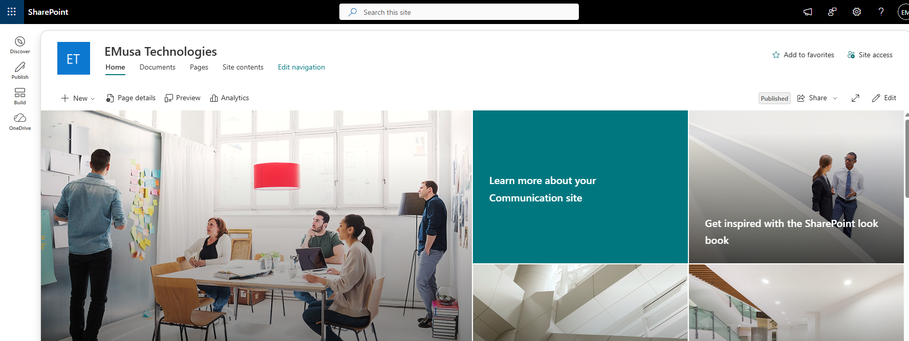
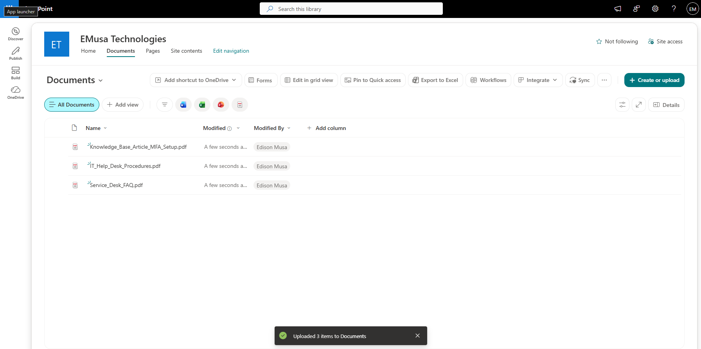

# Manage Document Libraries

## Overview

Document Libraries provide centralized storage for files and documents within a SharePoint site. Libraries support collaboration, versioning, metadata, and secure document management.

## Location

**SharePoint Site → Site contents → New → Document library**

## Steps

1. Opened the target **SharePoint site**.
2. Selected **Site contents**.
3. Selected **New → Document library**.
4. Entered a name and description for the library.
5. Selected **Create**.
6. Confirmed that the document library appeared in Site contents.
7. Opened the newly created document library.
8. Uploaded a sample document.
9. Verified that the document was stored successfully.
10. Reviewed the library settings and available options.
11. Confirmed that users could access the library according to assigned permissions.

## Result

A SharePoint Document Library was successfully created and configured for document storage and collaboration.

### Document Library Configuration

### Document Library Created

## Administrative Notes

Document Libraries provide centralized storage for files and support collaboration across teams.

Libraries can be configured with custom columns, metadata, permissions, version history, and content approval settings.

Access should be reviewed regularly to ensure users have the appropriate permissions.