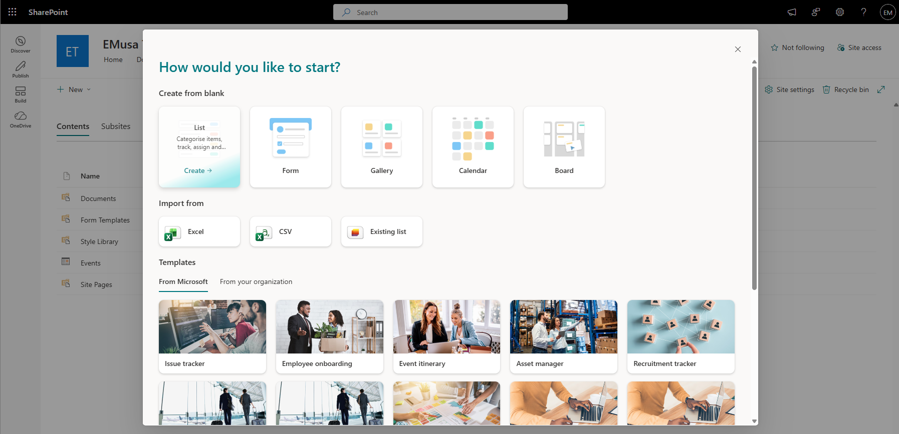
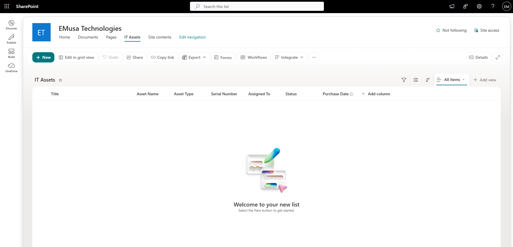
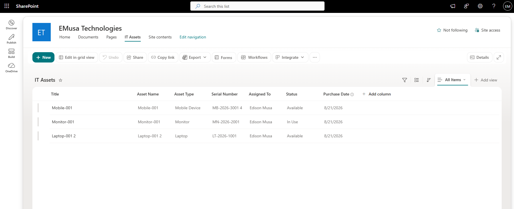

# Manage Lists

## Overview

SharePoint Lists allow organizations to store, track, and manage structured information such as assets, tickets, projects, requests, and operational data.

## Location

**SharePoint Site → Site contents → New → List**

## Steps

1. Opened the target **SharePoint site**.
2. Selected **Site contents**.
3. Selected **New → List**.
4. Chose **Blank list**.
5. Entered a name and description for the list.
6. Selected **Create**.
7. Confirmed that the list appeared in Site contents.
8. Opened the newly created list.
9. Added custom columns as required.
10. Created sample list items.
11. Reviewed the list views and available options.
12. Confirmed that users could access and manage list data according to assigned permissions.

## Result

A SharePoint List was successfully created and configured to manage structured information within the site.

### List Configuration

### List Created

## Administrative Notes

SharePoint Lists can be used to manage operational data, requests, inventories, assets, projects, and tracking information.

Lists can be customized with additional columns, views, filters, formatting, and automation.

Permissions should be reviewed regularly to ensure appropriate access to list data.