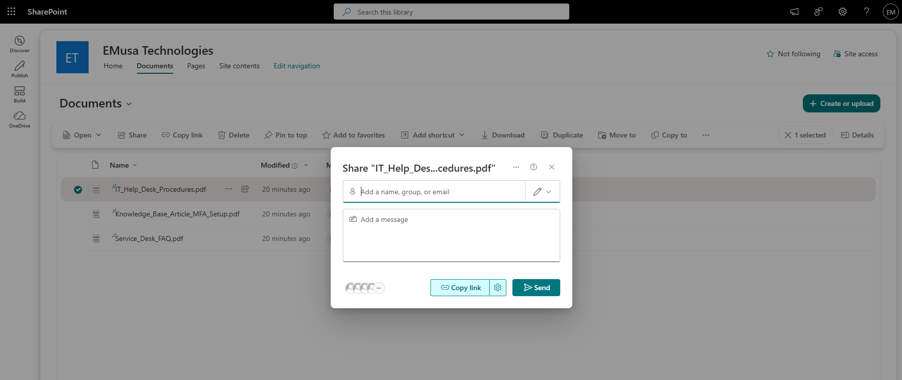
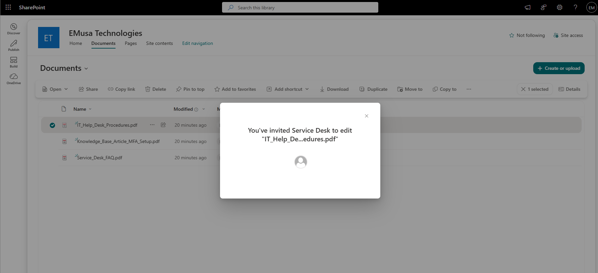

# Manage File and Folder Sharing

## Overview

File and Folder Sharing allows users to securely share documents and folders with internal users, groups, and external recipients while maintaining access control and collaboration capabilities.

## Location

**SharePoint Site → Documents**

## Steps

1. Opened the target **SharePoint site**.
2. Navigated to the **Documents** library.
3. Selected a file or folder to be shared.
4. Selected **Share**.
5. Reviewed the sharing options.
6. Chose the appropriate sharing permission level.
7. Entered the recipient's email address.
8. Added a message where applicable.
9. Selected **Send** to share the file or folder.
10. Verified that the sharing link was successfully created.
11. Reviewed the file or folder permissions.
12. Confirmed that the recipient had access to the shared content.

## Result

A SharePoint file or folder was successfully shared with the intended recipient. Access permissions were applied according to the selected sharing settings.

### File or Folder Sharing Configuration

### Shared File or Folder

## Administrative Notes

Files and folders can be shared with internal users, groups, or external recipients depending on the organization's sharing configuration.

Sharing permissions should be reviewed regularly to ensure access follows the principle of least privilege.

Sensitive information should only be shared with authorized users and appropriate permission levels.