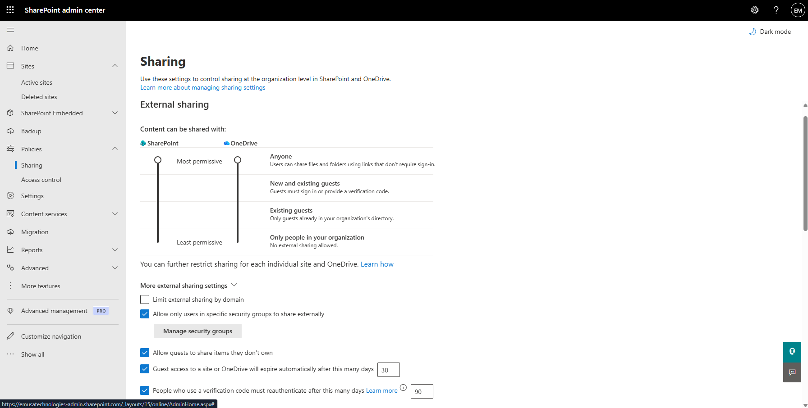
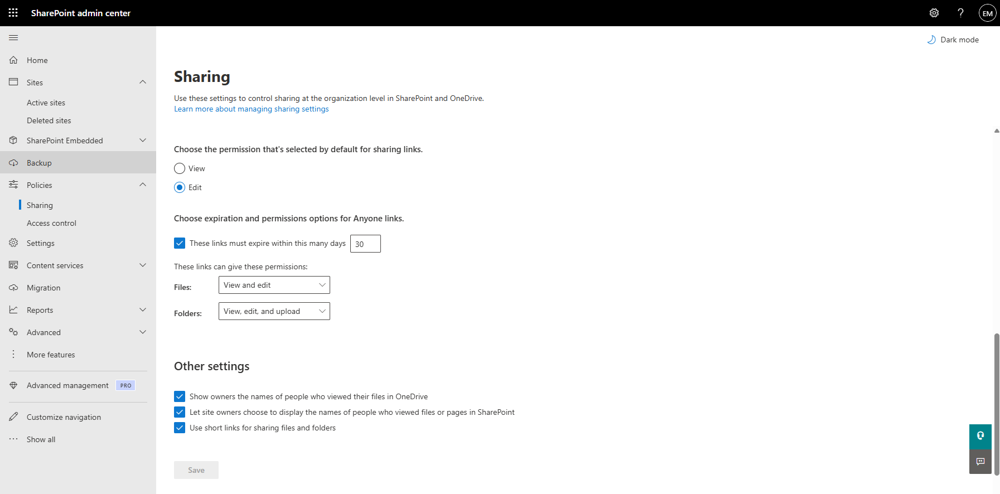
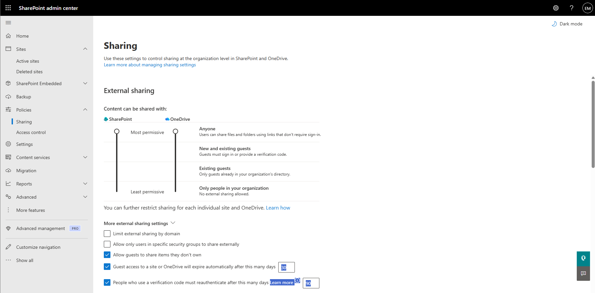
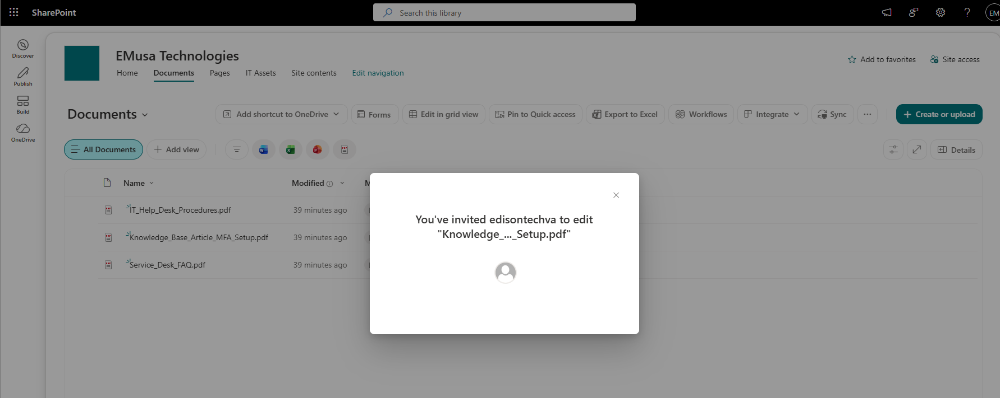

# Manage External Sharing

## Overview

External Sharing allows SharePoint administrators and site owners to collaborate with users outside the organization by sharing sites, files, and folders securely.

## Location

**SharePoint admin center → Policies → Sharing**

**SharePoint Site → Documents**

## Steps

1. Opened the **SharePoint admin center**.
2. Navigated to **Policies → Sharing**.
3. Reviewed the organization's external sharing settings.
4. Confirmed that external sharing was enabled.
5. Opened the target SharePoint site.
6. Navigated to the **Documents** library.
7. Selected a file or folder.
8. Selected **Share**.
9. Entered an external recipient email address.
10. Selected the appropriate permission level.
11. Sent the sharing invitation.
12. Verified that the external sharing link was successfully created.
13. Reviewed the access permissions for the shared content.

## Result

External sharing was successfully configured and tested. SharePoint content can be securely shared with external users according to the organization's sharing policies.

### External Sharing Configuration

### External User Sharing

## Administrative Notes

External sharing should be configured according to organizational security requirements.

Sharing permissions should follow the principle of least privilege.

Guest and external user access should be reviewed periodically to ensure appropriate access is maintained.