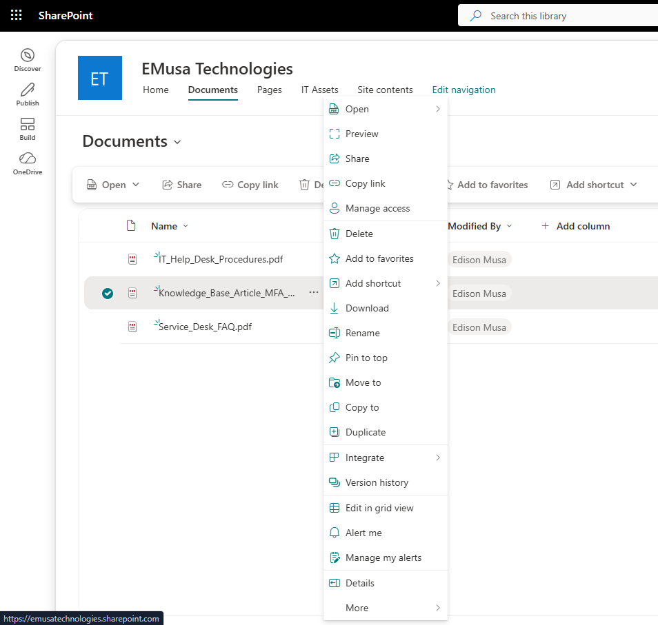
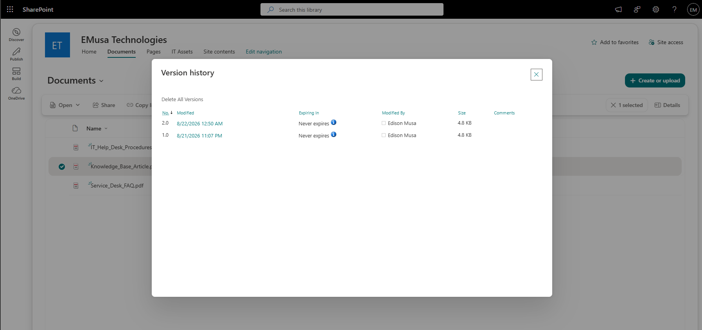
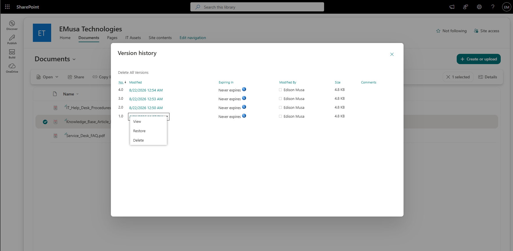

# Manage Version History

## Overview

Version History allows SharePoint administrators and users to track changes made to files, restore previous versions, and maintain document integrity.

## Location

**SharePoint Site → Documents**

## Steps

1. Opened the target **SharePoint site**.
2. Navigated to the **Documents** library.
3. Located an existing document.
4. Opened the documeand made a modificatnt ion.
5. Saved the updated document.
6. Returned to the **Documents** library.
7. Selected the document.
8. Opened the **Version history** option.
9. Reviewed the available document versions.
10. Compared the version details and modification history.
11. Selected a previous version where applicable.
12. Verified that previous versions were available for restoration.

## Result

Version History was successfully reviewed and validated. Multiple document versions were available, allowing changes to be tracked and previous versions to be restored when needed.

### Version History Configuration

### Document Version History

## Administrative Notes

Version History helps protect against accidental changes and supports document recovery.

Organizations should ensure versioning is enabled for important document libraries.

Document versions should be reviewed periodically to maintain storage efficiency and governance requirements.