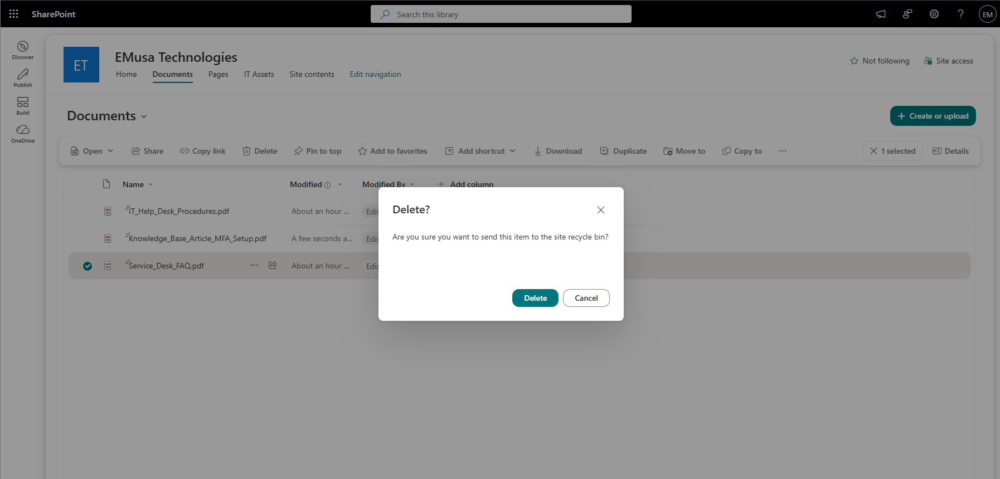
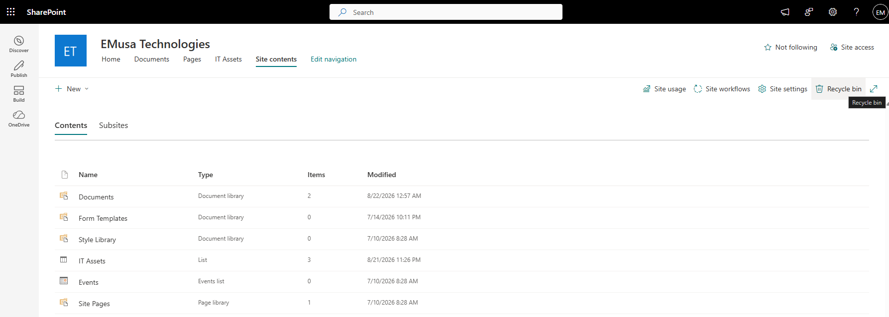
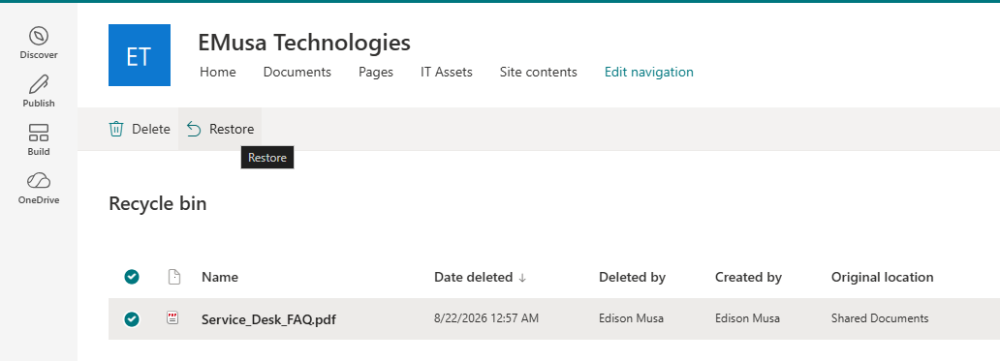

# Manage Recycle Bin and Restore

## Overview

The SharePoint Recycle Bin allows administrators and site owners to recover deleted files, folders, and list items during the retention period.

## Location

**SharePoint Site → Recycle Bin**

## Steps

1. Opened the target **SharePoint site**.
2. Navigated to the **Documents** library.
3. Selected a file to be deleted.
4. Deleted the file.
5. Confirmed that the file was removed from the library.
6. Navigated to **Recycle Bin**.
7. Reviewed the deleted items.
8. Located the deleted file.
9. Selected the file.
10. Selected **Restore**.
11. Confirmed that the file was successfully restored.
12. Returned to the Documents library.
13. Verified that the restored file was available and accessible.

## Result

A deleted SharePoint file was successfully restored from the Recycle Bin and made available within the document library.

### Deleted File

### Restored File

## Administrative Notes

The Recycle Bin provides a recovery mechanism for accidentally deleted files and folders.

Deleted content remains recoverable for a limited retention period before permanent removal.

Administrators should periodically review deleted content and restore items when necessary.