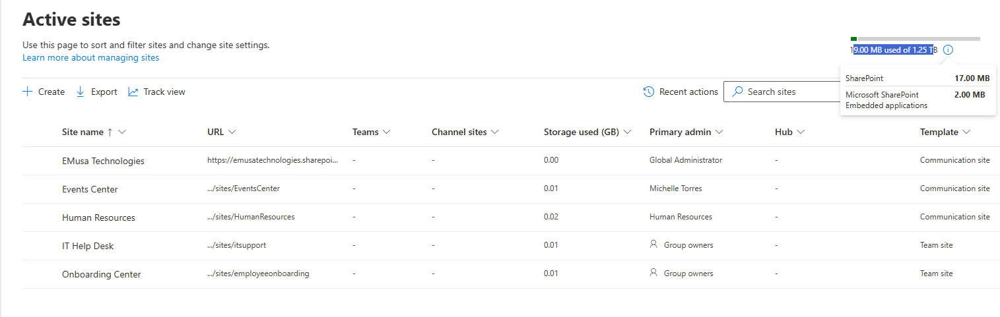
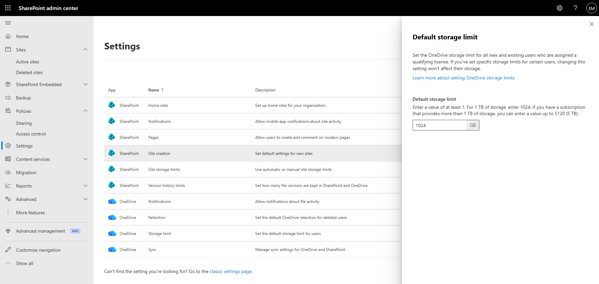

# Manage Storage Limits

## Overview

Storage limits allow administrators to monitor and control the amount of storage consumed by SharePoint sites. Managing site storage helps ensure efficient resource utilization and compliance with organizational requirements.

## Location

**SharePoint admin center → Sites → Active sites**

## Steps

1. Opened the **SharePoint admin center**.
2. Navigated to **Sites → Active sites**.
3. Selected the target SharePoint site.
4. Reviewed the current storage usage.
5. Reviewed the site's storage limit settings.
6. Selected **Storage** or **Edit storage limit** where applicable.
7. Reviewed the allocated storage quota.
8. Updated the storage limit if required.
9. Saved the configuration.
10. Verified that the storage settings were successfully applied.
11. Confirmed that storage usage information was available for monitoring.

## Result

The SharePoint site's storage settings were successfully reviewed and validated. Storage allocation and consumption information were available for administrative monitoring.

### Storage Usage

### Storage Limit Configuration

## Administrative Notes

Storage limits help prevent uncontrolled site growth and support storage planning.

Administrators should monitor storage consumption regularly to identify sites approaching their allocated limits.

Storage allocations should align with business requirements and expected content growth.