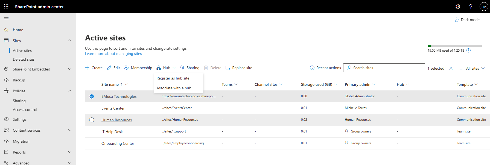
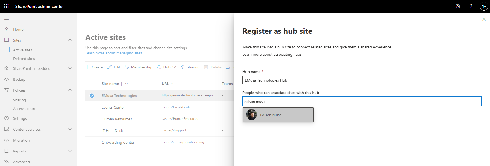
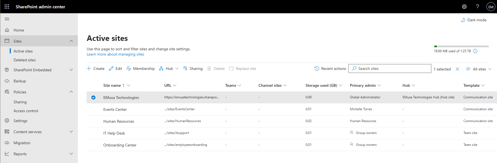

# Manage Hub Sites

## Overview

Hub Sites connect and organize related SharePoint sites under a common navigation structure, branding, and search experience.

## Location

**SharePoint admin center → Sites → Active sites**

## Steps

1. Opened the **SharePoint admin center**.
2. Navigated to **Sites → Active sites**.
3. Selected the target SharePoint site.
4. Opened the Hub Site options.
5. Reviewed the current hub site configuration.
6. Registered the site as a Hub Site where applicable.
7. Configured the hub site name and navigation settings.
8. Reviewed associated site settings.
9. Saved the configuration.
10. Verified that the site was successfully configured as a Hub Site.

## Result

The Hub Site configuration was successfully reviewed and validated. Related SharePoint sites can be organized and associated through a centralized hub structure.

### Hub Site Configuration

### Hub Site Registration

## Administrative Notes

Hub Sites provide common navigation, branding, and search experiences across multiple SharePoint sites.

Site associations should be planned carefully to maintain a logical organizational structure.

Hub Sites do not change site permissions and should be governed separately.