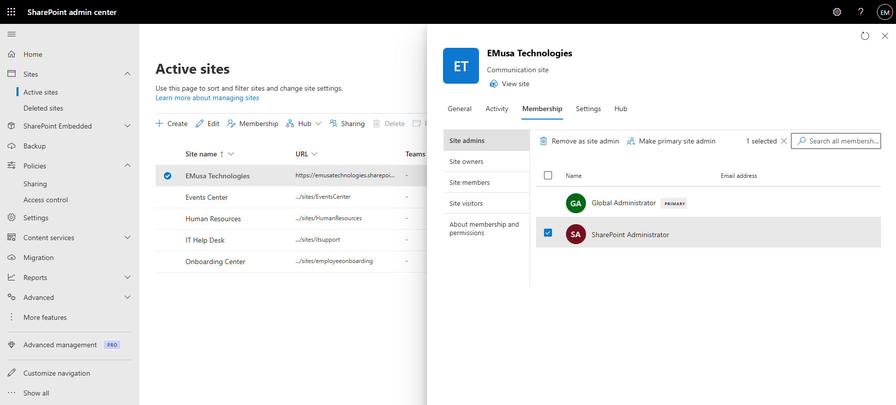
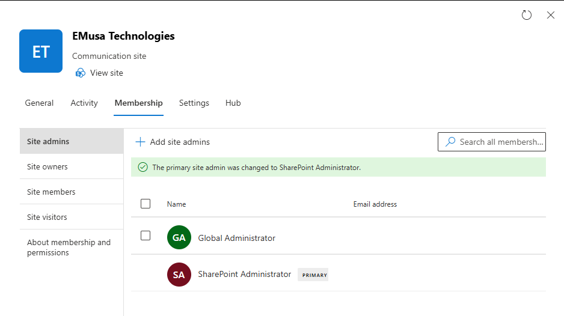

# Manage Site Administration

## Overview

Site Administration enables administrators to manage site ownership, administrative access, membership, governance settings, and overall SharePoint site management.

## Location

**SharePoint admin center → Sites → Active sites → Membership**

## Steps

1. Opened the **SharePoint admin center**.
2. Navigated to **Sites → Active sites**.
3. Selected the target SharePoint site.
4. Reviewed the site details.
5. Opened the **Membership** tab.
6. Reviewed the configured site administrators.
7. Reviewed site owners, members, and visitors.
8. Verified the primary site administrator assignment.
9. Reviewed administrative permissions and access controls.
10. Confirmed that site administration settings were configured appropriately.
11. Verified that administrative roles were correctly assigned.

## Result

Site administration settings were successfully reviewed and validated. Administrative access, site ownership, and membership configuration were confirmed.

### Site Administration Overview

### Site Administrator Configuration

## Administrative Notes

Site administrators have elevated permissions to manage site settings, content, and user access.

Administrative assignments should be reviewed regularly to ensure accountability and proper governance.

Sites should maintain at least one active administrator to prevent ownership and management issues.