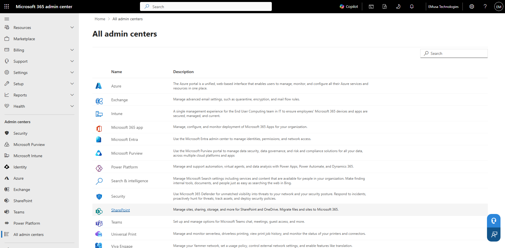
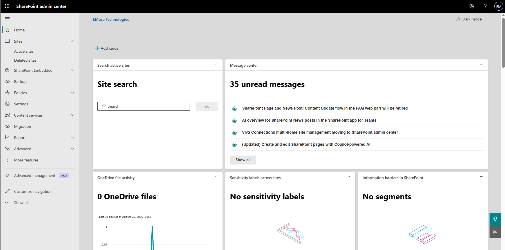
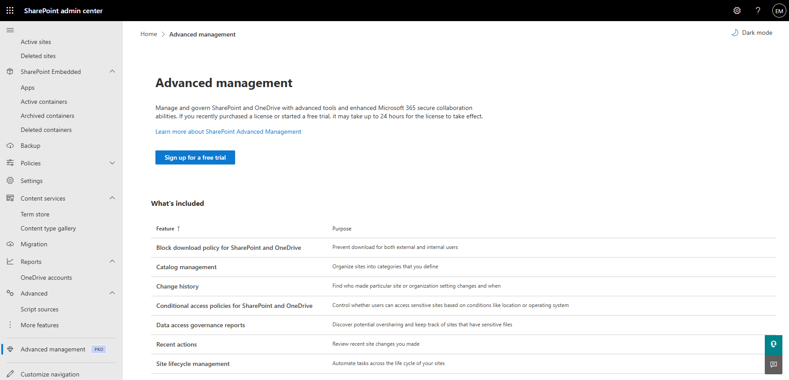

# Use SharePoint Admin Center

## Overview

The SharePoint Admin Center provides centralized management capabilities for SharePoint Online, including site management, sharing policies, storage settings, user access controls, reporting, migration, and governance.

## Location

**Microsoft 365 Admin Center → Admin Centers → SharePoint**

## Steps

1. Opened the **Microsoft 365 Admin Center**.
2. Navigated to **Admin Centers → SharePoint**.
3. Opened the **SharePoint Admin Center**.
4. Reviewed the available administration sections.
5. Reviewed **Active sites** and site management options.
6. Reviewed **Policies** and sharing configuration settings.
7. Reviewed **Access control** settings.
8. Reviewed **Settings** and storage configurations.
9. Reviewed **Content services** options.
10. Reviewed **Migration** capabilities.
11. Reviewed **Reports** available for SharePoint Online.
12. Confirmed that administrative permissions and management features were accessible.

## Result

The SharePoint Admin Center was successfully reviewed and validated. Administrative tools and management capabilities were available for SharePoint Online administration.

### SharePoint Admin Center Overview

### SharePoint Administration Features

## Administrative Notes

The SharePoint Admin Center serves as the primary administration portal for SharePoint Online.

Administrators can manage sites, permissions, sharing settings, storage, migration activities, and reporting from a centralized location.

Administrative settings should be reviewed periodically to ensure compliance with organizational governance and security requirements.