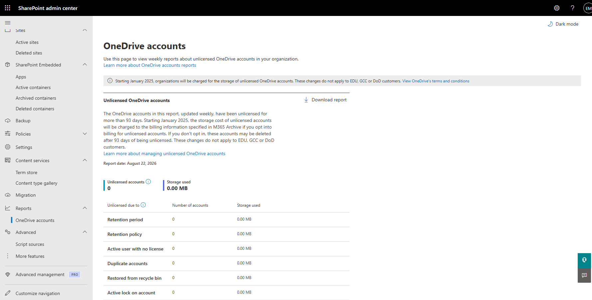

# View SharePoint Reports

## Overview

SharePoint and OneDrive reports provide administrators with visibility into storage consumption, account status, activity trends, and service utilization across Microsoft 365.

## Location

**SharePoint admin center → Reports**

## Steps

1. Opened the **SharePoint admin center**.
2. Navigated to **Reports**.
3. Reviewed the available reporting options.
4. Opened the **OneDrive accounts** report.
5. Reviewed unlicensed account information.
6. Reviewed storage consumption metrics.
7. Reviewed retention-related account information.
8. Reviewed duplicate account reporting information.
9. Reviewed account recovery and recycle bin reporting data.
10. Verified that reporting information was available for administrative review.
11. Reviewed the report generation date and available export options.

## Result

Reporting data was successfully reviewed and validated. Administrative reports provided visibility into OneDrive account status, storage usage, and retention-related information.

### Reports Dashboard

### OneDrive Accounts Report

## Administrative Notes

Reports help administrators monitor storage utilization, account activity, retention status, and compliance requirements.

Administrative reports should be reviewed periodically to identify trends, manage storage consumption, and support governance activities.

Report information can be exported and used for operational reviews, auditing, and capacity planning.

