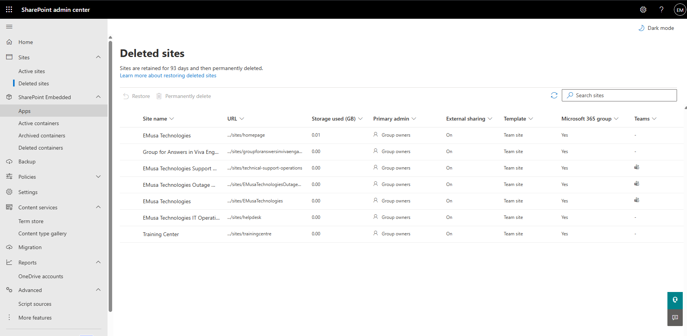
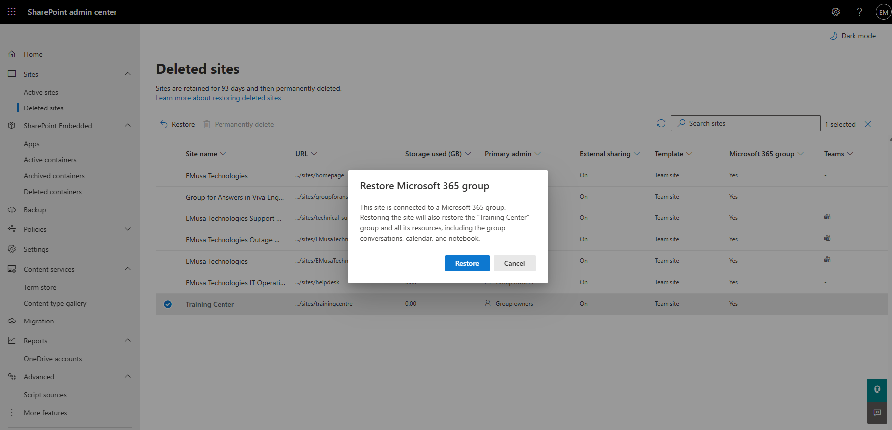
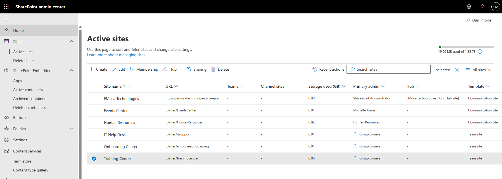

# Restore Deleted Site

## Overview

SharePoint administrators can restore deleted sites during the retention period. Restoring a site returns its content, permissions, libraries, lists, and site configuration.

## Location

**SharePoint admin center → Sites → Deleted sites**

## Steps

1. Opened the **SharePoint admin center**.
2. Navigated to **Sites → Deleted sites**.
3. Reviewed the list of deleted SharePoint sites.
4. Located the site eligible for restoration.
5. Reviewed the site details and deletion information.
6. Selected the deleted site.
7. Selected **Restore**.
8. Confirmed the restoration request.
9. Waited for the restoration process to complete.
10. Navigated to **Sites → Active sites**.
11. Verified that the restored site appeared in the Active Sites list.
12. Opened the restored site.
13. Confirmed that site content and permissions were successfully restored.

## Result

The deleted SharePoint site was successfully restored and returned to the Active Sites list with its associated content and configuration.

### Deleted Site

### Restored Site

## Administrative Notes

Deleted SharePoint sites can be restored during the Microsoft retention period.

Restoring a site returns site content, document libraries, permissions, and configuration settings.

Administrators should verify site functionality and permissions after restoration.