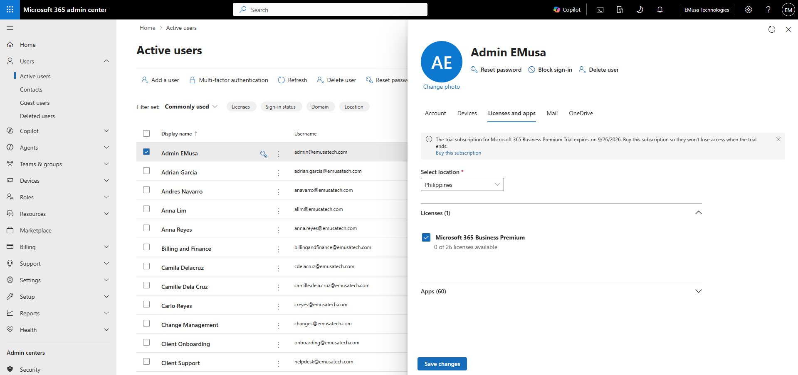
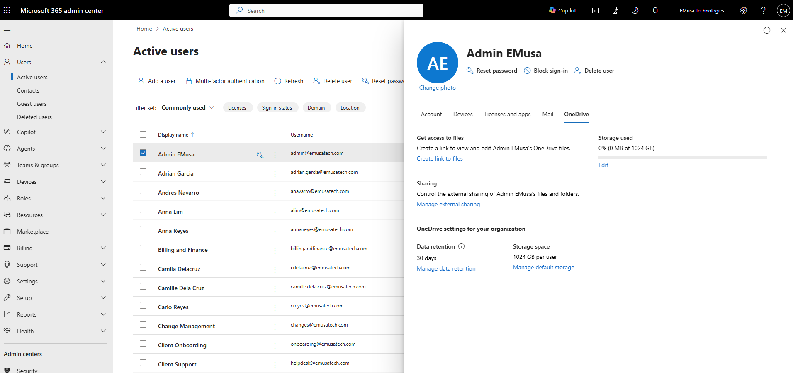
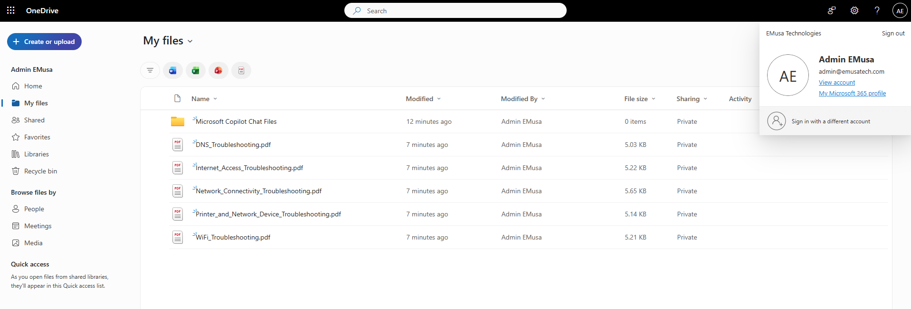

# Provision OneDrive

## Overview

OneDrive provides personal cloud storage for Microsoft 365 users, allowing secure file storage, synchronization, sharing, and collaboration across devices.

## Location

**Microsoft 365 Admin Center → Users → Active users**

**Microsoft 365 App Launcher → OneDrive**

## Steps

1. Opened the **Microsoft 365 Admin Center**.
2. Navigated to **Users → Active users**.
3. Selected the target user account.
4. Opened the **Licenses and apps** tab.
5. Verified that a **Microsoft 365 Business Premium** license was assigned.
6. Opened the **OneDrive** tab.
7. Reviewed the user's OneDrive provisioning status.
8. Signed in using the licensed test user account.
9. Opened **OneDrive** from the Microsoft 365 app launcher.
10. Confirmed that the OneDrive site was successfully provisioned.
11. Verified that the OneDrive URL was accessible.
12. Uploaded test files to OneDrive.
13. Created folders within the OneDrive site.
14. Confirmed that uploaded files and folders were accessible.

## Result

OneDrive was successfully provisioned and validated. The user was able to access the OneDrive site, upload files, create folders, and manage content.

### User OneDrive Information

### OneDrive User Access

## Administrative Notes

OneDrive is automatically provisioned when a licensed Microsoft 365 user accesses the service for the first time.

Users must have an eligible Microsoft 365 license assigned before OneDrive can be provisioned.

Administrators should verify licensing, provisioning status, and site accessibility when troubleshooting OneDrive access issues.