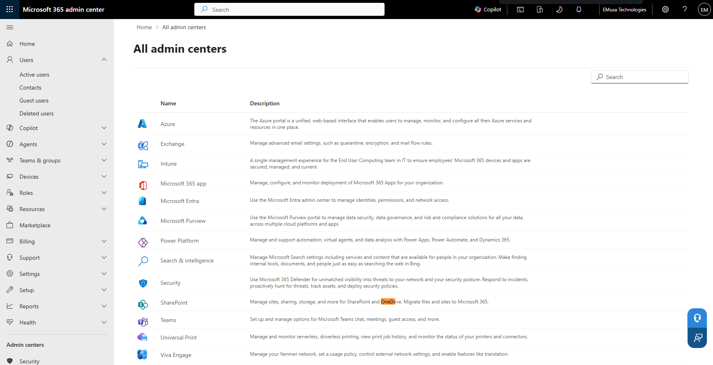
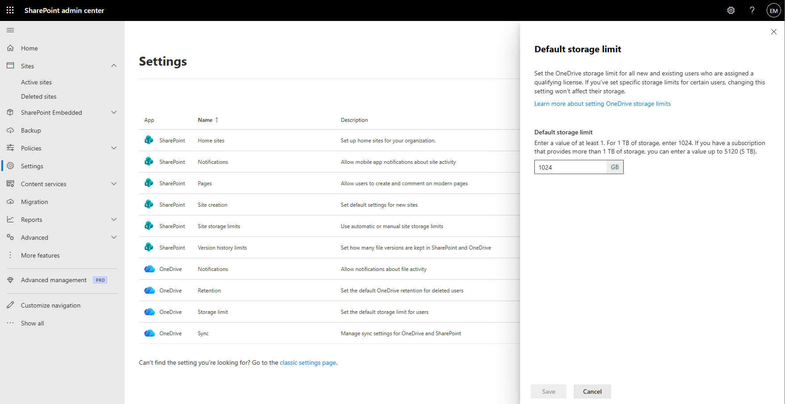

# Manage Storage Quota

## Overview

Storage Quotas allow administrators to review and manage storage allocations for OneDrive and SharePoint Online. In this tenant, OneDrive storage management is administered through the SharePoint Admin Center because a separate OneDrive Admin Center is not available.

## Location

**Microsoft 365 Admin Center → Admin centers → SharePoint**

**SharePoint Admin Center → Settings → Storage limit**

## Steps

1. Opened the **Microsoft 365 Admin Center**.
2. Navigated to **Admin centers**.
3. Reviewed the available administration centers.
4. Confirmed that a separate **OneDrive Admin Center** was not available.
5. Opened the **SharePoint Admin Center**.
6. Navigated to **Settings**.
7. Located the **Storage limit** configuration.
8. Reviewed the current storage allocation settings.
9. Reviewed the default storage quota configuration.
10. Verified the configured storage value.
11. Reviewed available storage management options.
12. Confirmed that OneDrive storage settings are managed through SharePoint Online settings in the tenant.
13. Saved the configuration where applicable.
14. Verified that the storage settings were successfully applied.

## Result

Storage quota settings were successfully reviewed and validated. OneDrive storage management was confirmed to be administered through the SharePoint Admin Center, and the configured storage allocation settings were available for administrative management.

### Available Admin Centers

### Storage Limit Configuration

## Administrative Notes

In this tenant, a dedicated OneDrive Admin Center is not available. OneDrive administration and storage management are performed through the SharePoint Admin Center.

Storage quotas help organizations manage storage consumption across SharePoint Online and OneDrive.

Administrators should periodically review storage allocations and utilization to support growth planning and resource management.