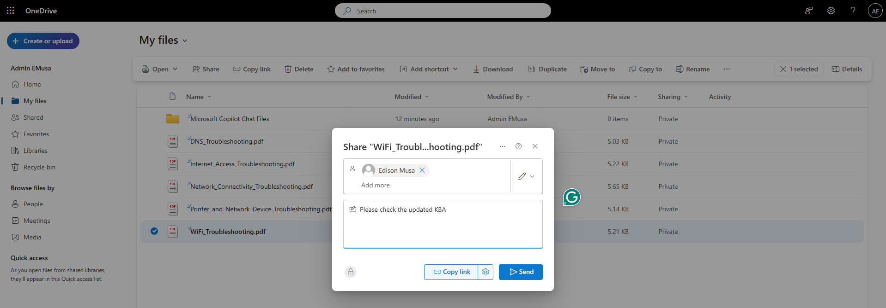
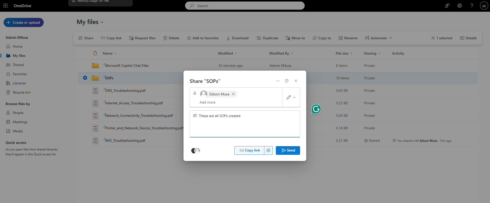
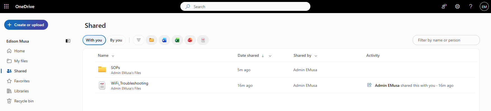

# Manage File and Folder Sharing

## Overview

OneDrive File and Folder Sharing allows users to securely share files and folders with internal users while maintaining access controls and collaboration capabilities.

## Location

**OneDrive → My Files**

## Steps

1. Opened the user's **OneDrive** site.
2. Navigated to **My Files**.
3. Selected a file to be shared.
4. Selected **Share**.
5. Reviewed the available sharing options.
6. Selected the appropriate permission level.
7. Entered the recipient's email address.
8. Added a message where applicable.
9. Selected **Send**.
10. Verified that the sharing invitation was successfully generated.
11. Reviewed the file permissions.
12. Confirmed that the recipient could access the shared file.
13. Repeated the process for a folder.
14. Verified that folder sharing permissions were applied successfully.

## Result

File and folder sharing was successfully configured and validated. Shared content was accessible according to the configured sharing permissions.

### File Sharing Configuration

### Folder Sharing Configuration

### Receiver received the file and folder shared

## Administrative Notes

OneDrive allows users to securely share files and folders with internal users.

Sharing permissions should be reviewed regularly to ensure access follows the principle of least privilege.

Shared content should be monitored to ensure sensitive information is only accessible to authorized users.