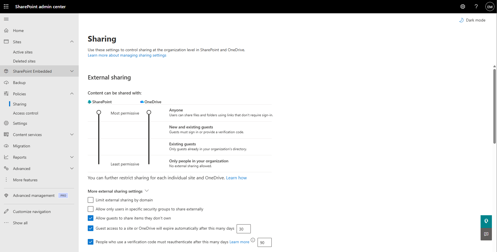
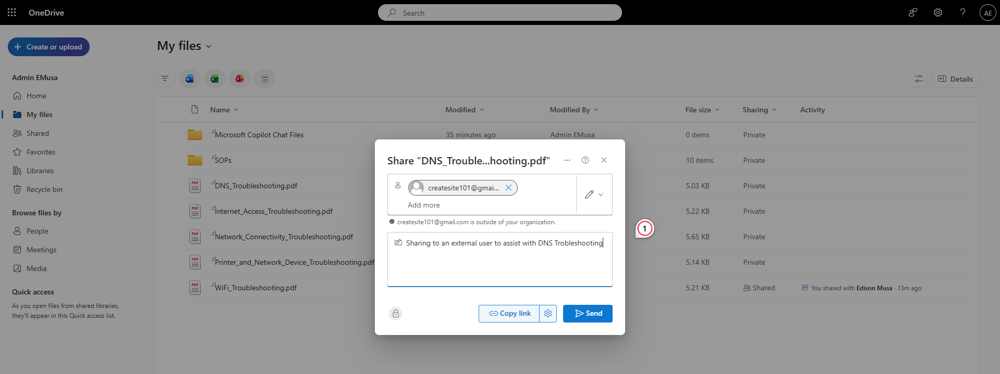

# Manage External Sharing

## Overview

OneDrive external sharing allows users to securely share files and folders with people outside the organization. Sharing availability is controlled by organization-level policies and the permissions selected for each shared item.

## Location

**SharePoint admin center → Policies → Sharing**

**OneDrive → My files → Select file or folder → Share**

## Steps

1. Opened the **SharePoint admin center**.
2. Navigated to **Policies → Sharing**.
3. Reviewed the organization-level OneDrive sharing settings.
4. Confirmed that external sharing was enabled.
5. Signed in using the licensed test user account.
6. Opened **OneDrive** from the Microsoft 365 app launcher.
7. Navigated to **My files**.
8. Selected a file or folder for external sharing.
9. Selected **Share**.
10. Opened the sharing link settings.
11. Selected **Specific people**.
12. Entered the external recipient's email address.
13. Selected the appropriate viewing or editing permission.
14. Sent the sharing invitation.
15. Confirmed that the external recipient could access the shared content.
16. Reviewed the shared item's **Manage access** settings.

## Result

OneDrive external sharing was successfully configured and validated. The test user shared content with an external recipient, and access was granted according to the selected permissions.

### External Sharing Configuration

### External Access Granted

## Administrative Notes

OneDrive organization-level sharing settings are managed through the SharePoint admin center because there is no separate OneDrive admin center in this tenant.

External sharing should use **Specific people** when access must be limited to identified recipients.

External access and sharing links should be reviewed periodically. Access should be removed when collaboration is complete or no longer required.