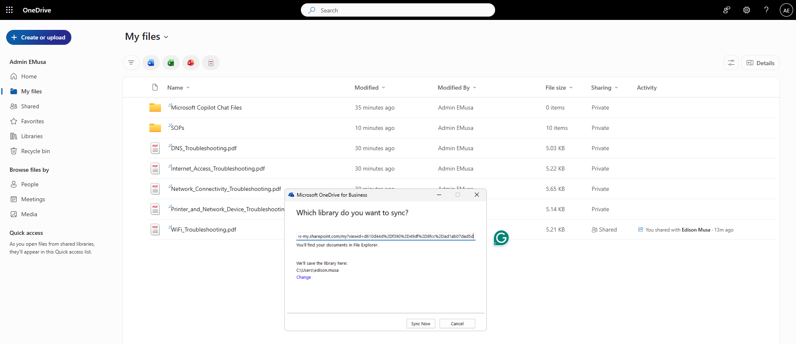
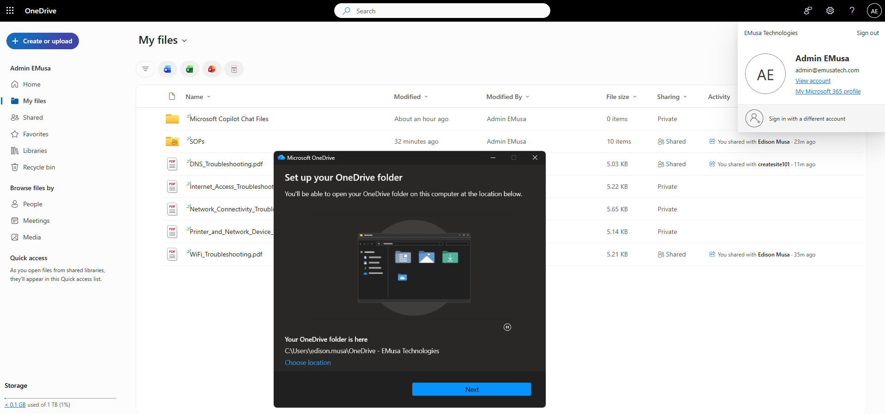
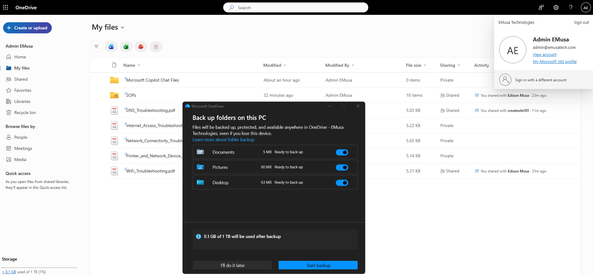
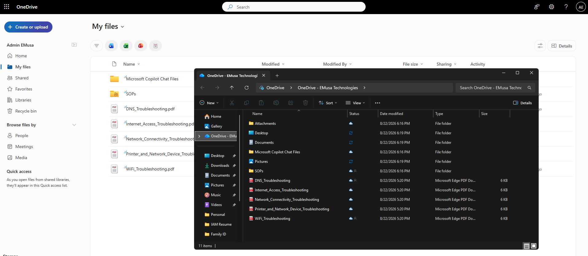

# Manage Sync Client

## Overview

The OneDrive Sync Client enables users to synchronize files and folders between OneDrive, SharePoint Online, and local devices for offline access and seamless collaboration.

## Location

**OneDrive → Settings → Sync**

**Windows System Tray → OneDrive**

## Steps

1. Signed in using the test user account.
2. Opened **OneDrive** from the Microsoft 365 app launcher.
3. Verified that files and folders were available in OneDrive.
4. Opened the **OneDrive Sync Client** on the local device.
5. Confirmed that the user was signed in to the sync client.
6. Reviewed the synchronization status.
7. Verified that OneDrive files were syncing successfully.
8. Uploaded a test file to OneDrive.
9. Confirmed that the file synchronized to the local device.
10. Created a local test file within the OneDrive folder.
11. Verified that the file synchronized to OneDrive.
12. Reviewed synchronization health and status notifications.
13. Confirmed that file synchronization was functioning correctly.

## Result

The OneDrive Sync Client was successfully configured and validated. Files synchronized successfully between the local device and OneDrive.

### OneDrive Sync Client

### Successful File Synchronization

## Administrative Notes

The OneDrive Sync Client allows users to access files online and offline while maintaining synchronization between devices and Microsoft 365.

Administrators should verify synchronization status when troubleshooting file access and synchronization issues.

Users should ensure that the OneDrive Sync Client remains signed in and updated to the latest supported version.