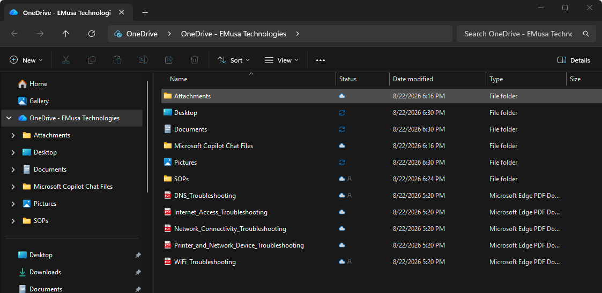

# Configure Known Folder Move

## Overview

Known Folder Move (KFM) redirects commonly used Windows folders such as Desktop, Documents, and Pictures to OneDrive, helping protect user data and enable automatic cloud synchronization.

## Location

**Microsoft OneDrive Sync Client → Settings → Sync and backup → Manage backup**

## Steps

1. Opened the Microsoft OneDrive Sync Client.
2. Reviewed the OneDrive synchronization settings.
3. Opened the synchronized OneDrive folder in File Explorer.
4. Verified that Desktop, Documents, and Pictures folders were available within OneDrive.
5. Confirmed that Known Folder Move was configured successfully.
6. Reviewed the synchronization status of the protected folders.
7. Verified that files within the protected folders were synchronized to OneDrive.
8. Confirmed successful access to the protected folders through File Explorer.

## Result

Known Folder Move was successfully configured and validated. Selected Windows folders were protected by OneDrive and synchronized automatically to Microsoft 365.

### Known Folder Move Configuration

## Administrative Notes

Known Folder Move helps protect user data by automatically synchronizing Desktop, Documents, and Pictures folders to OneDrive.

Administrators can use Known Folder Move to improve data protection, device recovery, and user productivity.

Users should verify that important files are stored within protected folders to ensure successful synchronization and backup.