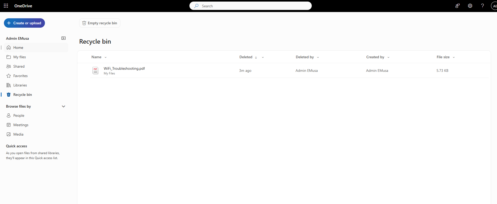
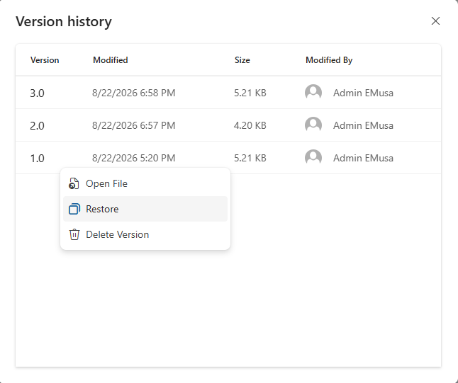

# Restore Files

## Overview

OneDrive allows users to restore deleted files and recover previous file versions. This helps protect against accidental deletions, unwanted modifications, and data loss.

## Location

**OneDrive → Recycle Bin**

**OneDrive → File Options → Version History**

## Steps

1. Opened **Microsoft OneDrive**.
2. Accessed the **Recycle Bin** from the left navigation pane.
3. Reviewed the list of deleted files available for recovery.
4. Selected the deleted file to be restored.
5. Clicked **Restore**.
6. Verified that the file was returned to its original location.
7. Opened an existing file stored in OneDrive.
8. Accessed **Version History** for the selected file.
9. Reviewed the available file versions.
10. Selected the required file version.
11. Clicked **Restore**.
12. Verified that the previous version was successfully restored.
13. Confirmed that file recovery and version restoration were functioning correctly.

## Result

Files were successfully restored from the OneDrive Recycle Bin, and previous file versions were recovered using Version History. OneDrive file recovery functionality was validated successfully.

### Restore Deleted File

### Restore Previous Version

## Administrative Notes

OneDrive Recycle Bin allows users to recover deleted files within the configured retention period.

Version History provides protection against accidental file changes by enabling restoration of previous versions.

Administrators should familiarize users with file recovery capabilities to reduce the risk of permanent data loss and support self-service recovery scenarios.