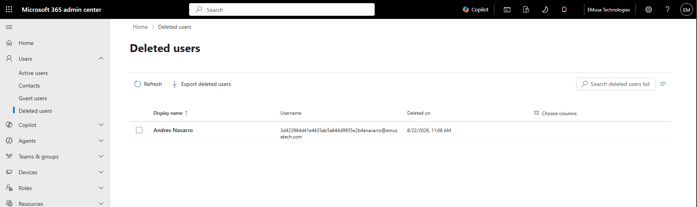
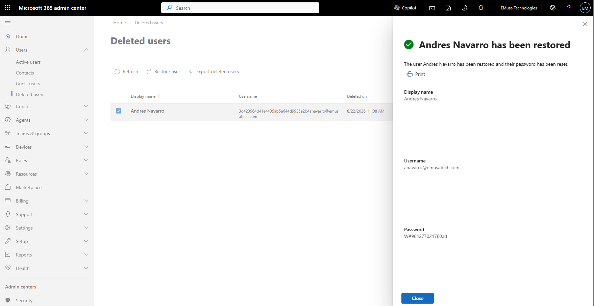
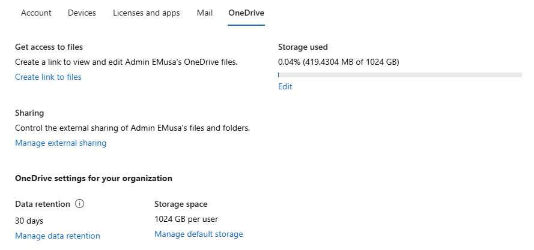

# Restore Deleted User OneDrive

## Overview

When a Microsoft 365 user account is deleted, the associated OneDrive remains available for a retention period. Administrators can restore access to the user's OneDrive to recover files and transfer ownership when necessary.

## Location

**Microsoft 365 Admin Center → Users → Deleted Users**

**Microsoft 365 Admin Center → Users → Active Users → OneDrive**

## Steps

1. Signed in to the Microsoft 365 Admin Center using an administrator account.
2. Navigated to **Users**.
3. Reviewed the list of deleted users.
4. Verified that the deleted user account was within the retention period.
5. Restored the deleted user account.
6. Confirmed that the user account was successfully restored.
7. Navigated to **Active Users**.
8. Selected the restored user account.
9. Opened the user's OneDrive administration options.
10. Verified that the OneDrive site was accessible.
11. Reviewed the files and folders stored within the OneDrive site.
12. Confirmed that OneDrive content was successfully recovered.
13. Validated administrative access to the restored OneDrive.

## Result

The deleted user's OneDrive was successfully restored and validated. Files and folders remained accessible within the retention period, allowing administrative recovery and data access.

### Restore Deleted User Account

### Access Restored OneDrive

## Administrative Notes

Deleted user OneDrive sites remain available for a retention period based on Microsoft 365 configuration settings.

Administrators can restore user access or retrieve business-critical files before permanent deletion occurs.

Organizations should establish recovery procedures to ensure timely restoration and protection of user data.