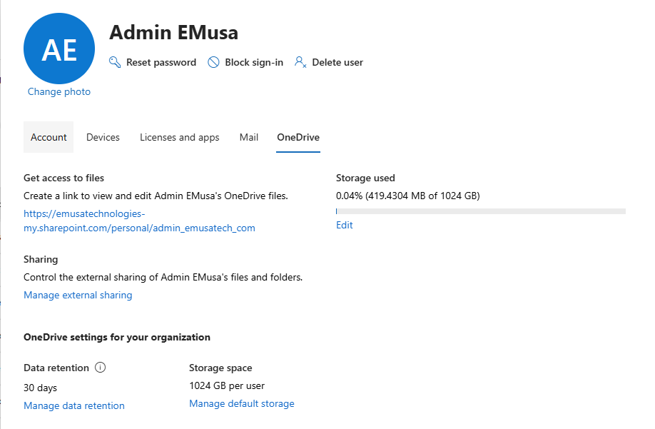
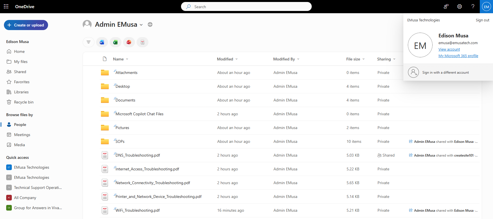

# Manage OneDrive Storage

## Overview

OneDrive storage management allows administrators to monitor storage consumption, review usage, access user files, and ensure sufficient capacity is available for business data.

## Location

**Microsoft 365 Admin Center → Users → Active Users → Select User → OneDrive**

## Steps

1. Signed in to the Microsoft 365 Admin Center using an administrator account.
2. Navigated to **Users**.
3. Selected **Active Users**.
4. Selected the target user account.
5. Opened the **OneDrive** tab.
6. Reviewed the user's current **Storage used** information.
7. Verified the allocated OneDrive storage quota.
8. Selected **Edit** and reviewed available storage settings.
9. Verified that storage allocation met organizational requirements.
10. Selected **Create link to files**.
11. Opened the generated OneDrive link.
12. Verified access to the user's OneDrive files and folders.
13. Reviewed the contents stored within OneDrive.
14. Confirmed that files were accessible through the administrative access link.
15. Validated OneDrive storage and file access functionality successfully.

## Result

OneDrive storage allocation, usage, and administrative file access were successfully reviewed and validated. Storage information was accessible, and user files were available through the generated OneDrive access link.

### Review OneDrive Storage Information

### Create Link to Files

### Access User OneDrive Files

## Administrative Notes

Administrators can review storage utilization and storage quotas directly from the Microsoft 365 Admin Center.

The **Create link to files** feature provides temporary administrative access to a user's OneDrive content for troubleshooting, support, and recovery purposes.

Storage utilization should be monitored regularly to support capacity planning and ensure users have sufficient space for business data.