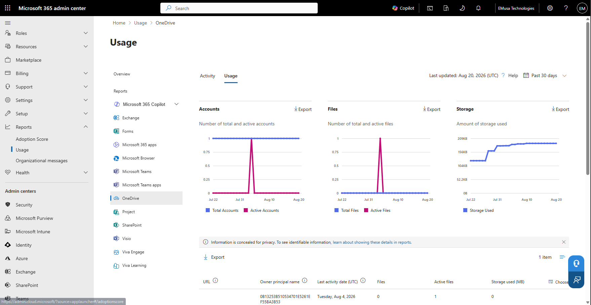
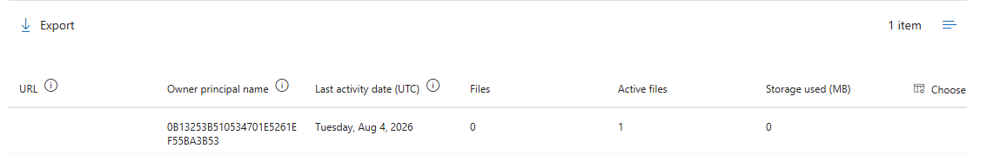

# Generate OneDrive Usage Report

## Overview

OneDrive reporting provides administrators with visibility into user activity, storage consumption, file usage, and overall OneDrive adoption across the Microsoft 365 environment.

## Location

**Microsoft 365 Admin Center → Reports → Usage**

**Microsoft 365 Admin Center → Reports → OneDrive**

## Steps

1. Signed in to the Microsoft 365 Admin Center using an administrator account.
2. Navigated to **Reports**.
3. Selected **Usage**.
4. Opened the **OneDrive** usage reports.
5. Reviewed active OneDrive users.
6. Reviewed file activity statistics.
7. Reviewed storage consumption metrics.
8. Reviewed synchronization activity information.
9. Verified OneDrive usage trends for the organization.
10. Selected the available reporting period.
11. Generated the OneDrive usage report.
12. Reviewed report details and metrics.
13. Exported the report for administrative analysis.
14. Verified that report data was successfully generated and available for review.
15. Confirmed successful access to OneDrive reporting information.

## Result

The OneDrive usage report was successfully generated and reviewed. User activity, storage utilization, and adoption metrics were available for administrative monitoring and analysis.

### Access OneDrive Reports

### Export OneDrive Usage Report

## Administrative Notes

OneDrive reports provide visibility into user adoption, activity, synchronization, and storage utilization across the Microsoft 365 environment.

Administrators should review OneDrive reports regularly to identify usage trends, monitor storage growth, and support capacity planning.

Exported reports can be used for auditing, operational reviews, and management reporting.