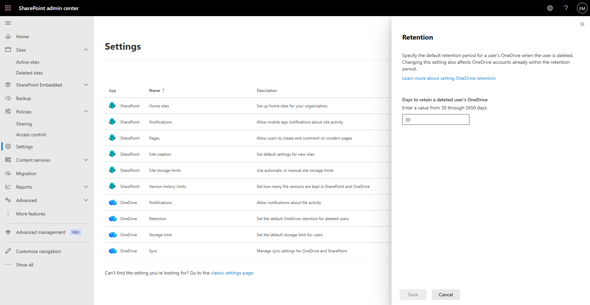
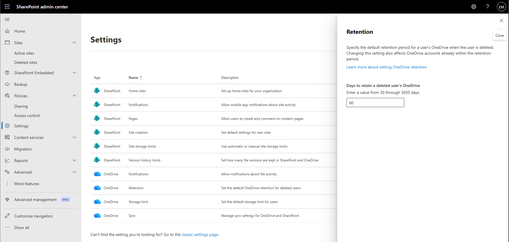

# Manage OneDrive Retention

## Overview

OneDrive retention settings determine how long a user's OneDrive data is retained after the user account is deleted. Administrators can configure retention periods to support compliance, auditing, data recovery, and business continuity requirements.

## Location

**SharePoint Admin Center → Settings → OneDrive Retention**

## Steps

1. Signed in to the Microsoft 365 Admin Center using an administrator account.
2. Opened the **SharePoint Admin Center**.
3. Navigated to **Settings**.
4. Located the **OneDrive Retention** configuration.
5. Reviewed the current retention period for deleted users.
6. Verified the number of days configured for OneDrive retention.
7. Confirmed that the retention period met organizational requirements.
8. Reviewed how OneDrive content would be preserved after user account deletion.
9. Validated that deleted user OneDrive data would remain recoverable during the configured retention period.
10. Confirmed that the retention configuration was applied successfully.

## Result

The OneDrive retention settings were successfully reviewed and validated. Deleted user OneDrive data will remain available during the configured retention period to support recovery and compliance requirements.

### Review OneDrive Retention Settings

### Verify Retention Configuration

## Administrative Notes

OneDrive retention settings determine how long user files remain available after user account deletion.

Organizations should configure retention periods according to business, legal, and compliance requirements.

Retention settings provide administrators with a recovery window for restoring or accessing deleted user OneDrive data before permanent removal.