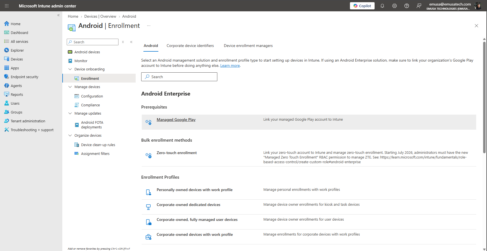
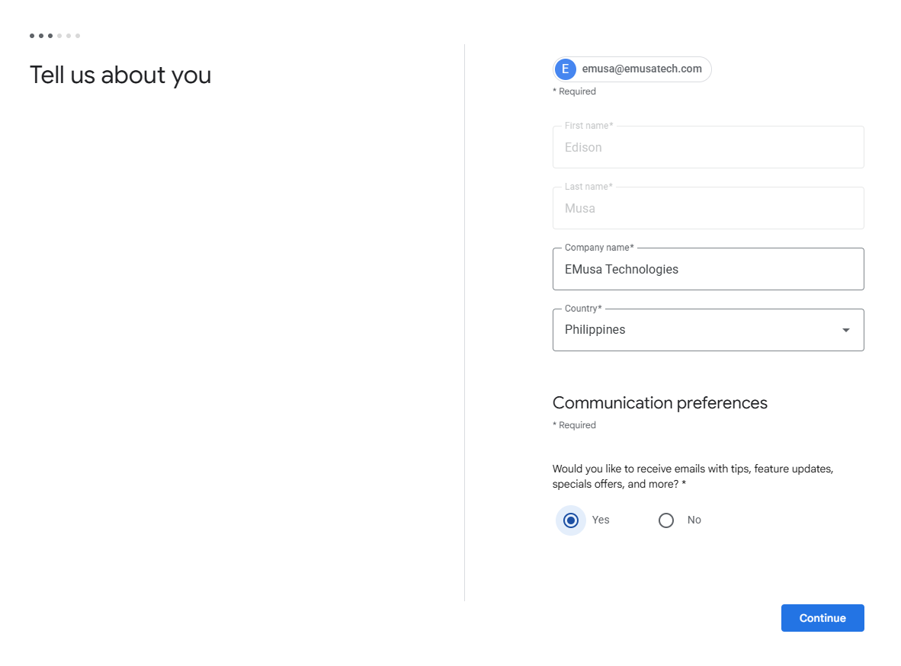
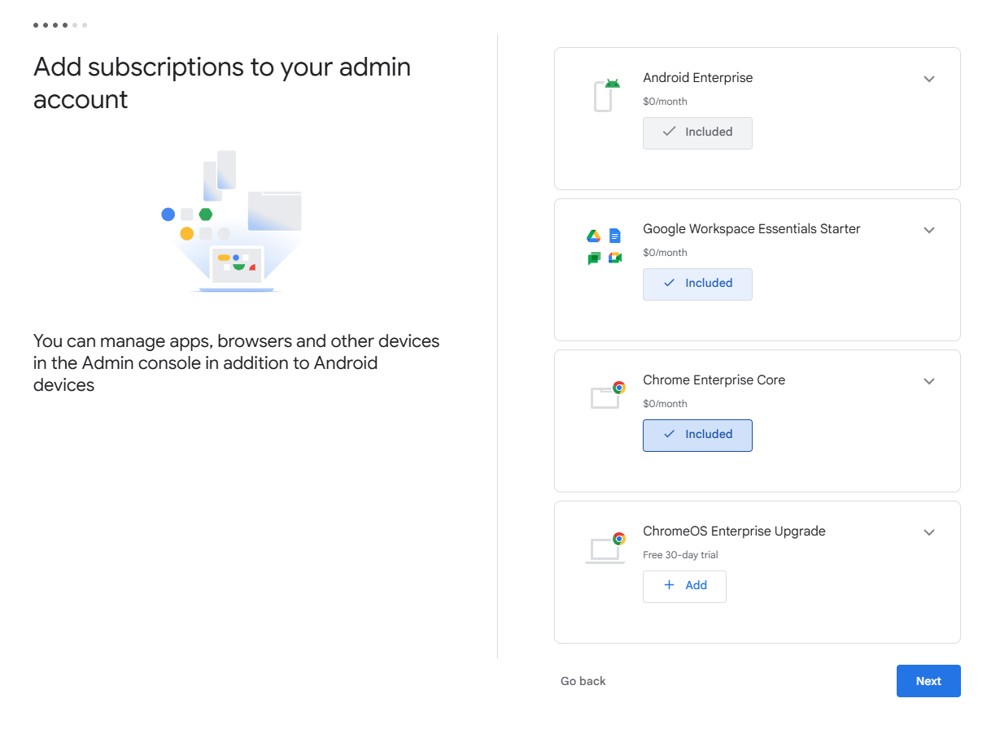
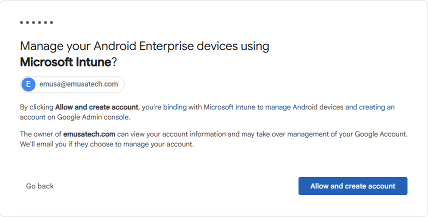
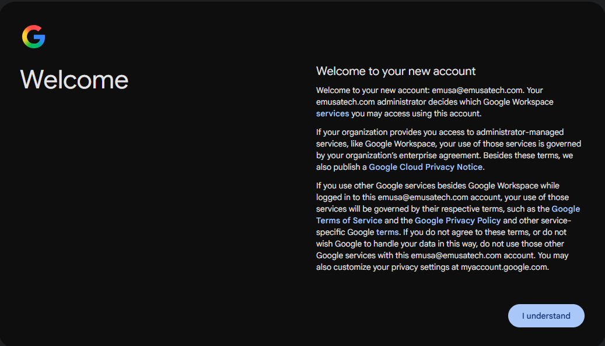
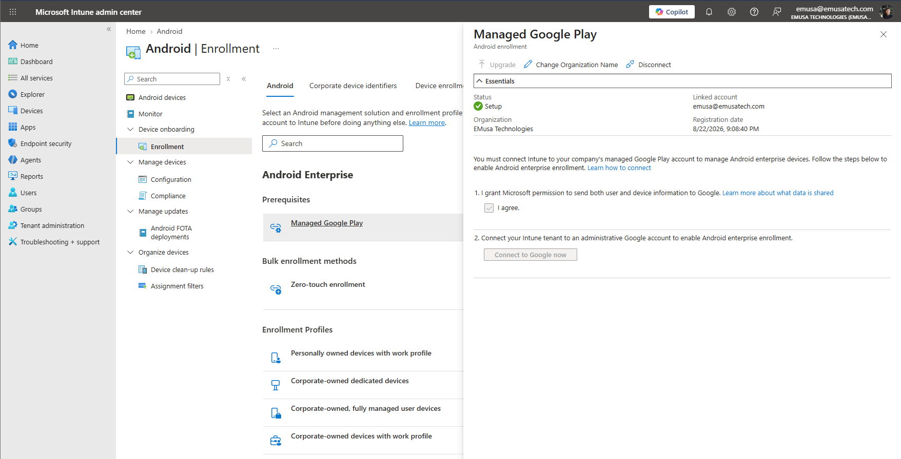

# Configure Managed Google Play

## Overview

Managed Google Play integrates Android Enterprise with Microsoft Intune, enabling administrators to manage Android applications, configure enrollment profiles, and support Android device enrollment within the organization.

## Location

**Microsoft Intune Admin Center → Devices → Enrollment → Android → Managed Google Play**

## Steps

1. Signed in to the Microsoft Intune Admin Center using an administrator account.
2. Navigated to **Devices**.
3. Selected **Enrollment**.
4. Opened **Android** enrollment settings.
5. Selected **Managed Google Play**.
6. Selected **Connect**.
7. Signed in using the organization's Google account.
8. Reviewed the Android Enterprise authorization requirements.
9. Accepted the permissions required to integrate Google services with Microsoft Intune.
10. Completed the Managed Google Play connection process.
11. Waited for the connection status to update.
12. Verified that Managed Google Play displayed a connected status.
13. Reviewed the available Android Enterprise enrollment options.
14. Confirmed that Android Enterprise services were available for device management.

## Result

Managed Google Play was successfully connected to Microsoft Intune. Android Enterprise services were enabled, allowing administrators to manage Android applications and configure Android enrollment scenarios.

### Access Managed Google Play

### Connect Managed Google Play

### Verify Managed Google Play Connection

## Administrative Notes

Managed Google Play is a required prerequisite for Android Enterprise device management in Microsoft Intune.

Android applications are deployed through Managed Google Play and can be assigned to users and devices from Intune.

Administrators should verify the Managed Google Play connection before configuring Android enrollment profiles or enrolling Android devices.