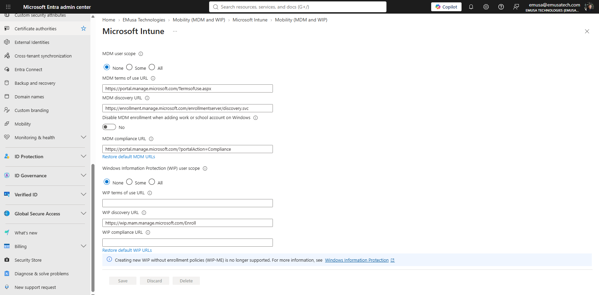
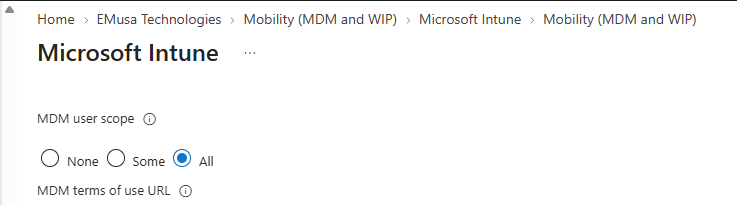

# Configure Intune Enrollment

## Overview

Microsoft Intune enrollment configuration enables organizations to automatically enroll supported devices for management. Administrators must configure Mobile Device Management (MDM) settings before users can enroll devices into Intune.

## Location

**Microsoft Entra Admin Center → Mobility (MDM and WIP) → Microsoft Intune**

## Steps

1. Signed in to the Microsoft Entra Admin Center using an administrator account.
2. Navigated to **Mobility (MDM and WIP)**.
3. Selected **Microsoft Intune**.
4. Reviewed the current Mobile Device Management (MDM) configuration.
5. Verified the Microsoft Intune enrollment settings.
6. Located the **MDM user scope** configuration.
7. Changed the **MDM user scope** from **None** to **All**.
8. Reviewed the MDM Terms of Use URL.
9. Reviewed the MDM Discovery URL.
10. Verified that **Disable MDM enrollment when adding work or school account on Windows** was set to **No**.
11. Reviewed the MDM Compliance URL.
12. Selected **Save** to apply the configuration.
13. Confirmed that the Intune enrollment settings were updated successfully.
14. Validated that users were eligible for automatic Intune enrollment.

## Result

Microsoft Intune enrollment was successfully configured. Users assigned eligible licenses can now enroll supported devices into Microsoft Intune for management.

### Review Intune Enrollment Settings

### Configure MDM User Scope

### Save Intune Enrollment Configuration

## Administrative Notes

The MDM user scope determines which users are automatically enrolled into Microsoft Intune.

Setting the MDM user scope to **All** enables automatic enrollment for all licensed users.

Administrators should verify licensing, enrollment restrictions, and device platform support before onboarding devices into Microsoft Intune.