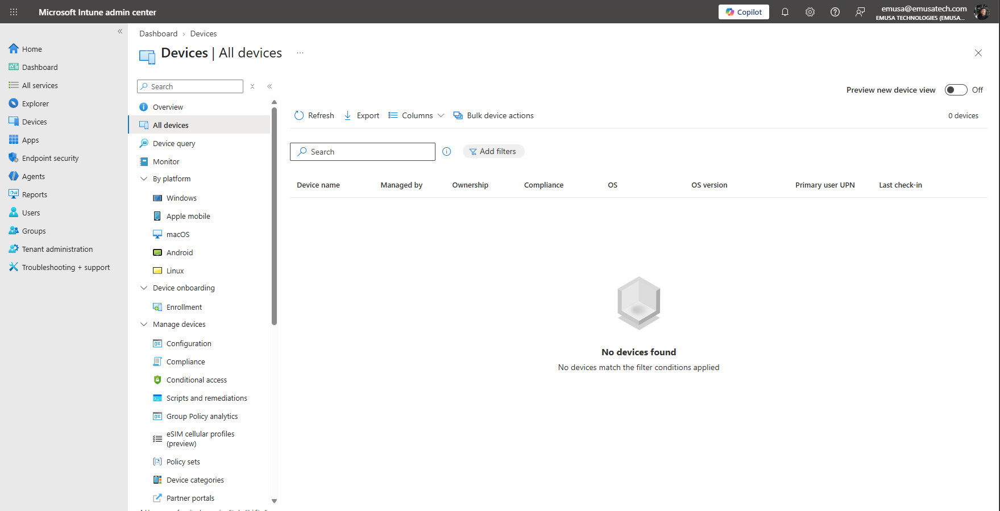
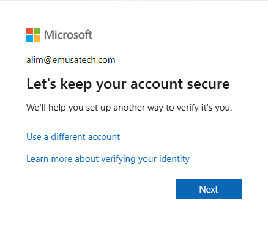

# Enroll Device

## Overview

Device enrollment enables devices to be registered and managed through Microsoft Intune. Enrolled devices can receive policies, applications, security configurations, and updates from the organization.

## Location

**Microsoft Intune Admin Center → Devices → All Devices**

## Steps

1. Signed in to the Microsoft Intune Admin Center using an administrator account.
2. Navigated to **Devices**.
3. Selected **All Devices**.
4. Reviewed the device inventory.
5. Verified the current enrollment status of managed devices.
6. Reviewed device management options available within Intune.
7. Examined available device platforms including Windows, iOS, Android, Linux, and macOS.
8. Reviewed enrollment and device management settings.
9. Validated access to Intune device management features.
10. Confirmed readiness for device enrollment and management activities.

## Result

The Microsoft Intune device management interface was successfully reviewed and validated. The environment was confirmed to be ready for device enrollment and management operations.

### Review Intune Device Inventory

## Administrative Notes

The **All Devices** page provides administrators with visibility into devices enrolled in Microsoft Intune.

Devices must be enrolled before compliance policies, configuration profiles, applications, and security settings can be deployed.

Administrators should regularly review device inventory to monitor enrollment status and device management activities.

