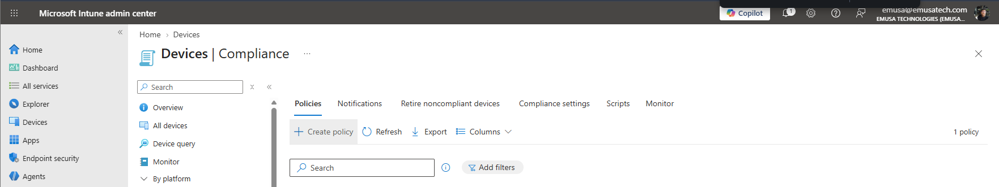
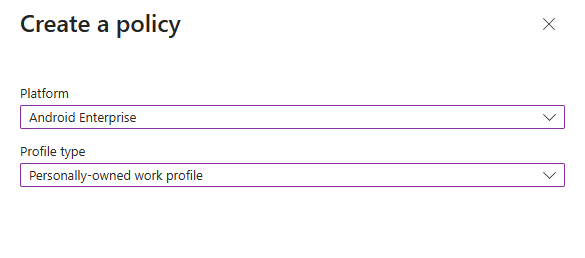
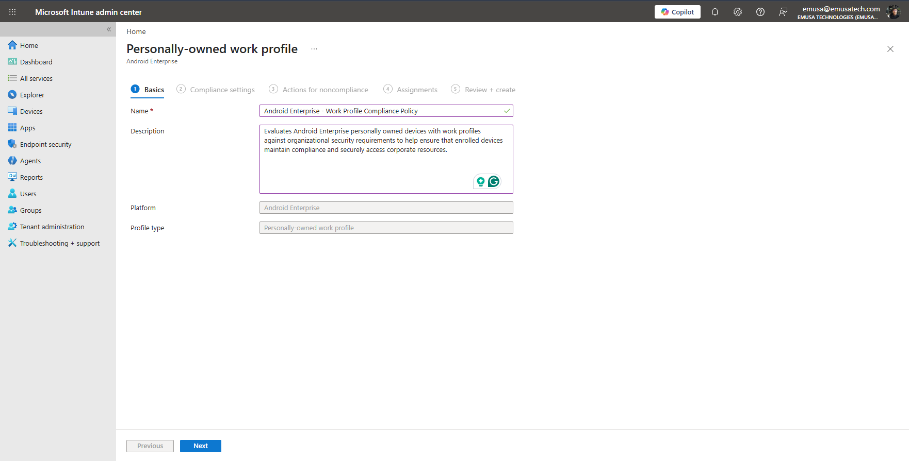
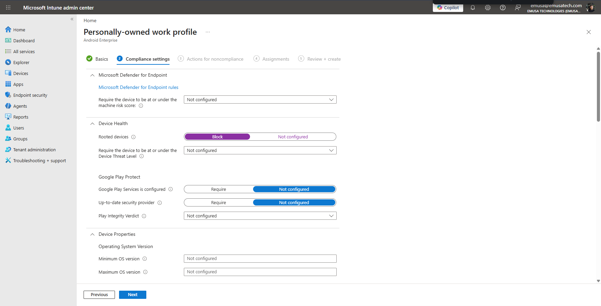
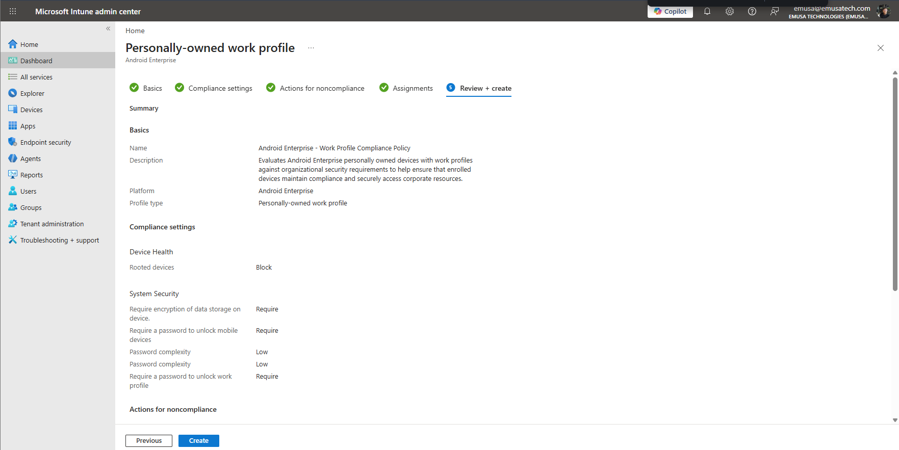
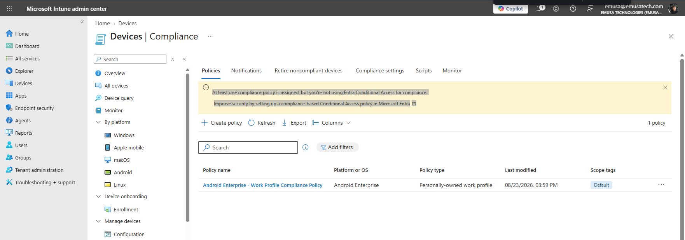

# Manage Device Compliance

## Overview

Device compliance policies help organizations define the rules and requirements that devices must meet before they can access corporate resources. Microsoft Intune evaluates devices against compliance policies and reports their compliance status to administrators.

## Location

**Microsoft Intune Admin Center → Devices → Compliance**

## Steps

1. Signed in to the Microsoft Intune Admin Center using an administrator account.
2. Navigated to **Devices**.
3. Selected **Compliance**.
4. Selected **Policies**.
5. Clicked **Create Policy**.
6. Selected **Android Enterprise** as the platform.
7. Selected **Personally-owned work profile** as the profile type.
8. Clicked **Create**.
9. Entered the policy name **Android Enterprise - Work Profile Compliance Policy**.
10. Entered the policy description.
11. Configured the required compliance requirements.
12. Reviewed device health settings.
13. Reviewed system security settings.
14. Configured actions for noncompliant devices.
15. Assigned the compliance policy to the target users or groups.
16. Selected **Create** to deploy the policy.
17. Verified that the compliance policy was successfully created.
18. Reviewed the policy assignment status.
19. Confirmed that Android Enterprise devices with a work profile would be evaluated against the configured compliance requirements.

## Result

An Android Enterprise compliance policy for personally owned devices with a work profile was successfully created and assigned. Microsoft Intune is now configured to evaluate enrolled Android devices against the organization's compliance requirements.

### Select Android Enterprise Platform

### Configure Compliance Settings

### Verify Compliance Policy Creation

## Administrative Notes

Device compliance policies help ensure that managed devices meet organizational security requirements before accessing corporate resources.

Android Enterprise compliance policies can be applied specifically to personally owned devices with a work profile, corporate-owned devices, or fully managed devices.

Compliance policies can be integrated with Microsoft Entra Conditional Access to restrict access from noncompliant devices.

Conditional Access was not configured as part of this exercise.

Administrators should review compliance reports regularly and update policy requirements to align with organizational security standards.