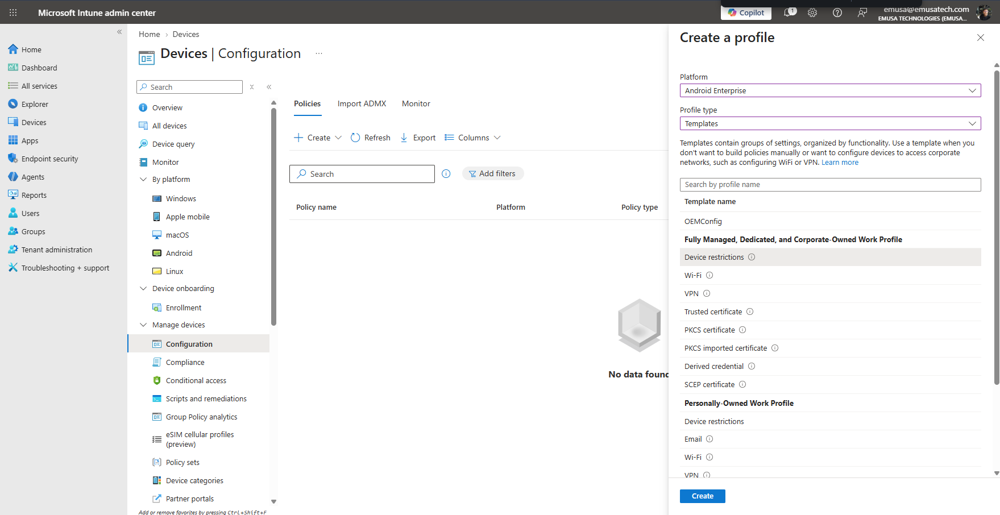
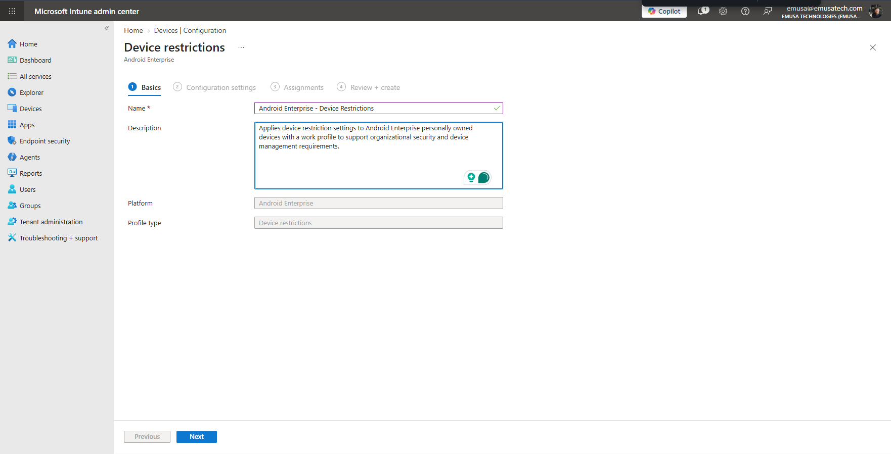
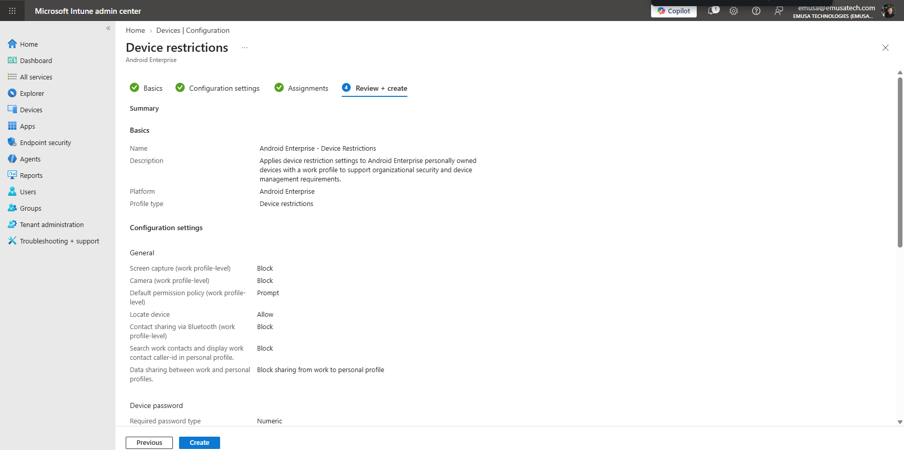
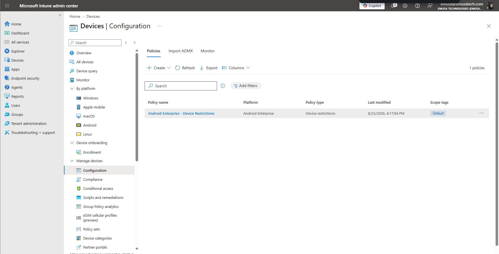

# Manage Configuration Profiles

## Overview

Configuration profiles allow administrators to deploy and enforce device settings across managed devices. Microsoft Intune configuration profiles help standardize device configurations, improve security, and simplify device management.

## Location

**Microsoft Intune Admin Center → Devices → Configuration**

## Steps

1. Signed in to the Microsoft Intune Admin Center using an administrator account.
2. Navigated to **Devices**.
3. Selected **Configuration**.
4. Selected **Create**.
5. Chose **Android Enterprise** as the platform.
6. Selected an appropriate profile type.
7. Entered the profile name and description.
8. Reviewed the available configuration settings.
9. Configured the required device settings.
10. Reviewed the settings configuration.
11. Assigned the configuration profile to the target users or groups.
12. Selected **Create** to deploy the profile.
13. Verified that the configuration profile was successfully created.
14. Reviewed the profile assignment status.
15. Confirmed that the profile was available for deployment to enrolled Android devices.

## Result

An Android Enterprise configuration profile was successfully created and assigned. Microsoft Intune is now configured to deploy standardized device settings to managed Android devices.

### Select Android Enterprise Platform

### Configure Profile Settings

### Verify Configuration Profile Creation

## Administrative Notes

Configuration profiles allow administrators to enforce organizational settings and standardize device configurations.

Android Enterprise configuration profiles can be used to manage device restrictions, security settings, Wi-Fi configurations, certificates, and other device settings.

Administrators should thoroughly test configuration profiles before deploying them to production users and devices.