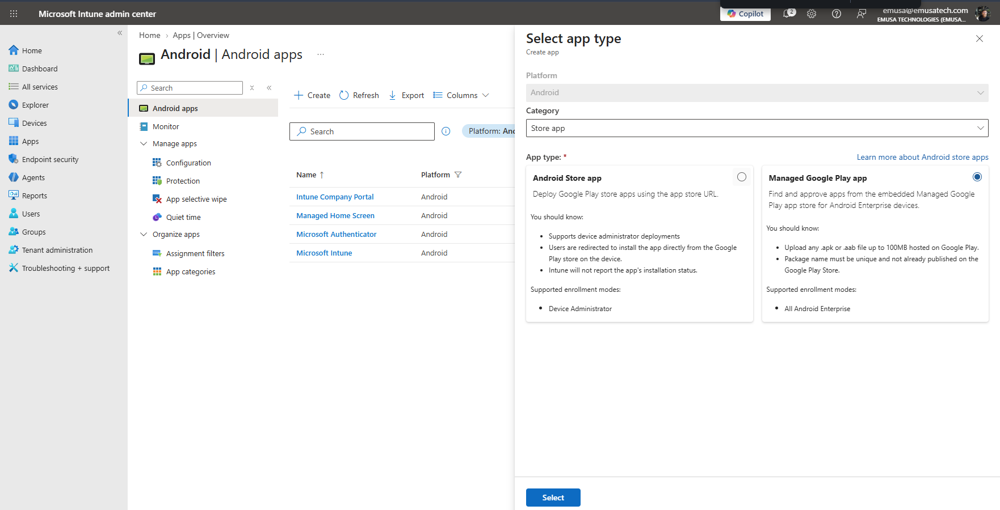
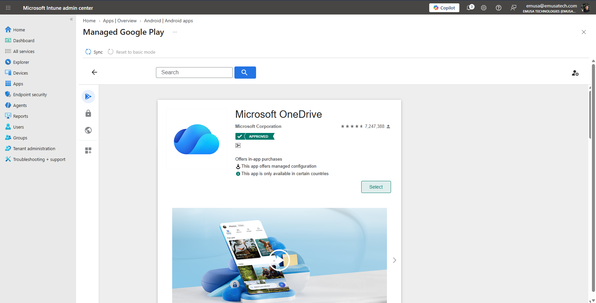
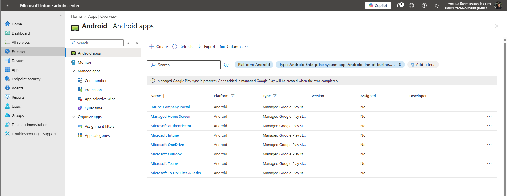
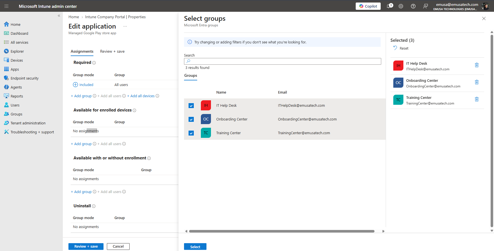
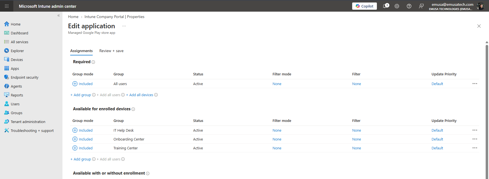
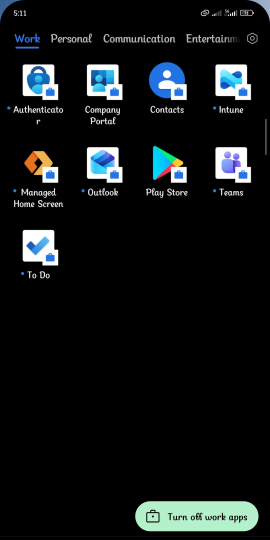

# Deploy Applications

## Overview

Application deployment allows administrators to distribute and manage applications on enrolled devices through Microsoft Intune. Managed Google Play integration enables Android applications to be deployed securely to Android Enterprise devices.

## Location

**Microsoft Intune Admin Center → Apps → Android**

**Microsoft Intune Admin Center → Apps → All Apps**

## Steps

1. Signed in to the Microsoft Intune Admin Center using an administrator account.
2. Navigated to **Apps**.
3. Selected **Android**.
4. Clicked **Create**.
5. Selected **Store app** as the category.
6. Selected **Managed Google Play app** as the app type.
7. Opened **Managed Google Play**.
8. Searched for Android applications.
9. Selected the required applications.
10. Approved the applications for organizational use.
11. Synchronized the approved applications with Microsoft Intune.
12. Verified that the applications appeared in the Android app inventory.
13. Opened the application properties.
14. Selected **Assignments**.
15. Clicked **Add group**.
16. Selected the target users or groups.
17. Configured the application as **Available for enrolled devices**.
18. Saved the assignment configuration.
19. Verified that the application assignment was successful.
20. Confirmed that the assigned applications were available through the Android work profile and Company Portal.

## Result

An Android application was successfully added from Managed Google Play and assigned through Microsoft Intune. The application became available for deployment to enrolled Android Enterprise devices.

### Add Managed Google Play Application

### Approve Application

### Configure Application Assignment

### Verify Application Deployment

## Administrative Notes

Managed Google Play applications must be approved before they can be deployed through Microsoft Intune.

Applications can be assigned as required, available, or unavailable depending on organizational requirements.

Administrators should test application deployments before assigning applications to large groups of users.