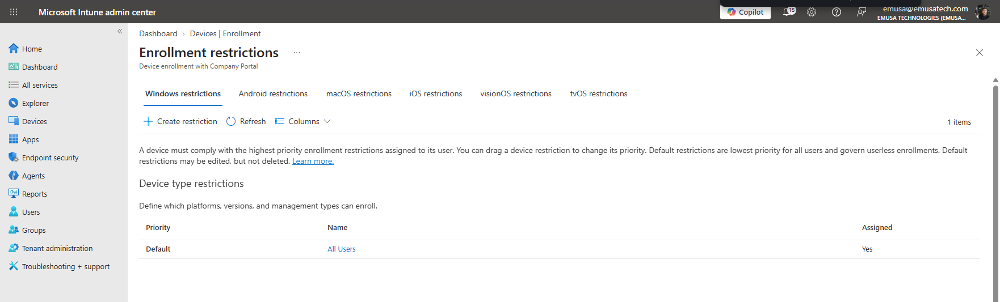
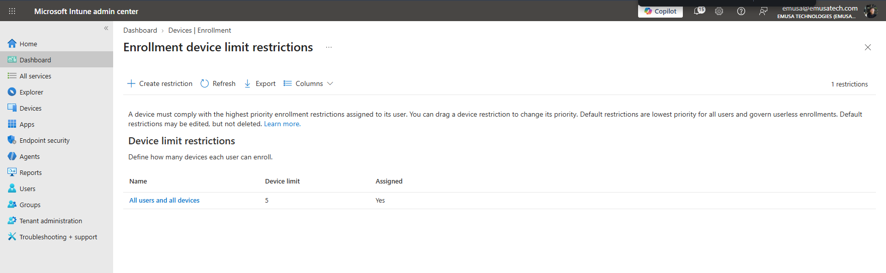
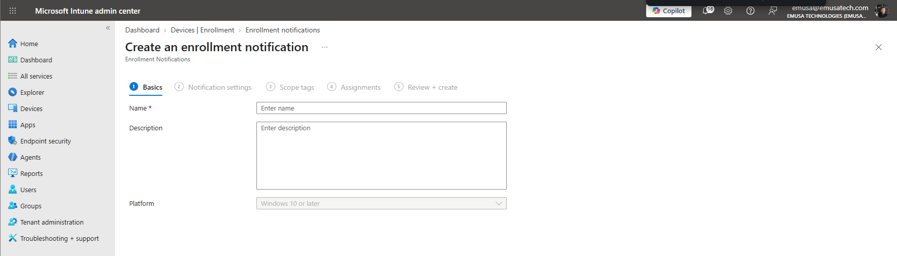
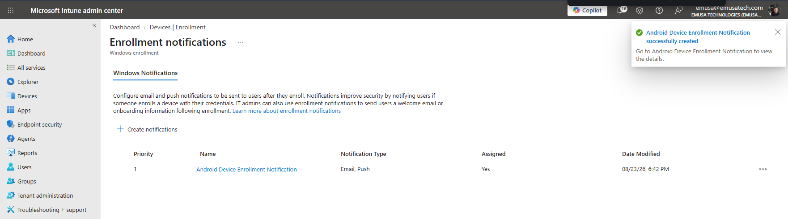

# Manage Enrollment Options

## Overview

Enrollment Options allow administrators to configure device platform restrictions, device enrollment limits, and enrollment notifications within Microsoft Intune.

## Location

**Microsoft Intune Admin Center → Devices → Enrollment → Enrollment Options**

## Steps

1. Signed in to the Microsoft Intune Admin Center using an administrator account.
2. Navigated to **Devices**.
3. Selected **Enrollment**.
4. Opened **Enrollment Options**.
5. Reviewed the **Device Platform Restriction** configuration.
6. Verified which device platforms were allowed to enroll.
7. Reviewed the **Device Limit Restriction** configuration.
8. Verified the maximum number of devices users could enroll.
9. Reviewed the **Enrollment Notifications** configuration.
10. Verified the available notification settings for newly enrolled devices.
11. Confirmed that enrollment options aligned with organizational requirements.

## Result

Enrollment options were successfully reviewed and validated. Microsoft Intune was configured to control device platform enrollment, device enrollment limits, and enrollment notification settings.

### Review Device Platform Restriction

### Review Device Limit Restriction

### Review Enrollment Notifications

### Created Enrollment Notifications

## Administrative Notes

Device Platform Restrictions determine which device platforms can enroll into Microsoft Intune.

Device Limit Restrictions control the maximum number of devices users can enroll.

Enrollment Notifications can notify administrators or users when devices are enrolled.

Administrators should review enrollment options regularly to ensure they align with organizational security and device management requirements.