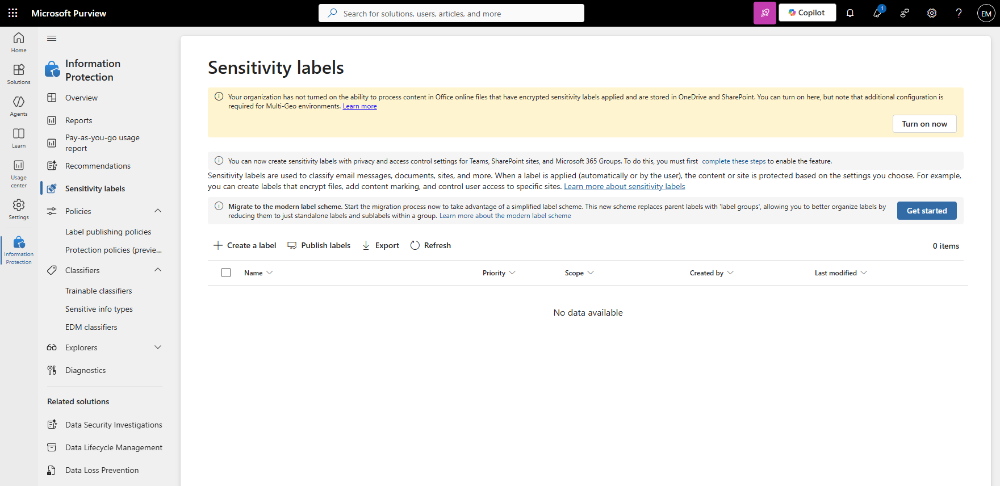
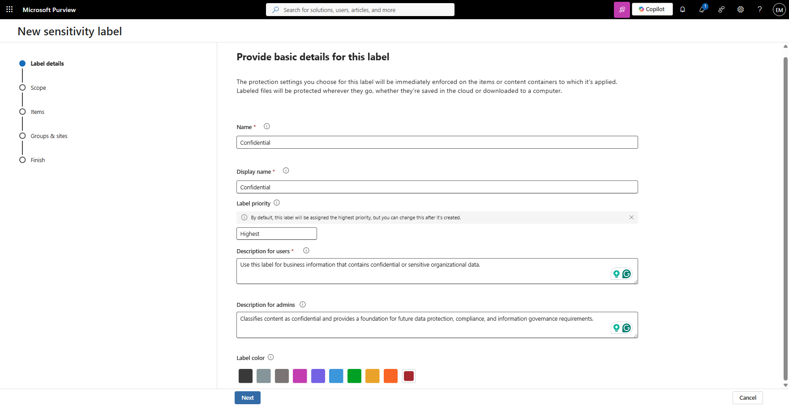
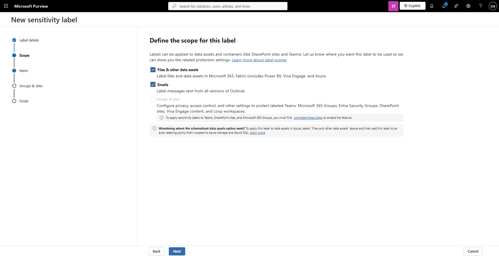
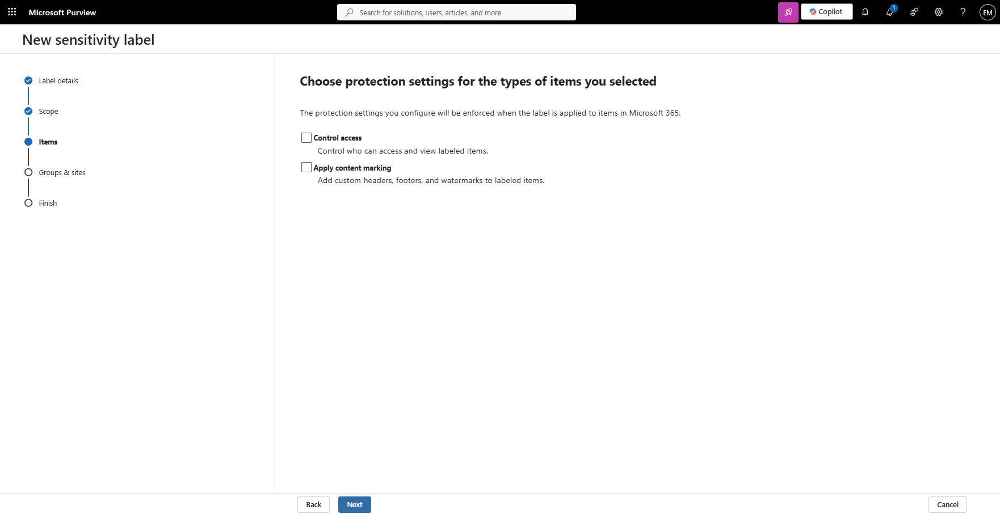
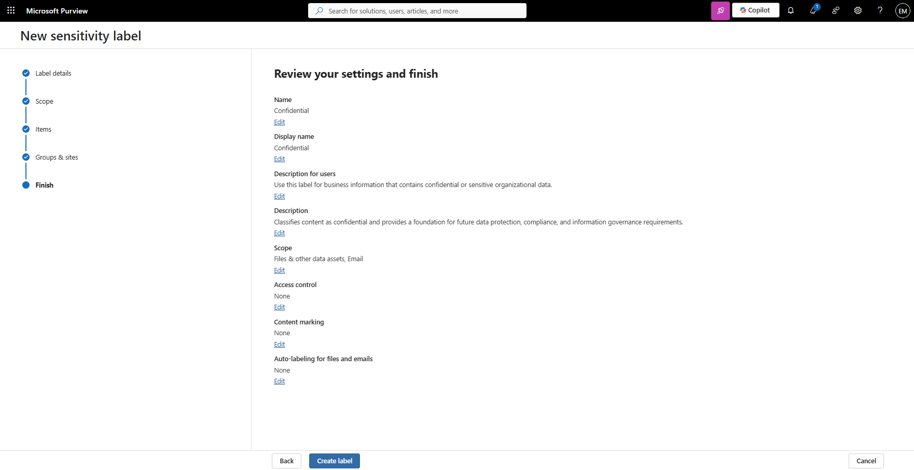
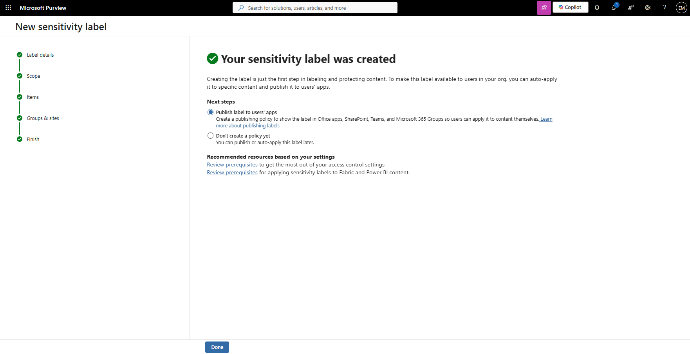
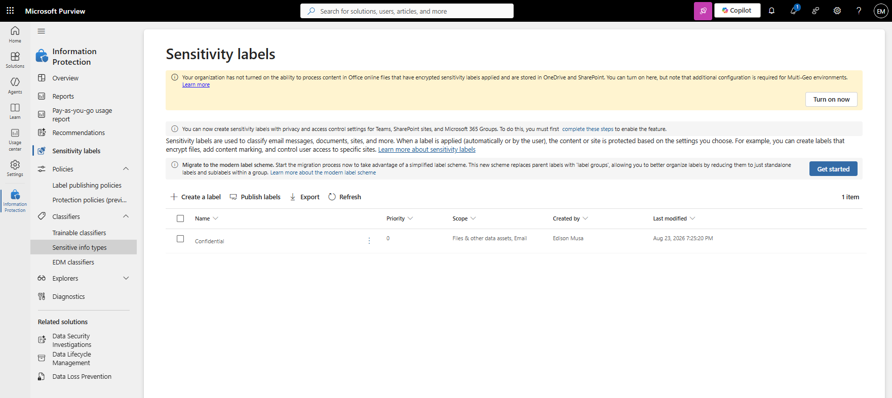

# Manage Sensitivity Labels

## Overview

Sensitivity Labels help organizations classify and protect data based on its sensitivity. Microsoft Purview Sensitivity Labels can be applied to emails, documents, and other supported content to support information classification and future data protection requirements.

## Location

**Microsoft Purview Portal → Information Protection → Sensitivity Labels**

## Steps

1. Signed in to the Microsoft Purview Portal using an administrator account.
2. Navigated to **Information Protection**.
3. Selected **Sensitivity Labels**.
4. Reviewed existing sensitivity labels.
5. Selected **Create a label**.
6. Entered the label name **Confidential**.
7. Entered the display name **Confidential**.
8. Entered the label description for users.
9. Entered the label description for administrators.
10. Selected a label color.
11. Selected **Next**.
12. Selected **Files and emails** as the label scope.
13. Selected **Next**.
14. Reviewed the available protection settings.
15. Left **Control access** disabled.
16. Left **Apply content marking** disabled.
17. Selected **Next**.
18. Reviewed the available groups and sites settings.
19. Left all groups and sites protection settings disabled.
20. Selected **Next**.
21. Reviewed the label configuration.
22. Selected **Create label**.
23. Verified that the sensitivity label was successfully created.

## Result

A Microsoft Purview Sensitivity Label named **Confidential** was successfully created. The label is available for future publishing through a label policy and can be used to classify organizational content.

### Access Sensitivity Labels

### Create Sensitivity Label

### Configure Label Settings

### Verify Label Creation

## Administrative Notes

Sensitivity Labels help classify and protect organizational data based on business and compliance requirements.

Labels can be configured with encryption, content markings, and access controls to help secure sensitive information.

Sensitivity Labels must be published through a Label Policy before users can apply them to content.

Administrators should define clear classification standards to ensure consistent data protection across the organization.

The tenant displayed a notification indicating that Office online processing for encrypted sensitivity labels stored in OneDrive and SharePoint was not enabled.

This setting was not required for the creation of a classification-only sensitivity label and was not modified as part of this exercise.

The feature may be enabled in future exercises involving encrypted sensitivity labels and advanced information protection scenarios.