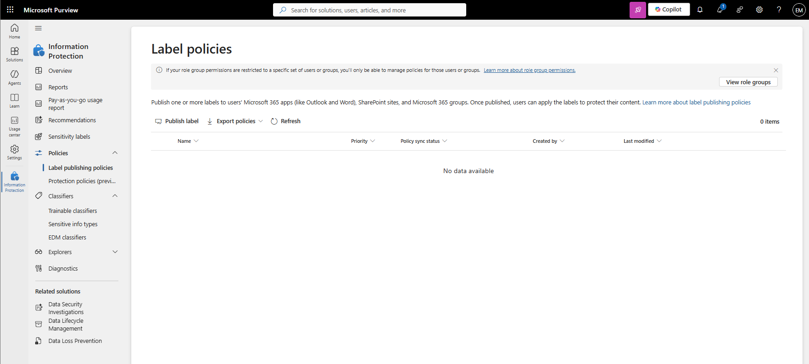
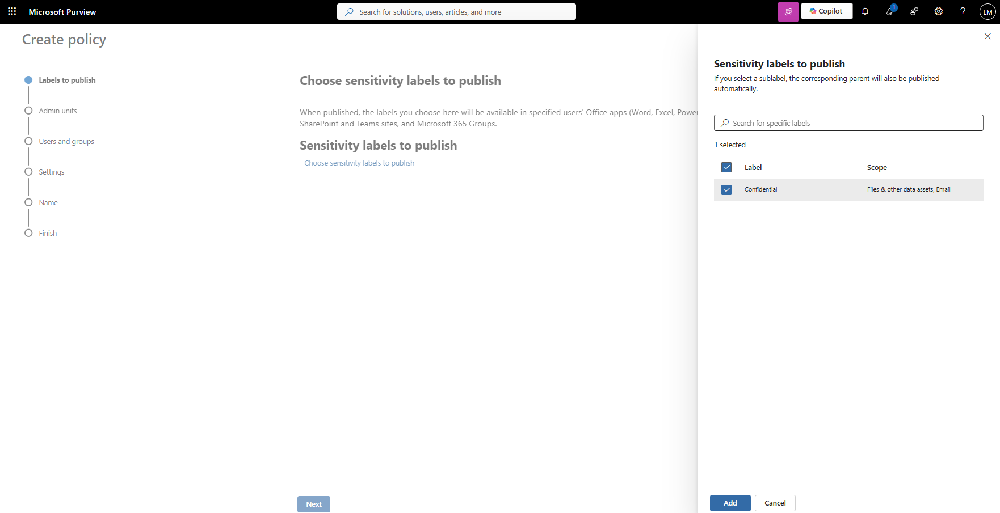
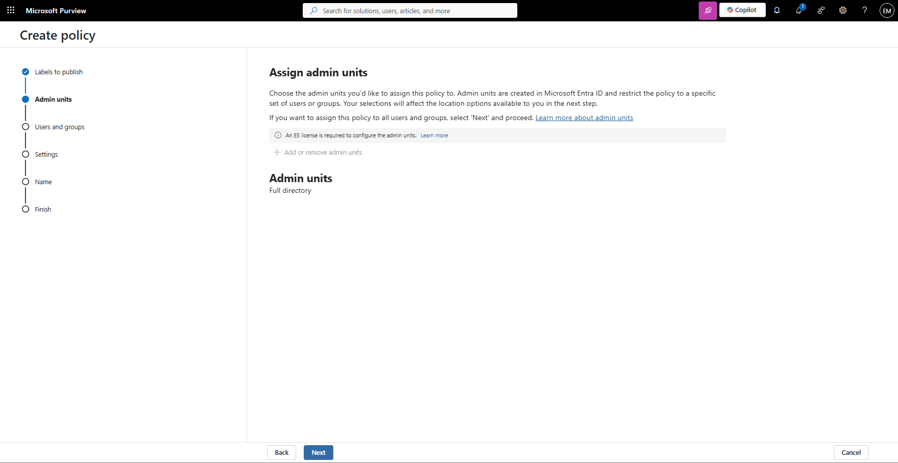
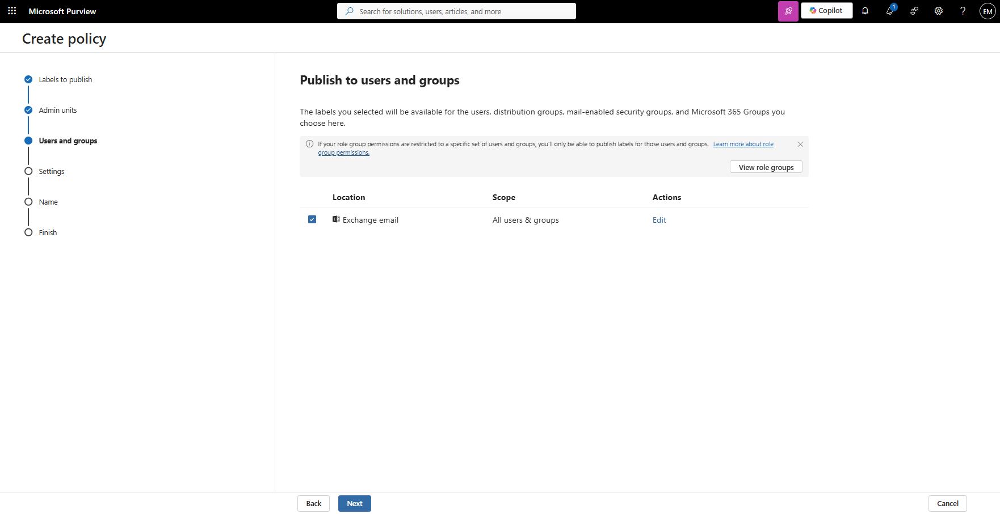
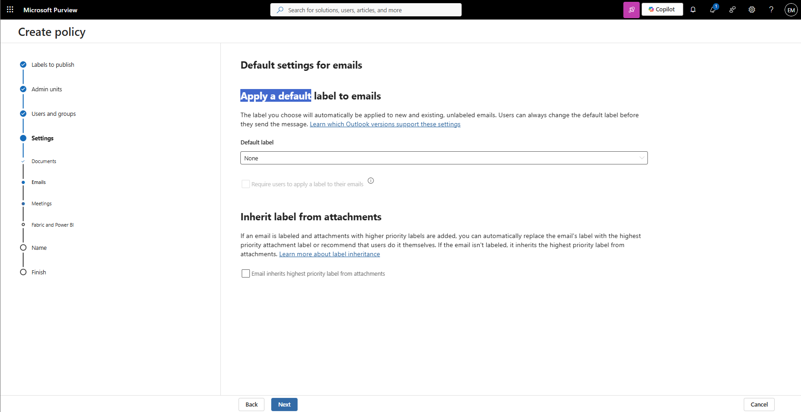
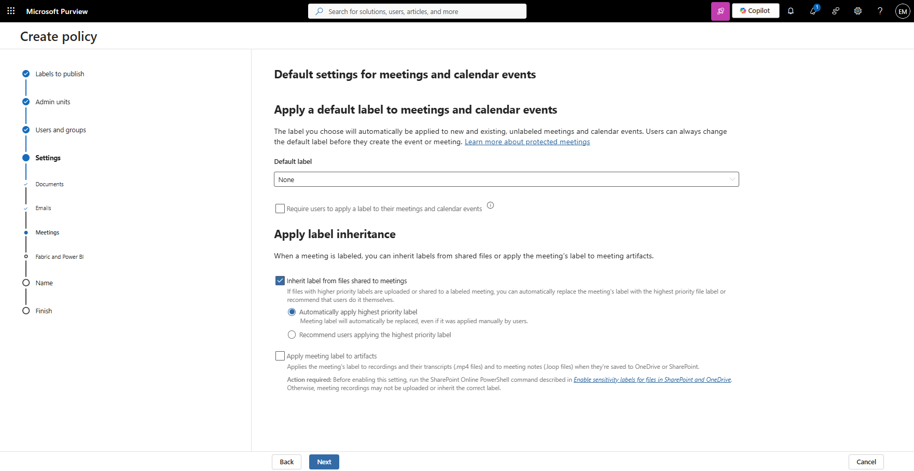
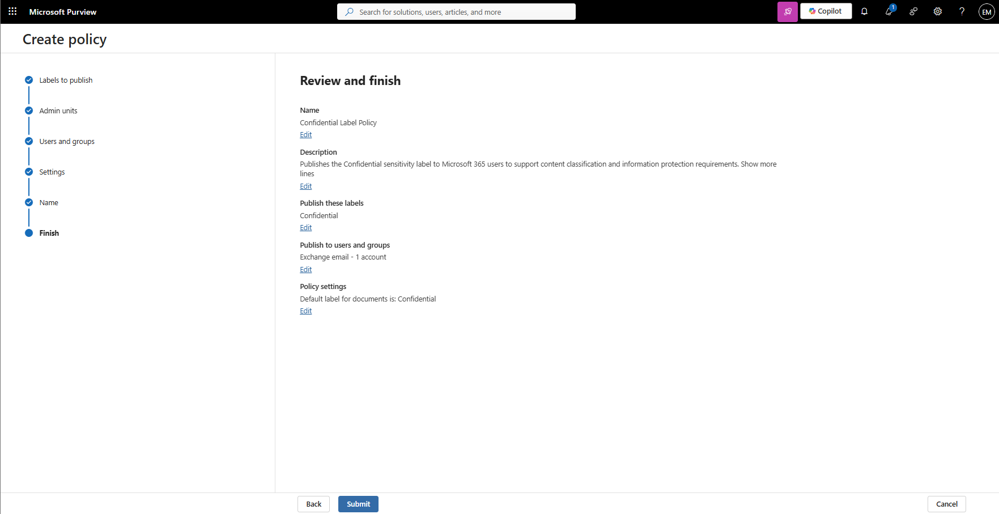
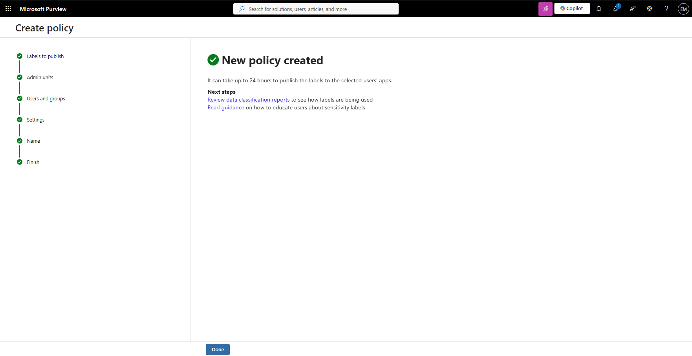
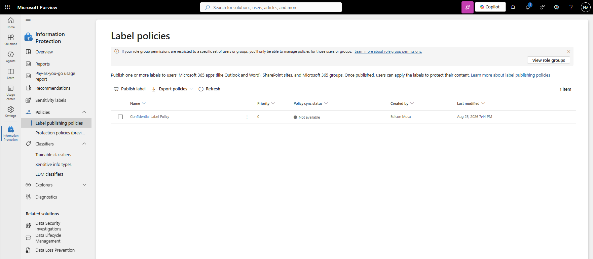

# Manage Label Policies

## Overview

Label Policies are used to publish Sensitivity Labels to users and groups within Microsoft 365. A label must be published through a Label Policy before users can view and apply it to emails, documents, and other supported Microsoft 365 content.

## Location

**Microsoft Purview Portal → Information Protection → Policies → Label Publishing Policies**

## Steps

1. Signed in to the Microsoft Purview Portal using an administrator account.
2. Navigated to **Information Protection**.
3. Expanded **Policies**.
4. Selected **Label Publishing Policies**.
5. Reviewed existing label publishing policies.
6. Selected **Publish labels**.
7. Selected the **Confidential** sensitivity label.
8. Selected **Add**.
9. Selected **Next**.
10. Chose the users or groups that would receive the label.
11. Reviewed label policy settings.
12. Configured policy settings according to organizational requirements.
13. Selected **Next**.
14. Entered the label policy name.
15. Entered the label policy description.
16. Reviewed the policy configuration.
17. Selected **Submit**.
18. Verified that the label publishing policy was successfully created.
19. Confirmed that the **Confidential** sensitivity label was published to the selected users.

## Result

A Label Publishing Policy was successfully created and configured. The **Confidential** sensitivity label was published and made available to the assigned users for classification of Microsoft 365 content.

### Access Label Publishing Policies

### Select Sensitivity Labels

### Configure Label Policy Settings

### Verify Label Policy Creation

## Administrative Notes

Sensitivity Labels must be published through a Label Policy before users can apply them within Microsoft 365 applications.

Label Policies determine which users can see and use specific sensitivity labels.

Policy changes can take time to replicate across Microsoft 365 services before becoming available to end users.

Administrators should validate policy assignments before publishing labels to a large user population.