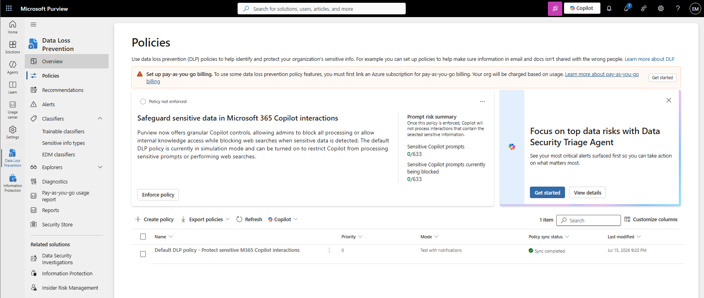
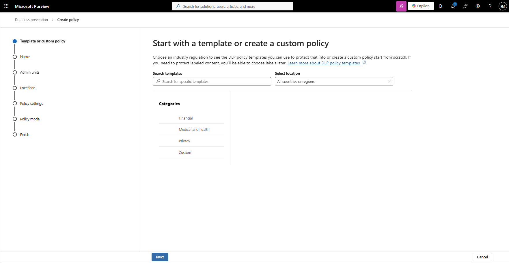
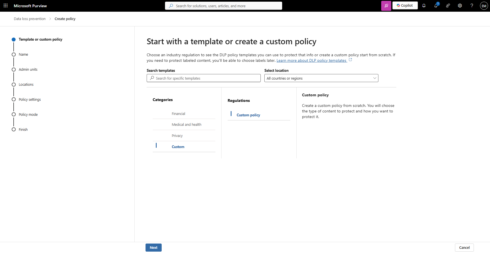
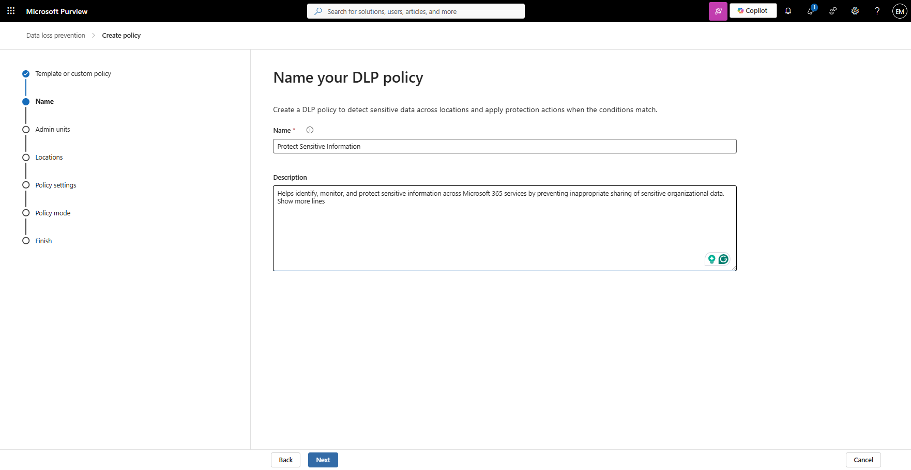
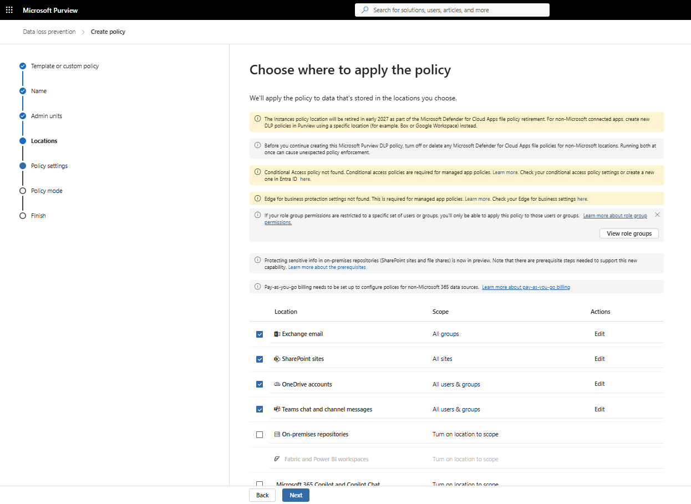
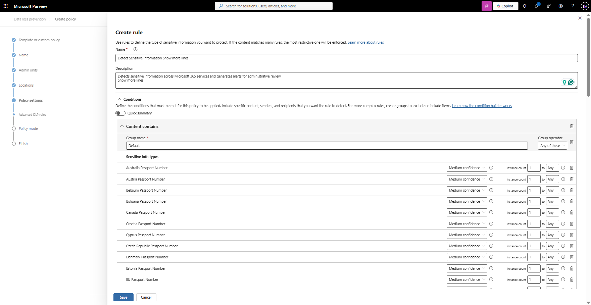
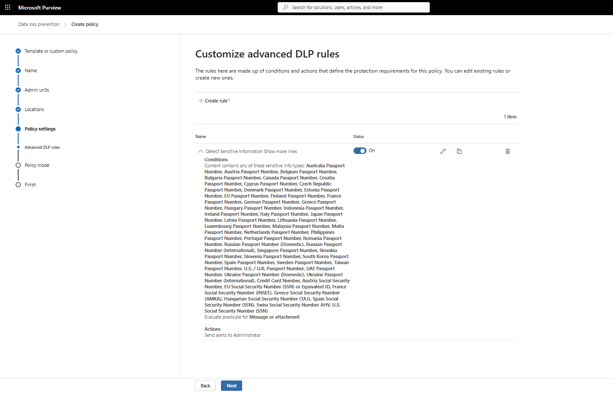
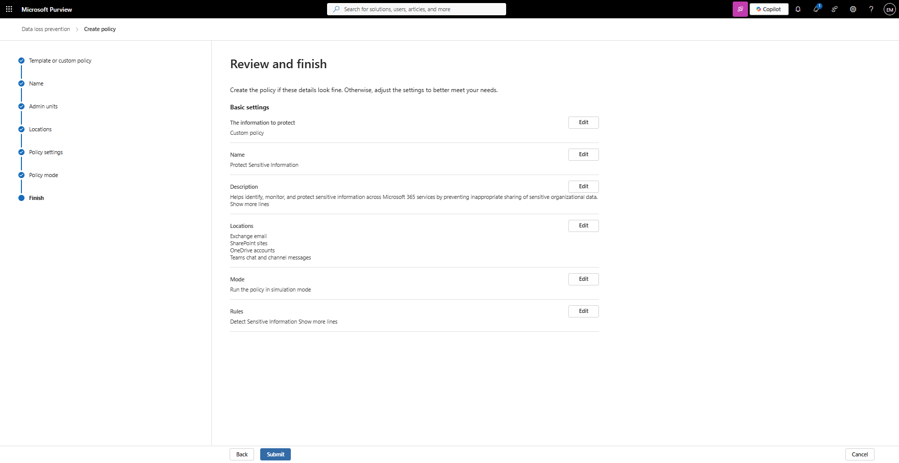
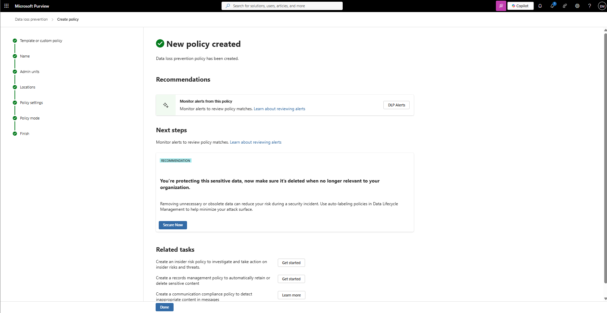

# Manage Data Loss Prevention

## Overview

Data Loss Prevention (DLP) policies help organizations identify, monitor, and protect sensitive information across Microsoft 365 services. Microsoft Purview DLP helps prevent users from accidentally or intentionally sharing sensitive data outside approved channels.

## Location

**Microsoft Purview Portal → Data Loss Prevention → Policies**

## Steps

1. Signed in to the Microsoft Purview Portal using an administrator account.
2. Navigated to **Data Loss Prevention**.
3. Selected **Policies**.
4. Reviewed existing DLP policies.
5. Selected **Create Policy**.
6. Selected **Custom** as the policy template.
7. Entered the policy name **Protect Sensitive Information**.
8. Entered the policy description.
9. Reviewed the available administrative units.
10. Selected the Microsoft 365 locations to protect.
11. Enabled **Exchange email**.
12. Enabled **SharePoint sites**.
13. Enabled **OneDrive accounts**.
14. Enabled **Teams chat and channel messages**.
15. Reviewed the available policy settings.
16. Selected **Create or customize advanced DLP rules**.
17. Created a rule named **Detect Sensitive Information**.
18. Configured the rule to detect sensitive information types.
19. Configured incident reporting settings.
20. Saved the DLP rule.
21. Selected **Simulation Mode** as the policy mode.
22. Reviewed the policy configuration.
23. Selected **Submit**.
24. Verified that the DLP policy was successfully created.

## Result

A Microsoft Purview Data Loss Prevention policy named **Protect Sensitive Information** was successfully created. The policy is configured to monitor sensitive information across Exchange Online, SharePoint Online, OneDrive for Business, and Microsoft Teams while operating in simulation mode.

### Access Data Loss Prevention Policies

### Select DLP Policy Template

### Configure Policy Details

### Select Protected Locations

### Configure Protection Rules

### Review and Create Policy

### Verify DLP Policy Creation

## Administrative Notes

Data Loss Prevention policies help organizations reduce the risk of sensitive information exposure across Microsoft 365 services.

Simulation Mode allows administrators to review policy behavior and potential matches before enabling enforcement actions.

DLP policies can monitor content stored in Exchange Online, SharePoint Online, OneDrive for Business, and Microsoft Teams.

Administrators should validate DLP policy behavior prior to deploying enforcement actions in production environments.