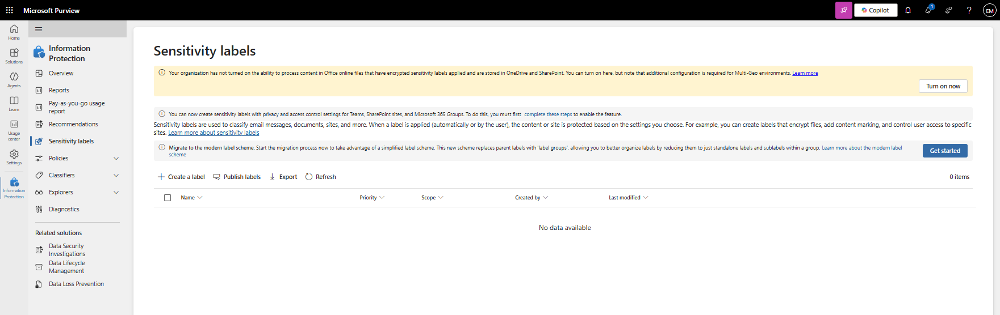
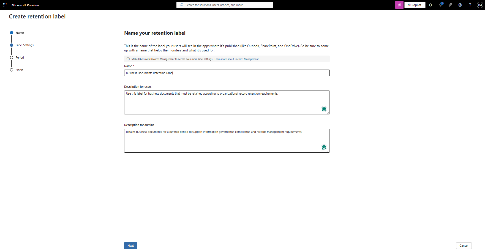
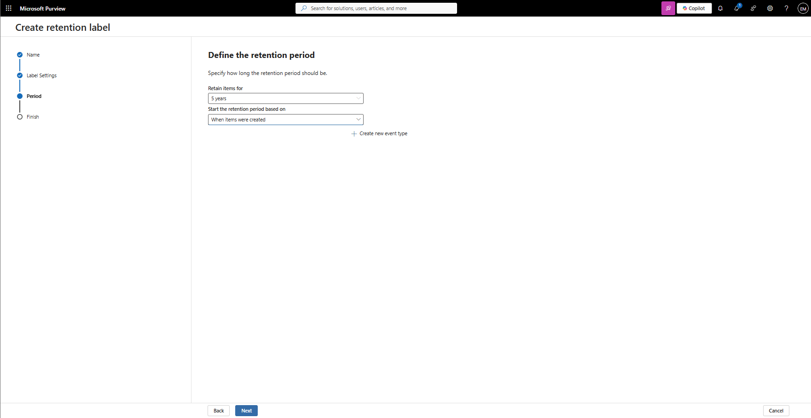
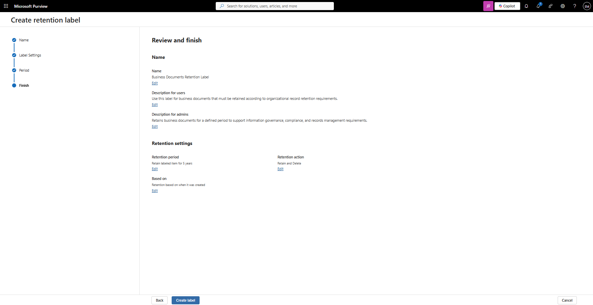
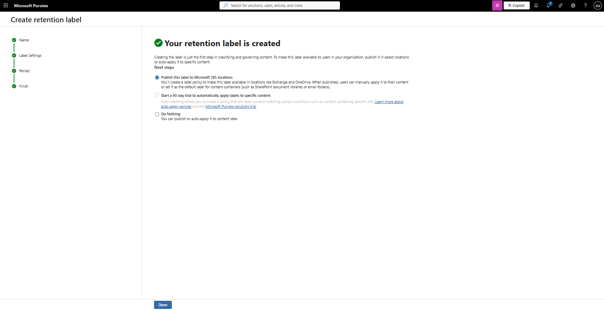
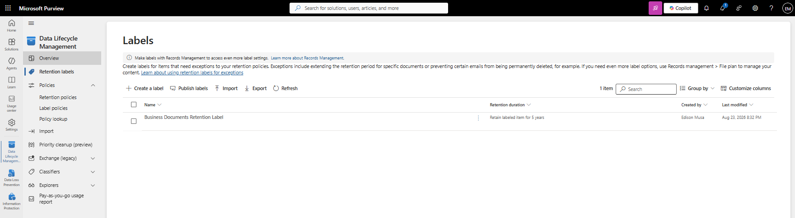

# Manage Retention Labels

## Overview

Retention Labels help organizations manage the lifecycle of information by retaining content for a specified period and optionally deleting content after the retention period expires. Microsoft Purview Retention Labels support information governance, records management, and compliance requirements.

## Location

**Microsoft Purview Portal → Data Lifecycle Management → Retention Labels**

## Steps

1. Signed in to the Microsoft Purview Portal using an administrator account.
2. Navigated to **Data Lifecycle Management**.
3. Selected **Retention Labels**.
4. Reviewed existing retention labels.
5. Selected **Create a retention label**.
6. Entered the label name **Business Documents Retention Label**.
7. Entered the label description for users.
8. Entered the label description for administrators.
9. Selected **Next**.
10. Selected **Retain items forever or for a specific period**.
11. Selected **Next**.
12. Configured the retention period settings.
13. Configured the retention duration.
14. Configured the disposition settings.
15. Reviewed the retention label configuration.
16. Selected **Create label**.
17. Verified that the retention label was successfully created.
18. Reviewed the publishing options available for the new retention label.
19. Confirmed that the retention label was available for publishing through a retention label policy.

## Result

A Microsoft Purview Retention Label named **Business Documents Retention Label** was successfully created. The label is available for publishing and can be used to manage content retention and disposition requirements across Microsoft 365 workloads.

### Access Retention Labels

### Create Retention Label

### Review Retention Label Configuration

### Verify Retention Label Creation

## Administrative Notes

Retention Labels help organizations retain and delete content according to business, legal, and compliance requirements.

Retention Labels can be published to users through Retention Label Policies.

Retention Labels support information governance and records management initiatives across Microsoft 365 workloads.

Administrators should align retention periods with organizational retention requirements and applicable regulatory obligations.