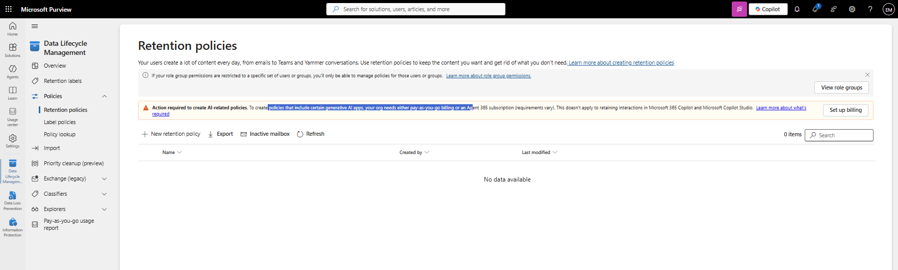
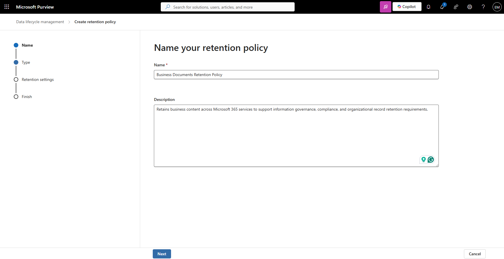
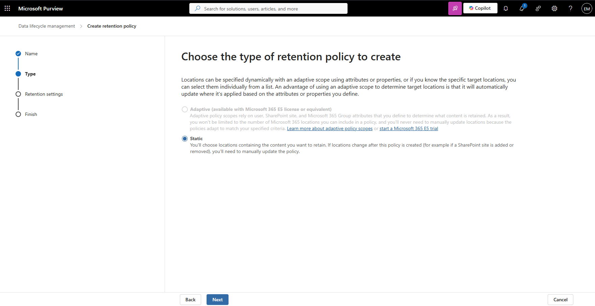
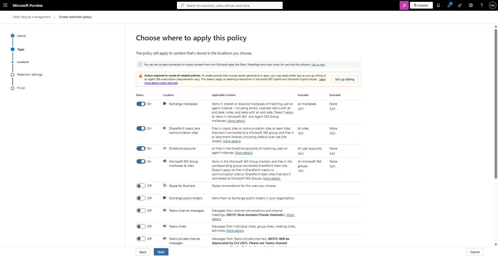
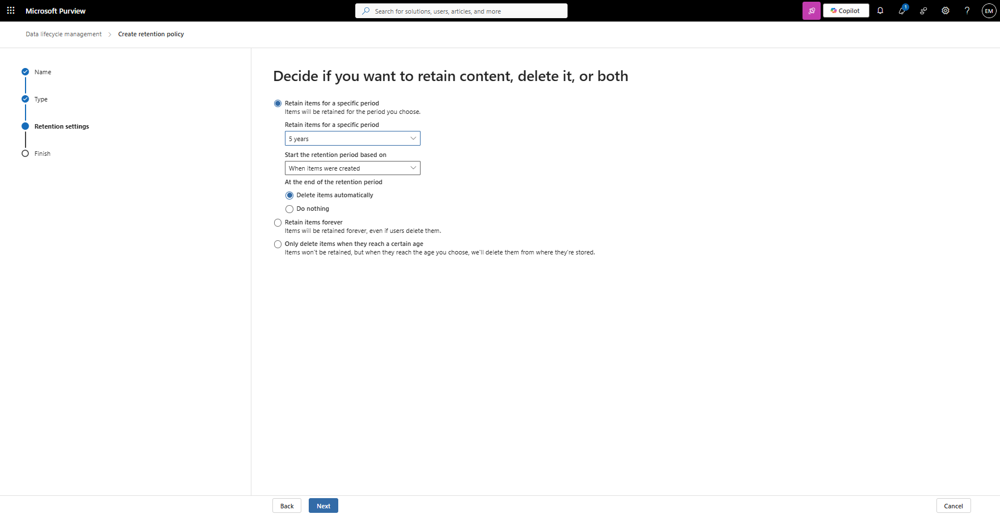
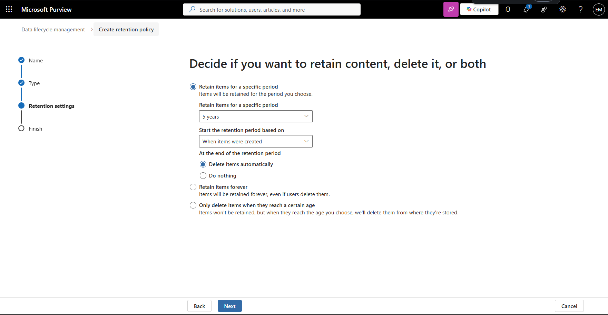
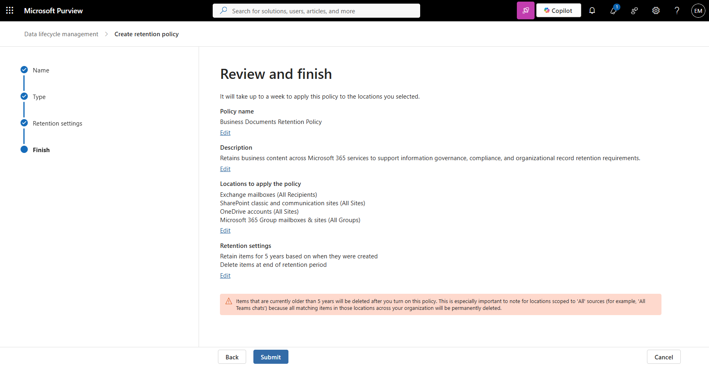
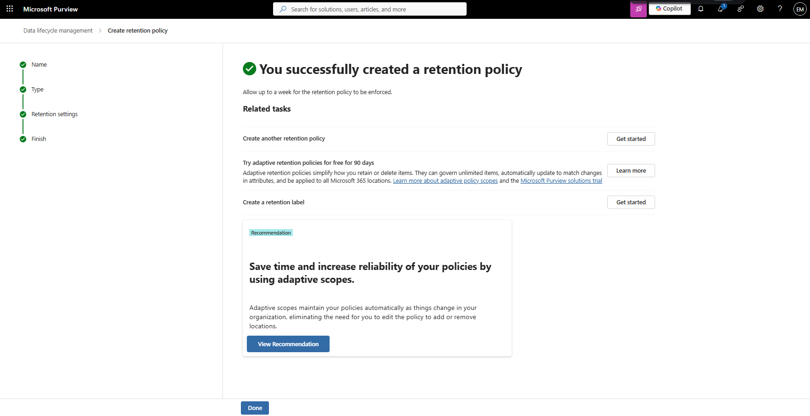
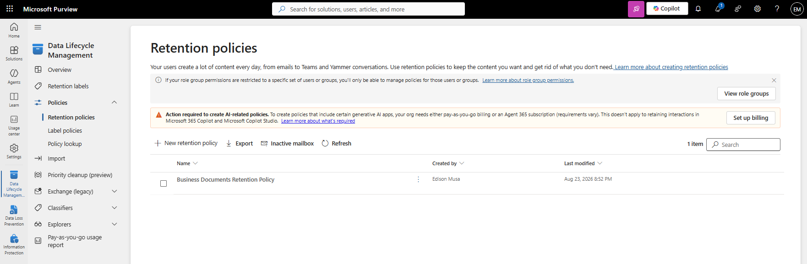

# Manage Retention Policies

## Overview

Retention Policies help organizations manage the lifecycle of information by retaining and deleting content according to business, legal, and compliance requirements. Microsoft Purview Retention Policies can be applied across multiple Microsoft 365 workloads from a single policy.

## Location

**Microsoft Purview Portal → Data Lifecycle Management → Policies → Retention Policies**

## Steps

1. Signed in to the Microsoft Purview Portal using an administrator account.
2. Navigated to **Data Lifecycle Management**.
3. Expanded **Policies**.
4. Selected **Retention Policies**.
5. Reviewed existing retention policies.
6. Selected **New retention policy**.
7. Entered the policy name **Business Documents Retention Policy**.
8. Entered the policy description.
9. Selected **Static** as the policy type.
10. Enabled **Exchange mailboxes**.
11. Enabled **SharePoint classic and communication sites**.
12. Enabled **OneDrive accounts**.
13. Enabled **Microsoft 365 Group mailboxes & sites**.
14. Enabled **Teams channel messages**.
15. Enabled **Teams chats**.
16. Left **Skype for Business** disabled.
17. Left **Exchange public folders** disabled.
18. Selected **Next**.
19. Configured the retention settings.
20. Configured the retention duration.
21. Configured the disposition settings.
22. Reviewed the policy configuration.
23. Selected **Submit**.
24. Verified that the retention policy was successfully created.
25. Confirmed that the retention policy appeared in the retention policy inventory.

## Result

A Microsoft Purview Retention Policy named **Business Documents Retention Policy** was successfully created. The policy is configured to retain and manage content across Exchange Online, SharePoint Online, OneDrive for Business, Microsoft 365 Groups, and Microsoft Teams according to organizational retention requirements.

### Access Retention Policies

### Create Retention Policy

### Configure Policy Details

### Configure Retention Settings

### Review Policy Configuration

### Verify Retention Policy Creation

## Administrative Notes

Retention Policies help organizations manage information throughout its lifecycle by retaining or deleting content according to business, legal, and compliance requirements.

Retention Policies can be applied across multiple Microsoft 365 workloads from a single policy, simplifying large-scale information governance management.

Retention Policies work alongside Retention Labels and can be used to support information governance, records management, and compliance objectives.

Administrators should validate retention requirements and test policies before deploying them broadly across production workloads.