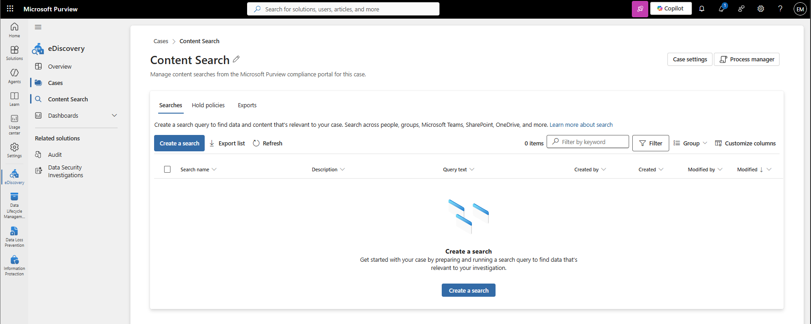
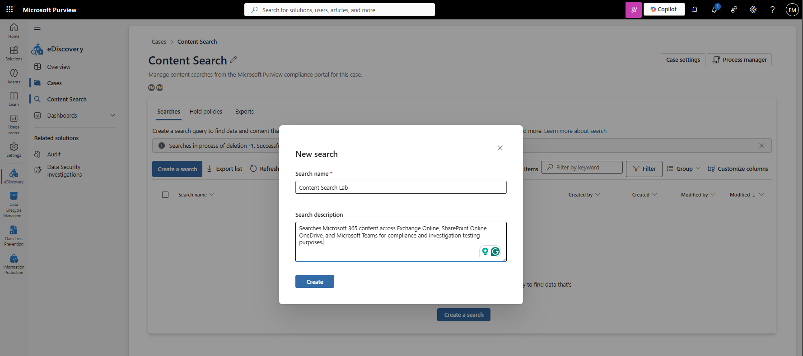
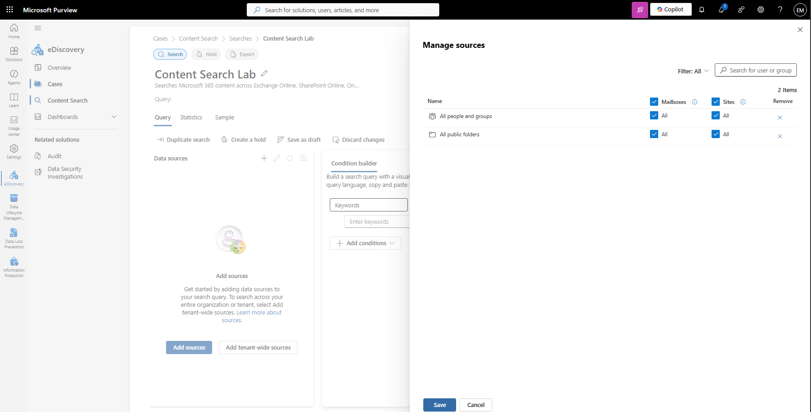
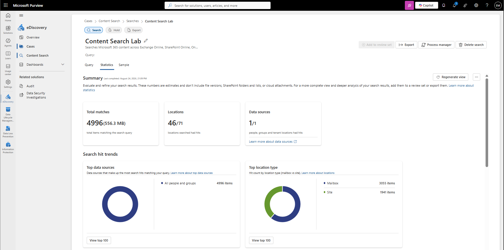

# Manage Content Search

## Overview

Content Search helps administrators locate and review content across Microsoft 365 workloads, including Exchange Online mailboxes, SharePoint Online sites, OneDrive accounts, and Microsoft Teams. Microsoft Purview Content Search supports compliance investigations, eDiscovery activities, and information governance requirements.

## Location

**Microsoft Purview Portal → eDiscovery → Cases → Content Search**

## Steps

1. Signed in to the Microsoft Purview Portal using an administrator account.
2. Navigated to **Settings**.
3. Selected **Roles and scopes**.
4. Opened **Role groups**.
5. Selected **eDiscovery Manager**.
6. Added the administrator account to the eDiscovery Manager role group.
7. Saved the role assignment.
8. Signed out and signed back in after permissions were updated.
9. Navigated to **eDiscovery**.
10. Created an eDiscovery case named **Content Search Lab**.
11. Opened the eDiscovery case.
12. Selected **Content Search**.
13. Created a new content search named **Content Search Lab**.
14. Added tenant-wide data sources.
15. Included Microsoft 365 content sources for users and groups.
16. Configured the search query.
17. Selected **Statistics** as the search results view.
18. Enabled the available tenant-wide search options.
19. Selected **Run query**.
20. Waited for the content search to complete.
21. Reviewed the search statistics.
22. Verified that content search results were successfully returned.

## Result

A Microsoft Purview Content Search named **Content Search Lab** was successfully created and executed. The search returned **4,996 matching items** across Microsoft 365 workloads, with results identified in **46 locations**.

### Access Content Search

### Create Content Search

### Verify Content Search Completion

## Administrative Notes

Content Search enables administrators to locate and review content across Microsoft 365 services for compliance, governance, and investigative purposes.

In the modern Microsoft Purview experience, Content Search is performed within an eDiscovery case.

Administrators may require membership in the **eDiscovery Manager** role group and access to the eDiscovery case before Content Search can be performed.

Content Search can be used independently or as part of broader eDiscovery investigations and legal discovery processes.