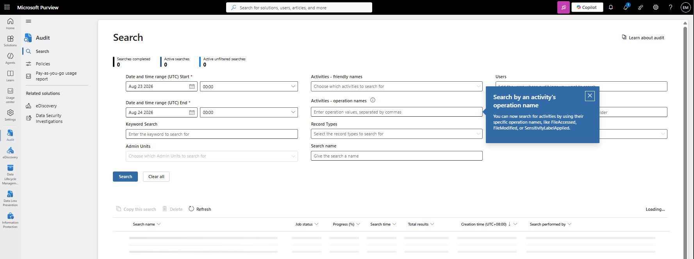
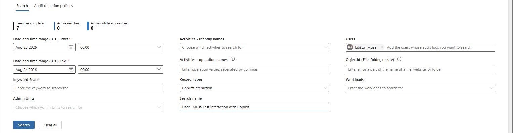
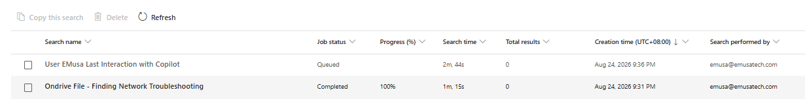
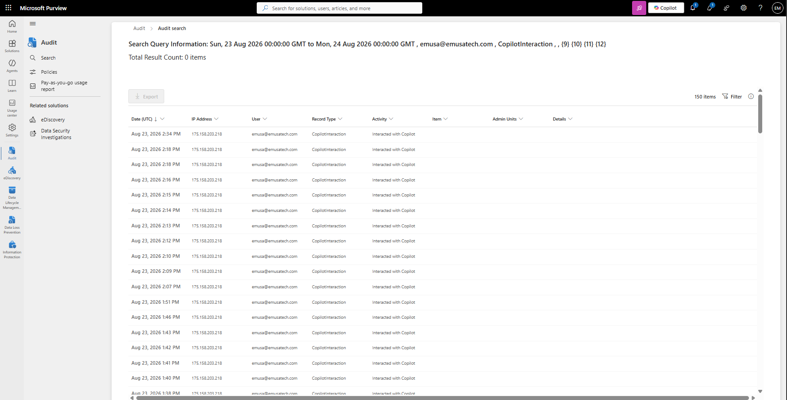

# Review Audit Logs

## Overview

Microsoft Purview Audit logs provide visibility into user, administrator, and system activities across Microsoft 365 services. Audit logs help administrators investigate activities, monitor changes, support compliance requirements, and perform security investigations.

## Location

**Microsoft Purview Portal → Audit**

## Steps

1. Signed in to the Microsoft Purview Portal using an administrator account.
2. Navigated to **Audit**.
3. Reviewed the Audit dashboard.
4. Verified that audit logging was available for the tenant.
5. Selected **Search**.
6. Reviewed the available audit search filters.
7. Configured the audit search criteria.
8. Selected the desired date range.
9. Reviewed available Microsoft 365 activities.
10. Executed the audit log search.
11. Waited for the audit search to complete.
12. Reviewed the returned audit records.
13. Reviewed user activity for **emusa@emusatech.com**.
14. Reviewed **CopilotInteraction** audit records.
15. Examined audit record details including date, IP address, user, record type, and activity.
16. Verified that audit records were returned successfully.
17. Confirmed that Microsoft Purview Audit successfully captured and displayed tenant activity.

## Result

Microsoft Purview Audit logs were successfully reviewed. Audit records were returned for tenant activity, including Microsoft Copilot interactions and Exchange item access events, providing visibility into Microsoft 365 user activity.

### Access Audit

### Configure Audit Search

### Verify Audit Log Search

## Administrative Notes

Microsoft Purview Audit provides centralized visibility into user, administrator, and workload activities across Microsoft 365 services.

Audit records can be used to investigate security incidents, compliance events, operational changes, and user activity.

Audit searches can be filtered by users, activities, workloads, record types, and date ranges to simplify investigations.

Administrators should regularly review audit logs to support security monitoring, compliance requirements, and operational troubleshooting.