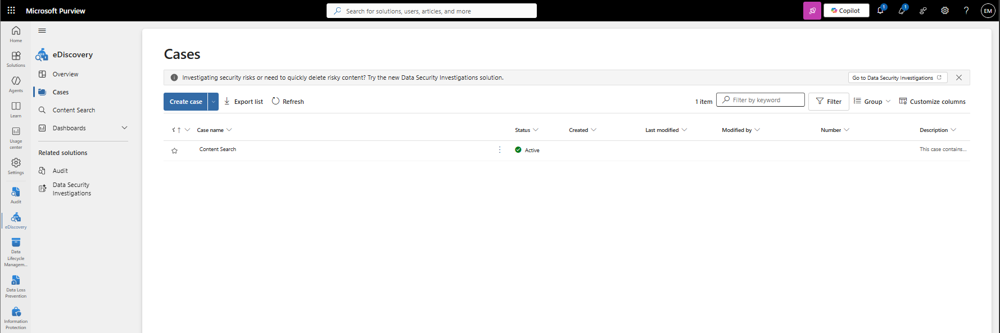
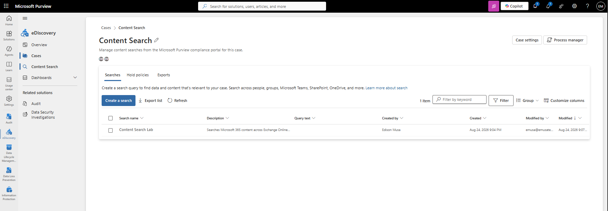
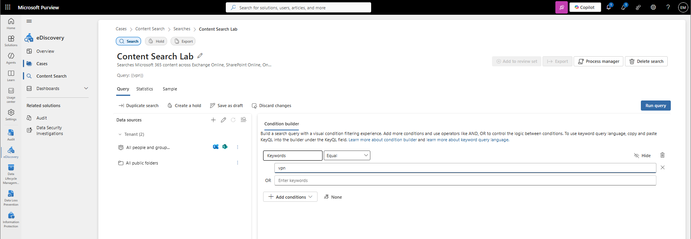

# Manage eDiscovery

## Overview

Microsoft Purview eDiscovery provides a centralized workspace for managing compliance investigations, reviewing case information, performing content searches, and coordinating discovery activities across Microsoft 365 services.

## Location

**Microsoft Purview Portal → eDiscovery → Cases**

## Steps

1. Signed in to the Microsoft Purview Portal using an administrator account.
2. Navigated to **eDiscovery**.
3. Selected **Cases**.
4. Reviewed existing eDiscovery cases.
5. Opened the eDiscovery case named **Content Search Lab**.
6. Reviewed the case details.
7. Reviewed the case status and configuration.
8. Reviewed assigned case members.
9. Reviewed available eDiscovery tools.
10. Verified access to **Content Search** within the case.
11. Reviewed the content search associated with the case.
12. Reviewed case search results and statistics.
13. Confirmed that the eDiscovery case was successfully configured and accessible.

## Result

The Microsoft Purview eDiscovery case **Content Search Lab** was successfully reviewed. Access to case resources and Content Search functionality was verified, providing a centralized workspace for compliance investigations and discovery activities.

### Access eDiscovery Cases

### Review eDiscovery Case

### Verify Content Search Within Case

## Administrative Notes

eDiscovery cases provide a centralized workspace for managing compliance investigations and discovery activities.

Content Search is performed within an eDiscovery case and can be used to locate content across Microsoft 365 services.

Case membership and appropriate role assignments are required before administrators can access eDiscovery resources and perform discovery activities.

eDiscovery helps organizations support compliance requirements, legal requests, and internal investigations.