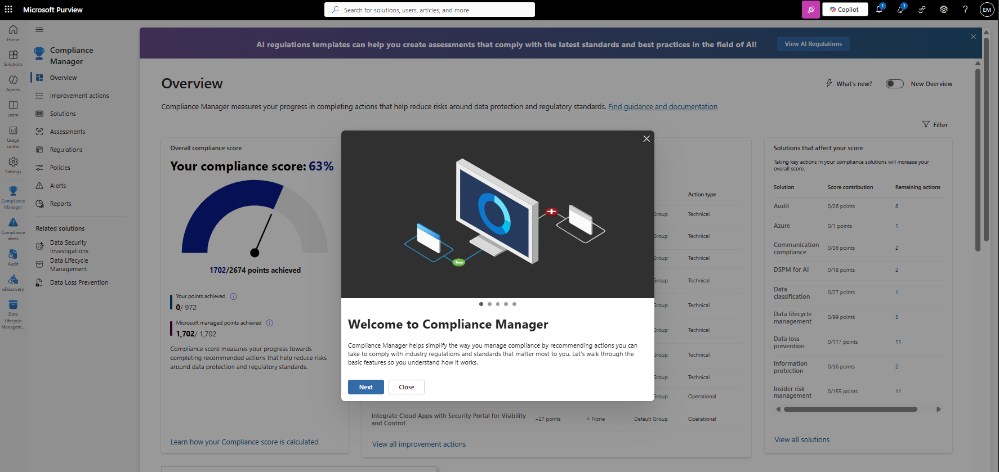
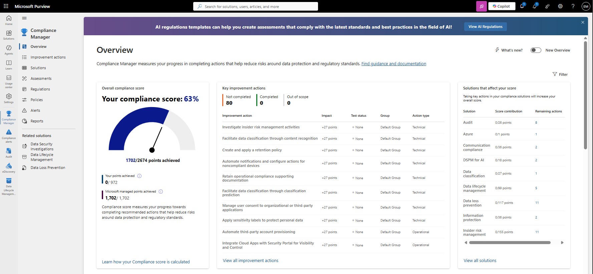
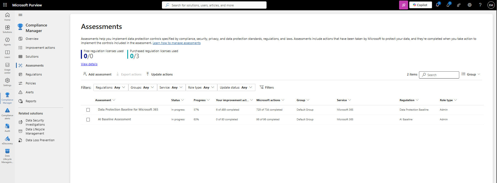
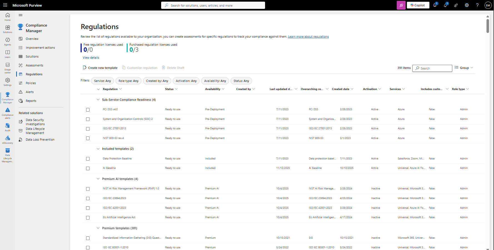
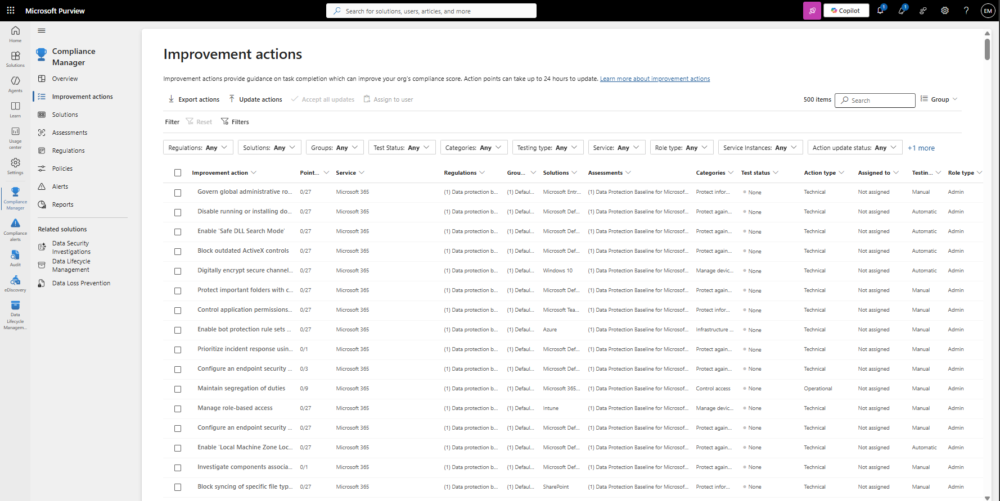
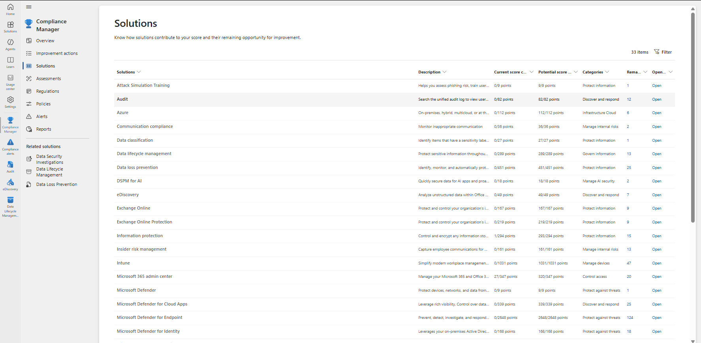

# Review Compliance Manager

## Overview

Microsoft Purview Compliance Manager helps organizations assess, monitor, and improve their compliance posture by providing compliance scores, improvement actions, assessments, and regulatory mappings.

## Location

**Microsoft Purview Portal → Compliance Manager**

## Steps

1. Signed in to the Microsoft Purview Portal using an administrator account.
2. Navigated to **Compliance Manager**.
3. Reviewed the Compliance Manager dashboard.
4. Reviewed the current compliance score.
5. Reviewed available improvement actions.
6. Reviewed assessment information.
7. Examined control categories and compliance requirements.
8. Reviewed Microsoft-managed actions.
9. Reviewed organization-managed actions.
10. Opened an assessment.
11. Reviewed assessment progress and status.
12. Examined recommended improvement actions.
13. Reviewed implementation details for a compliance control.
14. Confirmed that Compliance Manager was successfully accessible and reporting compliance information.

## Result

Microsoft Purview Compliance Manager was successfully reviewed. Compliance assessments, improvement actions, and the organization's compliance score were examined to support governance and compliance initiatives.

### Access Compliance Manager

### Review Compliance Score and Assessments

### Review Improvement Actions

## Administrative Notes

Compliance Manager helps organizations measure and improve their compliance posture through assessments, controls, and improvement actions.

Compliance scores provide a high-level view of compliance progress across supported regulations and standards.

Improvement actions help organizations identify and prioritize activities that can strengthen security, governance, and compliance practices.

Compliance Manager should be reviewed regularly to track compliance progress and remediation activities.