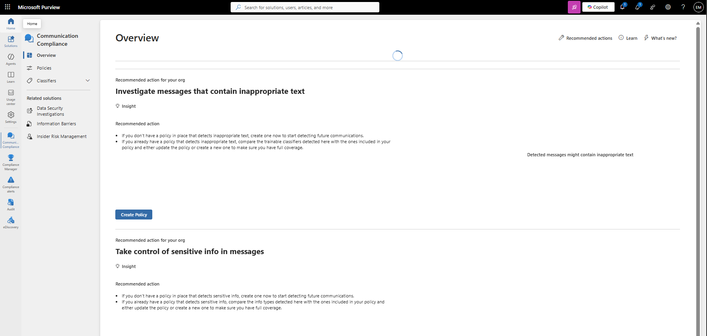
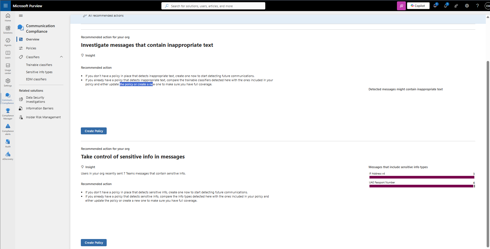
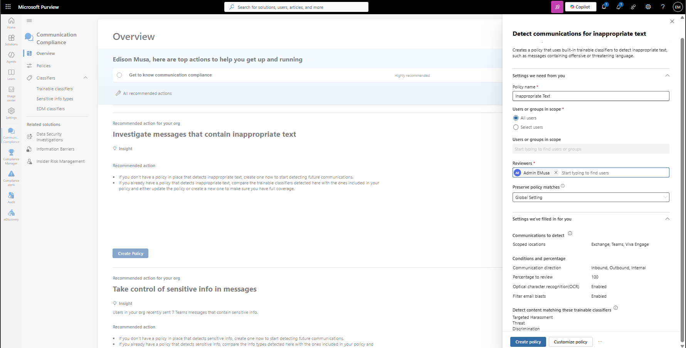
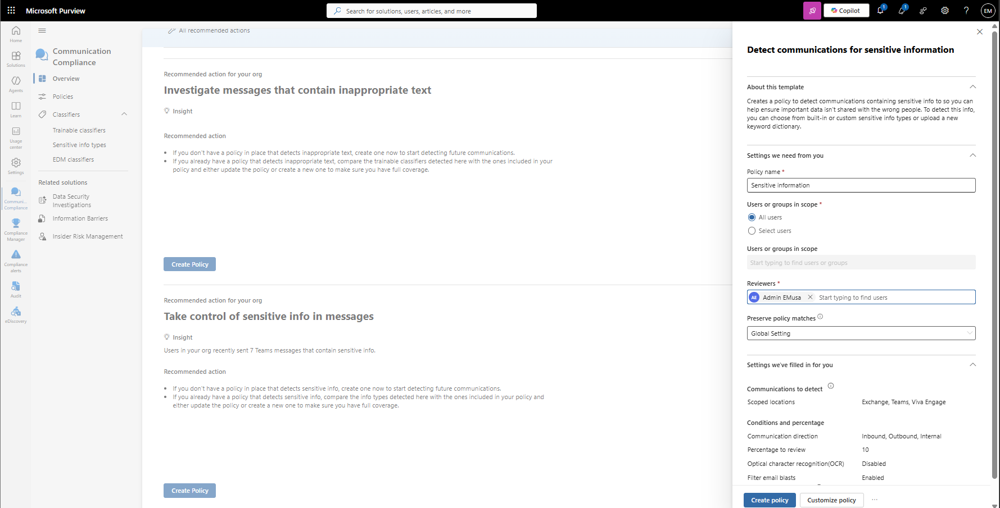

# Manage Communication Compliance

## Overview

Microsoft Purview Communication Compliance helps organizations detect, investigate, and remediate inappropriate communications across Microsoft 365 services. Communication Compliance policies can identify policy violations, risky behavior, and regulatory concerns within organizational communications.

## Location

**Microsoft Purview Portal → Communication Compliance**

## Steps

1. Signed in to the Microsoft Purview Portal using an administrator account.
2. Navigated to **Communication Compliance**.
3. Reviewed the Communication Compliance dashboard.
4. Reviewed available communication compliance templates.
5. Selected **Create policy**.
6. Reviewed available policy types.
7. Configured policy details.
8. Reviewed monitored communication sources.
9. Reviewed policy detection settings.
10. Reviewed policy conditions and indicators.
11. Reviewed investigation and remediation options.
12. Reviewed alert and escalation capabilities.
13. Reviewed existing communication compliance policies.
14. Confirmed that Communication Compliance was successfully accessible and configured for future policy creation.

## Result

Microsoft Purview Communication Compliance was successfully reviewed. Communication Compliance capabilities, policy options, and monitoring features were examined to support organizational compliance and risk management requirements.

### Access Communication Compliance

### Review Policy Templates and Settings

## Administrative Notes

Communication Compliance helps organizations identify and investigate policy violations and inappropriate communications across Microsoft 365 services.

Communication Compliance policies can monitor supported communication channels and provide investigation workflows for compliance administrators.

Policy templates help organizations implement common compliance scenarios and accelerate deployment.

Administrators should ensure monitoring activities align with organizational policies, privacy requirements, and applicable regulations.