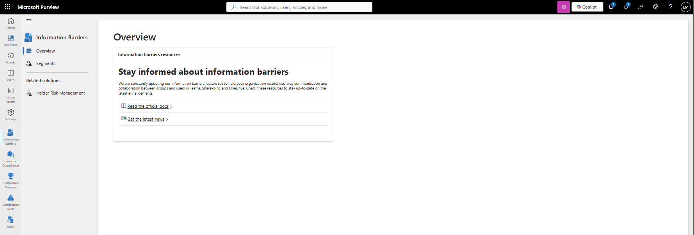
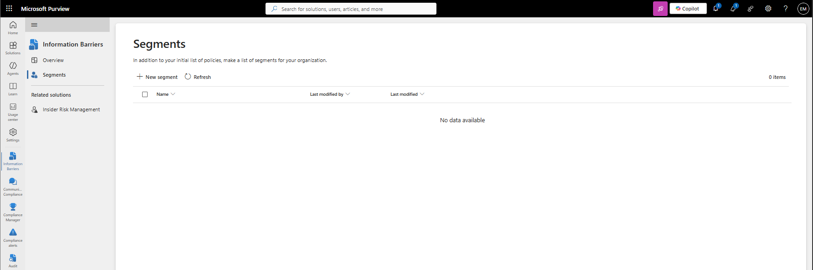
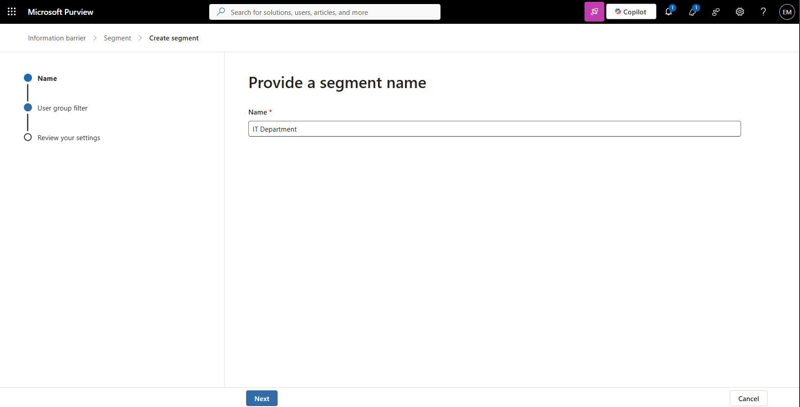
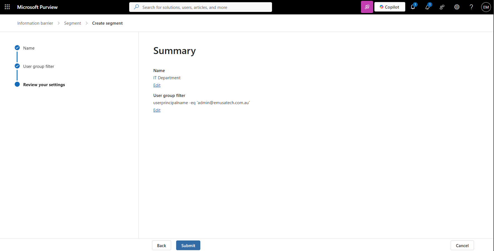
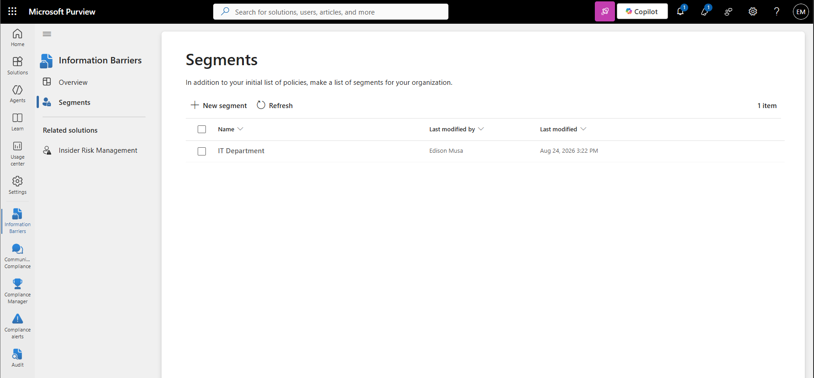

# Manage Information Barriers

## Overview

Microsoft Purview Information Barriers help organizations prevent specific groups of users from communicating and collaborating with each other. Information Barriers support regulatory compliance, conflict-of-interest management, and data separation requirements through the use of segments and policies.

## Location

**Microsoft Purview Portal → Information Barriers**

## Steps

1. Signed in to the Microsoft Purview Portal using an administrator account.
2. Navigated to **Information Barriers**.
3. Reviewed the Information Barriers dashboard.
4. Reviewed existing Information Barrier segments.
5. Selected **Create segment**.
6. Entered the segment name.
7. Selected **Next**.
8. Configured the user group filter.
9. Selected **User Principal Name** as the filter attribute.
10. Configured the filter to match **admin@emusatech.com.au**.
11. Reviewed the segment configuration.
12. Selected **Create**.
13. Verified that the segment was successfully created.
14. Reviewed available Information Barrier policy options.
15. Confirmed that Information Barriers was successfully configured for future policy creation.

## Result

A Microsoft Purview Information Barrier segment was successfully created. The segment contains the specified user account and can be used in future Information Barrier policies to control communication and collaboration between defined user groups.

### Access Information Barriers

### Review Segments and Policies

### Create Segment

## Administrative Notes

Information Barriers use segments to define groups of users that can be included in communication and collaboration restrictions.

Segments can be based on directory attributes such as User Principal Name, Department, Country, Job Title, and other supported Microsoft Entra ID attributes.

Information Barrier policies are created after segments are defined and can be used to restrict communication between designated user populations.

Administrators should carefully plan segment membership and policy design before implementing Information Barriers in production environments.
