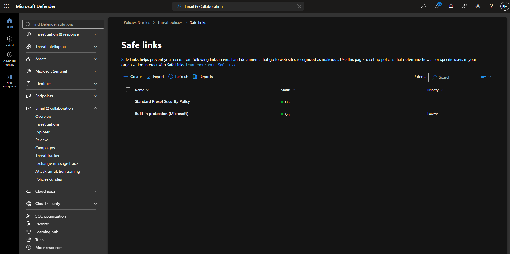
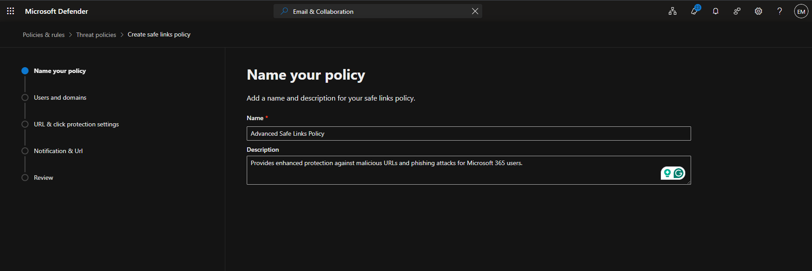
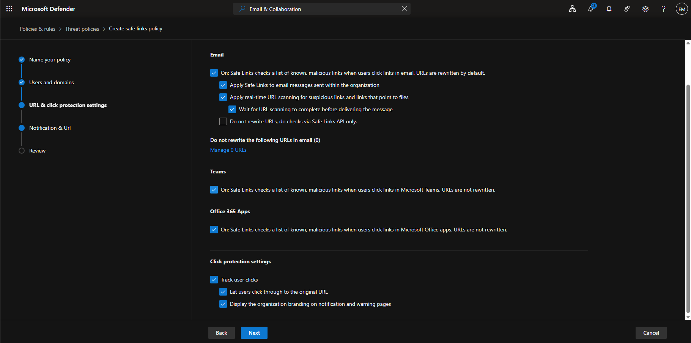
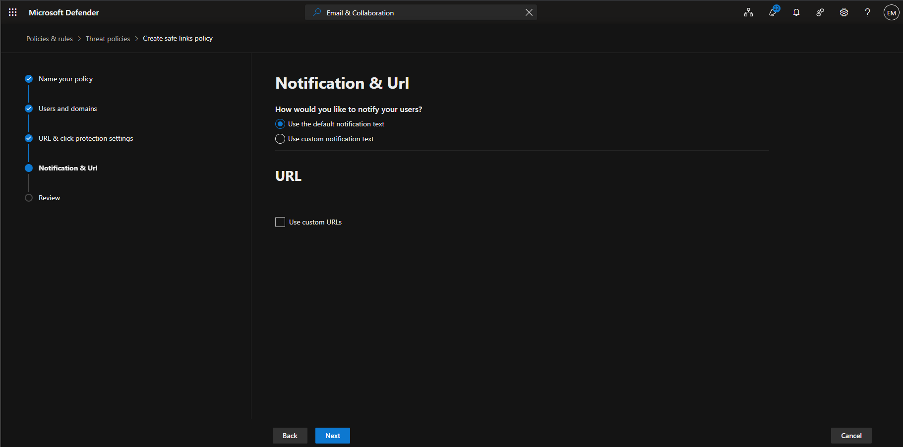
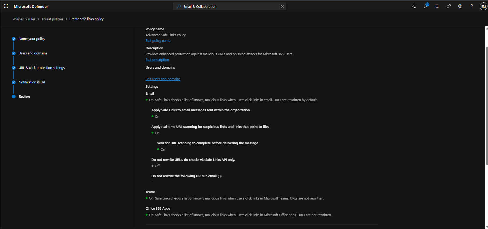
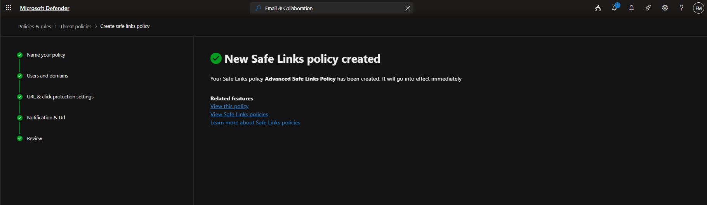
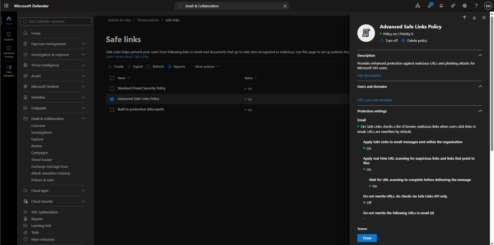

# Manage Safe Links

## Overview

Microsoft Defender for Office 365 Safe Links helps protect users by scanning and validating URLs in email messages and Microsoft Office documents. Safe Links provides time-of-click protection against malicious websites and phishing attacks.

## Location

**Microsoft Defender Portal → Email & Collaboration → Policies & Rules → Threat Policies → Safe Links**

## Steps

1. Signed in to the Microsoft Defender Portal using an administrator account.
2. Navigated to **Email & Collaboration**.
3. Selected **Policies & Rules**.
4. Selected **Threat Policies**.
5. Selected **Safe Links**.
6. Reviewed existing Safe Links policies.
7. Selected **Create Policy**.
8. Entered the policy name **Advanced Safe Links Policy**.
9. Configured the policy to apply to all recipients.
10. Enabled **Safe Links for email messages**.
11. Enabled **Safe Links for email messages sent within the organization**.
12. Enabled **Real-time URL scanning for suspicious links and links that point to files**.
13. Enabled **Wait for URL scanning to complete before delivering the message**.
14. Enabled **Safe Links protection for Microsoft Teams**.
15. Enabled **Safe Links protection for Microsoft Office applications**.
16. Enabled **Track user clicks**.
17. Enabled **Allow users to click through to the original URL**.
18. Selected **Use the default notification text**.
19. Left **Custom URLs** disabled.
20. Reviewed the Safe Links policy configuration.
21. Selected **Submit**.
22. Verified that the Safe Links policy was successfully created.configured.

## Result

A Microsoft Defender for Office 365 Safe Links policy was successfully reviewed and configured to help protect users from malicious URLs and phishing attacks.

### Access Safe Links

### Created Safe Links Policy

### Verify Safe Links Configuration

## Administrative Notes

Safe Links provides time-of-click URL protection for email messages and supported Microsoft 365 applications.

Safe Links helps protect users from phishing attacks and malicious websites by evaluating links when users access them.

Administrators should regularly review Safe Links policies to ensure protection settings align with organizational security requirements.