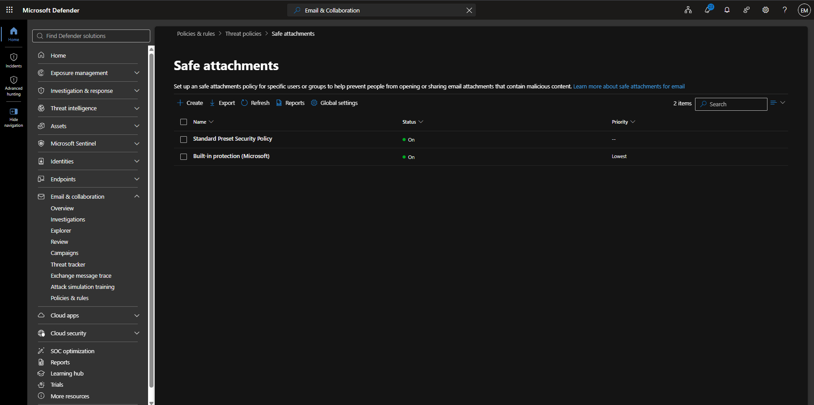
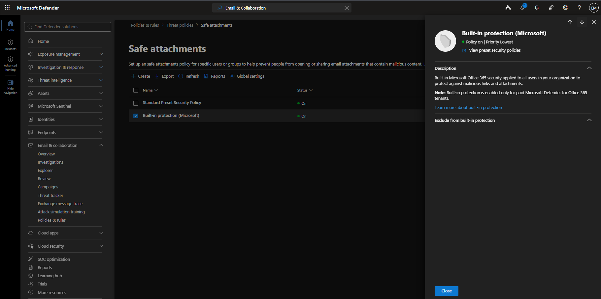
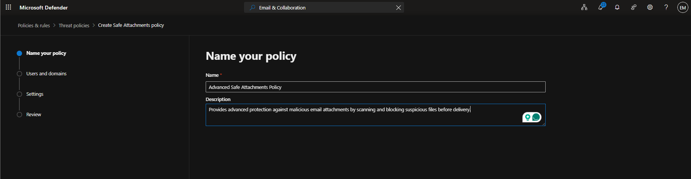
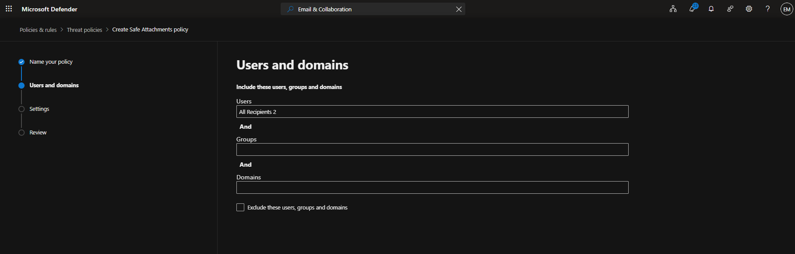
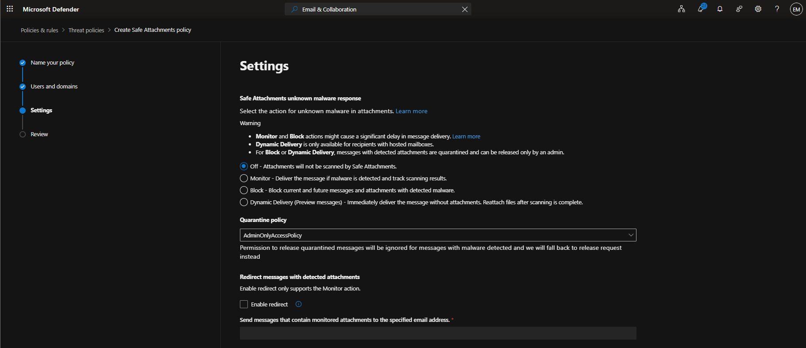
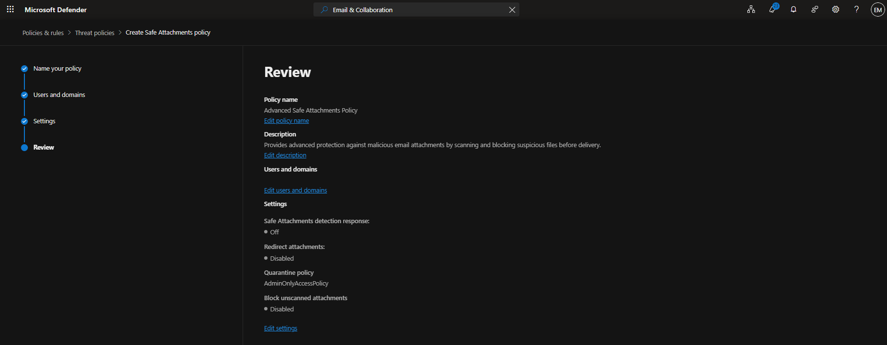
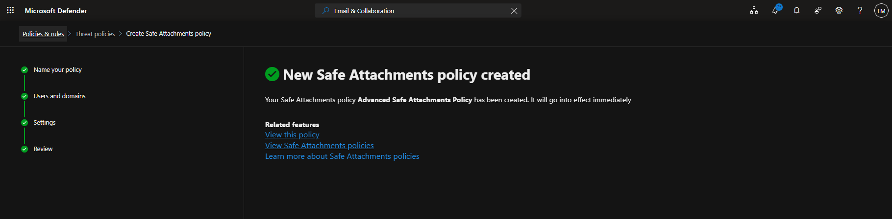
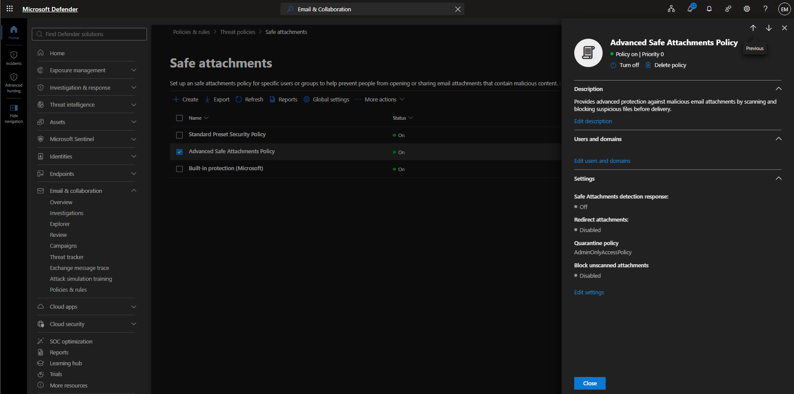

# Manage Safe Attachments

## Overview

Microsoft Defender for Office 365 Safe Attachments helps protect users from malicious files by scanning email attachments and identifying threats before delivery.

## Location

**Microsoft Defender Portal → Email & Collaboration → Policies & Rules → Threat Policies → Safe Attachments**

## Steps

## Steps

1. Signed in to the Microsoft Defender Portal using an administrator account.
2. Navigated to **Email & Collaboration**.
3. Selected **Policies & Rules**.
4. Selected **Threat Policies**.
5. Selected **Safe Attachments**.
6. Reviewed existing Safe Attachments policies.
7. Selected **Create Policy**.
8. Entered the policy name **Advanced Safe Attachments Policy**.
9. Configured the policy to apply to **All Recipients**.
10. Selected **Dynamic Delivery** as the Safe Attachments action.
11. Configured the quarantine policy as **AdminOnlyAccessPolicy**.
12. Left **Redirect messages with detected attachments** disabled.
13. Reviewed the Safe Attachments policy configuration.
14. Selected **Submit**.
15. Verified that the Safe Attachments policy was successfully created.

## Result

A Microsoft Defender for Office 365 Safe Attachments policy was successfully created to help protect users from malicious email attachments.

### Access Safe Attachments

### Create Safe Attachments Policy

### Verify Safe Attachments Configuration

## Administrative Notes

Safe Attachments helps protect Microsoft 365 users from malware and malicious files delivered through email.

Safe Attachments uses detonation technology and dynamic analysis to identify suspicious attachments before they reach users.

Administrators should regularly review Safe Attachments policies to ensure protection settings align with organizational security requirements.