# Manage Anti-Phishing

## Overview

Microsoft Defender for Office 365 Anti-Phishing policies help protect users against phishing attacks, spoofing attempts, user impersonation, and domain impersonation by applying advanced detection and protection controls.

## Location

**Microsoft Defender Portal → Email & Collaboration → Policies & Rules → Threat Policies → Anti-Phishing**

## Steps

1. Signed in to the Microsoft Defender Portal using an administrator account.
2. Navigated to **Email & Collaboration**.
3. Selected **Policies & Rules**.
4. Selected **Threat Policies**.
5. Selected **Anti-Phishing**.
6. Reviewed existing Anti-Phishing policies.
7. Selected **Create Policy**.
8. Entered the policy name **Advanced Anti-Phishing Policy**.
9. Entered the policy description.
10. Assigned the policy to **All Employees**.
11. Configured phishing threshold settings.
12. Enabled **Spoof Intelligence**.
13. Configured user impersonation protection settings.
14. Configured domain impersonation protection settings.
15. Configured Mailbox Intelligence settings.
16. Configured anti-phishing actions and quarantine actions.
17. Configured safety tips and sender indicators.
18. Reviewed the Anti-Phishing policy configuration.
19. Attempted to create the policy.
20. Received a Microsoft Defender **Client Error** during policy creation.
21. Verified that the custom Anti-Phishing policy was not added to the policy list.
22. Documented the issue for future investigation and remediation.

## Result

An Anti-Phishing policy configuration was prepared and validated; however, Microsoft Defender returned a **Client Error** during policy creation. The custom policy was not successfully created and requires further troubleshooting before deployment.

### Access Anti-Phishing Policies

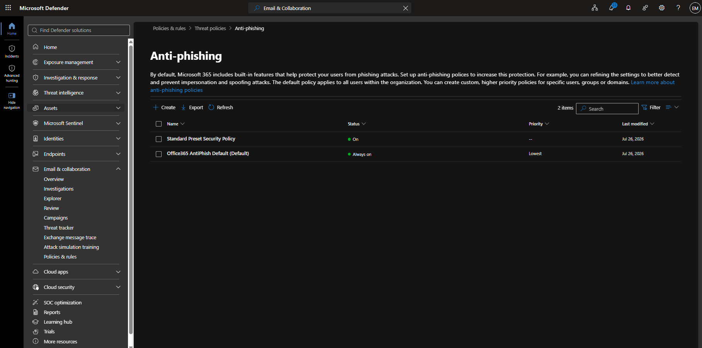

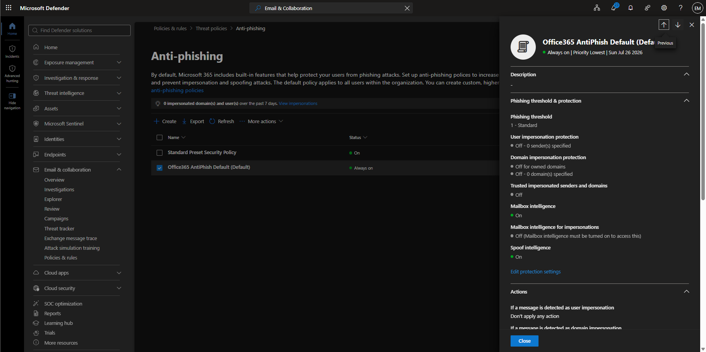

### Configure Anti-Phishing Policy

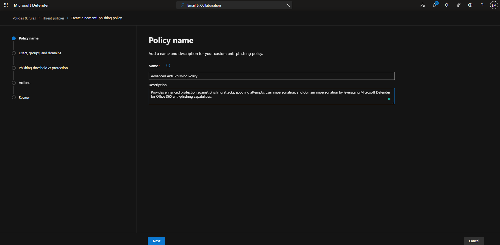

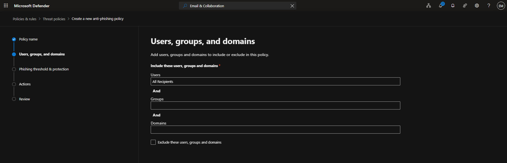

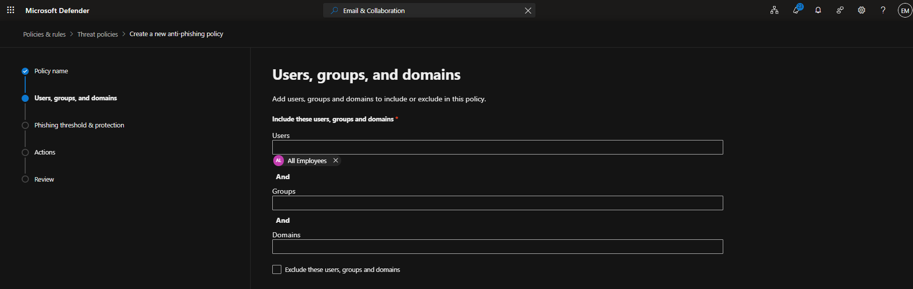

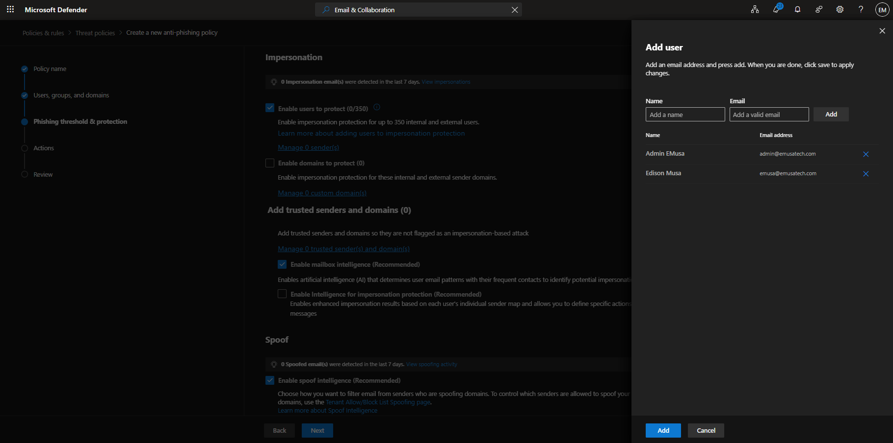

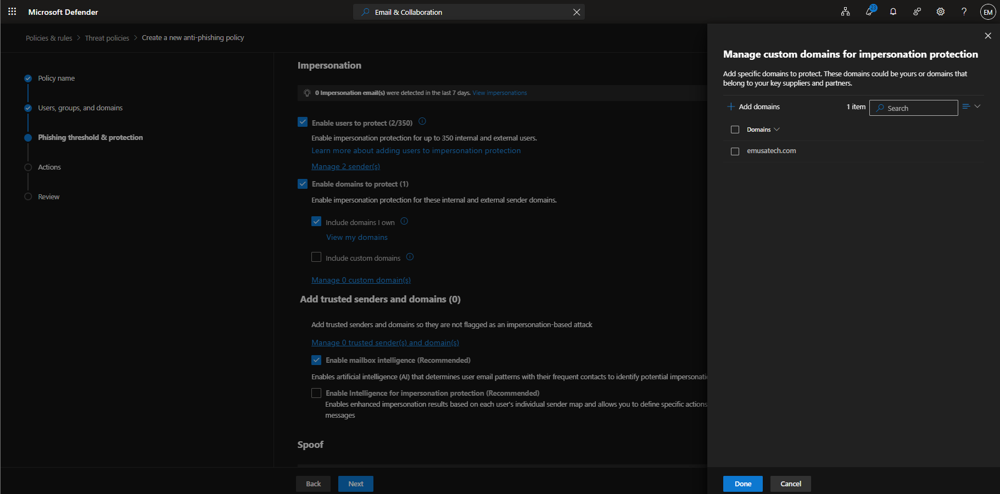

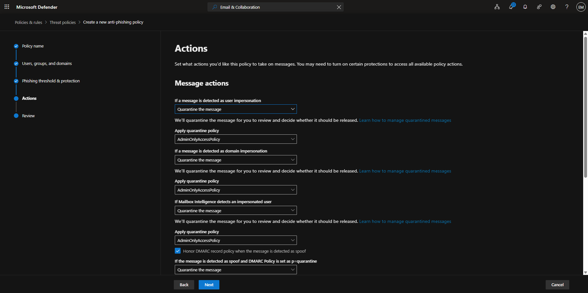

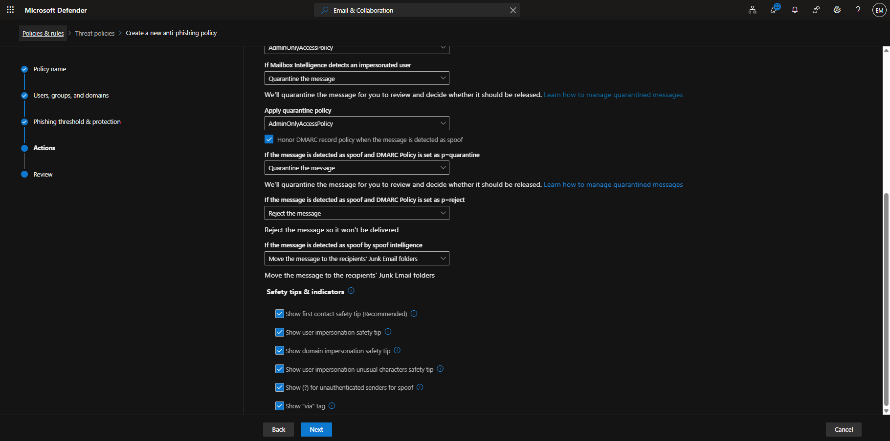

### Verify Anti-Phishing Policy

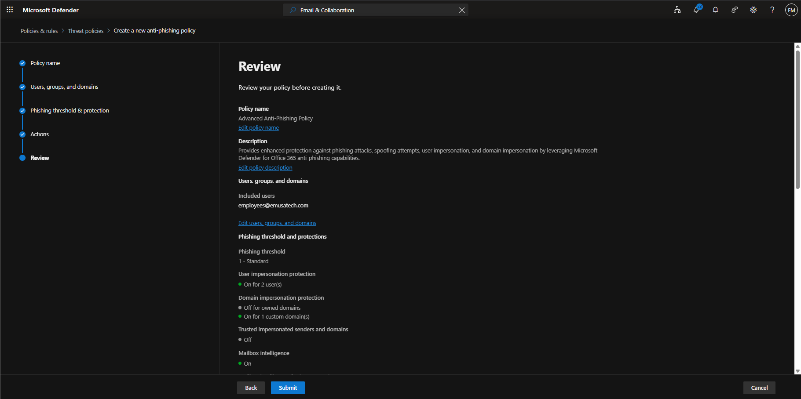

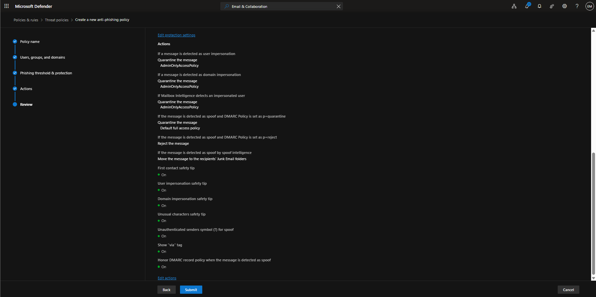

Error Submitting the Request

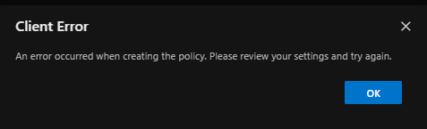

Anti-Phishing policies help protect users against spoofing, phishing, user impersonation, and domain impersonation attacks.

Advanced Anti-Phishing features include Mailbox Intelligence, Spoof Intelligence, impersonation protection, safety tips, and DMARC enforcement.

The Microsoft Defender portal returned a Client Error during policy creation despite successful configuration of policy settings.

The issue should be reviewed at a later date to determine whether the cause was related to licensing, service provisioning, portal validation, or a temporary Microsoft Defender service issue.