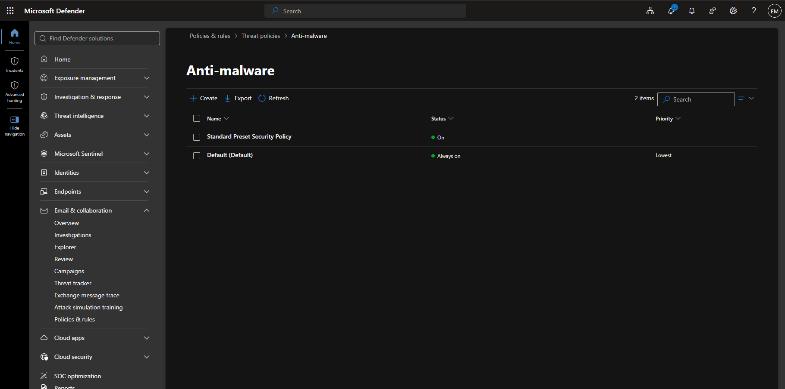
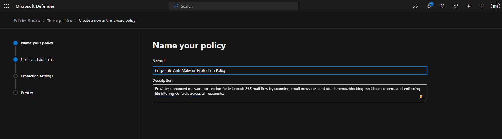

# Manage Anti-Malware

## Overview

Microsoft Defender for Office 365 Anti-Malware policies help protect users by scanning email messages and attachments for known malware, viruses, ransomware, and other malicious content before delivery.

## Location

**Microsoft Defender Portal → Email & Collaboration → Policies & Rules → Threat Policies → Anti-malware**

## Steps

1. Signed in to the Microsoft Defender Portal using an administrator account.
2. Navigated to **Email & Collaboration**.
3. Selected **Policies & Rules**.
4. Selected **Threat Policies**.
5. Selected **Anti-malware**.
6. Selected **Create Policy**.
7. Entered a policy name.
8. Entered a policy description.
9. Assigned the policy to the required users, groups, or domains.
10. Configured common attachment filter settings.
11. Enabled malware protection settings.
12. Configured file filtering options.
13. Configured notification settings for administrators and recipients.
14. Reviewed the Anti-Malware policy configuration.
15. Selected **Create**.
16. Verified that the Anti-Malware policy was successfully created.

## Result

A Microsoft Defender for Office 365 Anti-Malware policy was successfully created to help protect users from malware and malicious email attachments.

### Access Anti-Malware

### Create Anti-Malware Policy

### Configure Anti-Malware Settings

[Insert Screenshot]

### Verify Anti-Malware Policy

[Insert Screenshot]

## Administrative Notes

Anti-Malware policies help protect Microsoft 365 users from malware, ransomware, viruses, and other malicious content delivered through email.

Microsoft Defender for Office 365 scans messages and attachments using advanced detection technologies to prevent malicious content from reaching user mailboxes.

Administrators should regularly review Anti-Malware policies and protection reports to ensure security settings remain aligned with organizational requirements and evolving threats.